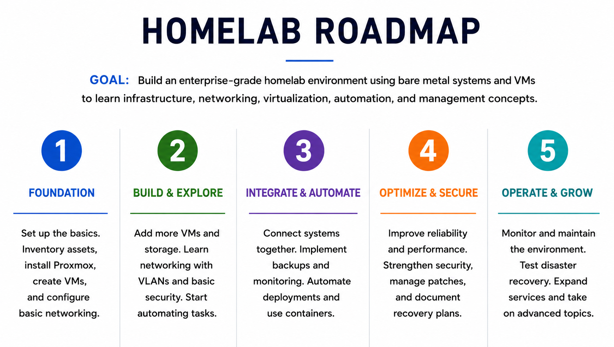

# enterprise-homelab

Welcome to my Enterprise Homelab.

This repository documents the design, implementation, and ongoing development of a home lab environment focused on building practical skills in systems administration, infrastructure engineering, identity and access management, networking, automation, virtualization, and cybersecurity.

The goal is to create a hands-on learning environment that mirrors technologies and processes commonly found in enterprise IT environments while documenting lessons learned along the way.

---

## Navigation

### Projects

- [Active Directory Lab](projects/active-directory-lab/)
- [Azure Administration Lab](projects/azure-administration-lab/)
- [Backup & Disaster Recovery](projects/backup-disaster-recovery/)
- [CI/CD Pipelines](projects/ci-cd-pipelines/)
- [Docker & Self-Hosted Services](projects/docker-self-hosted-services/)
- [Home Network Security](projects/home-network-security/)
- [Infrastructure Automation](projects/infrastructure-automation/)
- [Infrastructure Monitoring](projects/infrastructure-monitoring/)
- [Kubernetes Lab](projects/kubernetes-lab/)
- [Media Services Platform](projects/media-services-platform/)
- [Microsoft 365 & Entra ID Lab](projects/microsoft-365-entra-id/)
- [Network Infrastructure](projects/network-infrastructure/)
- [Security Operations Lab](projects/security-operations-lab/)
- [Virtualization Lab](projects/virtualization-lab/)

### Repository Sections

- [Roadmap](#roadmap)
- [Areas of Focus](#areas-of-focus)
- [Project Portfolio](#project-portfolio)
- [Documentation Scope](#documentation-scope)
- [Learning Philosophy](#learning-philosophy)

---

## Roadmap

See [Roadmap](roadmap.md)

---

## Areas of Focus

- Systems Administration
- Identity & Access Management
- Microsoft 365 & Entra ID
- Azure Administration
- Linux Administration
- Networking & Network Security
- Virtualization
- Containerization & Kubernetes
- Automation & Infrastructure as Code
- CI/CD & DevOps
- Infrastructure Monitoring & Observability
- Backup & Disaster Recovery
- Cybersecurity & Security Operations
- Infrastructure Documentation
- Self-Hosted Services

---

## Project Portfolio

| Project | Focus Area | Status |
|----------|----------|----------|
| Active Directory Lab | Windows Server, AD DS, Group Policy | 📋 Planned |
| Azure Administration Lab | Azure Infrastructure, RBAC, Governance | 📋 Planned |
| Backup & Disaster Recovery | Backup Strategy, DR Testing, Recovery Planning | 📋 Planned |
| CI/CD Pipelines | GitHub Actions, Automation, Deployment | 📋 Planned |
| Docker & Self-Hosted Services | Containers and Self-Hosted Applications | 📋 Planned |
| Home Network Security | VPNs, Segmentation, Hardening | 📋 Planned |
| Infrastructure Automation | Terraform, Ansible, Infrastructure as Code | 📋 Planned |
| Infrastructure Monitoring | Prometheus, Grafana, Observability | 📋 Planned |
| Kubernetes Lab | Container Orchestration and k3s | 📋 Planned |
| Media Services Platform | Debian, Jellyfin, Storage Services | ✅ Complete |
| Microsoft 365 & Entra ID Lab | M365 Administration and Hybrid Identity | 📋 Planned |
| Network Infrastructure | VLANs, Routing, DNS, DHCP | 📋 Planned |
| Security Operations Lab | SIEM, Detection Engineering, Incident Response | 📋 Planned |
| Virtualization Lab | Proxmox, Virtual Machines, Lab Foundation | 🔨 In Progress |

---

## Documentation Scope

This repository is used to document:

- Project Objectives
- Architecture Diagrams
- Build Notes
- Configuration Examples
- Lessons Learned
- Troubleshooting Procedures
- Future Enhancements

---

## Learning Philosophy

One of the primary goals of this lab is to demonstrate that practical IT skills can be developed using affordable and repurposed hardware. Many enterprise concepts can be learned through hands-on experimentation, documentation, and continuous improvement without requiring expensive equipment.

---

### Current Project

- Media Services Platform (Debian & Jellyfin)

### Planned Projects

- Active Directory Lab
- Microsoft 365 & Entra ID Lab
- Network Infrastructure Lab
- Infrastructure Monitoring
- Backup & Disaster Recovery
- Home Network Security
- Infrastructure Automation
- Docker & Self-Hosted Services
- Cloud Administration Lab

---

## EC-Builds

This repository is part of the EC-Builds project, where I document technical projects, infrastructure builds, and lessons learned while continuing to develop skills in enterprise IT and systems administration.

Follow along as the lab continues to grow.
