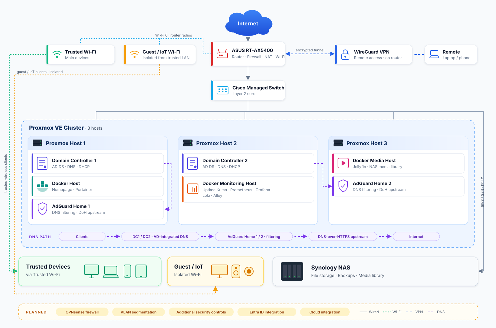

# Enterprise Homelab

Welcome to my Enterprise Homelab.

This repository documents my enterprise-focused homelab, where I build and document projects in systems administration, networking, Microsoft infrastructure, Linux, automation, virtualization, and cloud technologies.

The goal is to learn enterprise concepts through hands-on projects while emphasizing documentation, operational procedures, and production-inspired design.

## Navigation

#### README Sections

- [Roadmap](#roadmap)
- [Equipment](#equipment)
- [Current Infrastructure](#current-infrastructure)
- [Architecture Overview](#architecture-overview)
- [Areas of Focus](#areas-of-focus)
- [Project Portfolio](#project-portfolio)
- [Documentation Scope](#documentation-scope)
- [Learning Philosophy](#learning-philosophy)
- [Technology Stack](#technology-stack)
- [Core Documents](#core-documents)

## Roadmap

The roadmap outlines the planned evolution of the homelab, highlighting current priorities and future infrastructure projects.

➡️ **[Roadmap](docs/roadmap.md)**

## Equipment

The homelab is built on repurposed enterprise hardware, networking equipment, and storage platforms that support infrastructure, virtualization, networking, and automation projects.

➡️ **[Equipment Inventory](equipment/README.md)**

## Current Infrastructure

| Category | Current | Planned |
|----------|----------|----------|
| Router | ASUS RT-AX5400 | OPNsense Firewall |
| Storage | Synology DS718+ | — |
| Servers | Debian Media Server | Proxmox Cluster |
| Switching | Cisco Catalyst 3560CG | — |
| Networking | DHCP Reservations, WireGuard | VLANs, Internal DNS |
| Documentation | GitHub + Markdown | Continue expanding documentation |

## Architecture Overview

The diagram above shows the target logical topology — traffic flows from the edge router through the firewall and managed switch to the virtualization host, storage, and clients.

Functionally, the environment is organized into several infrastructure domains:

| Domain | Scope |
|--------|-------|
| Network Infrastructure | Routing, switching, VLANs, DNS/DHCP |
| Virtualization | Proxmox host, VM and container lifecycle |
| Identity & Access Management | Active Directory, Entra ID, RBAC |
| Security Operations | Firewall, segmentation, IDS/IPS |
| Infrastructure Monitoring | Metrics, logging, alerting |
| Media Services | Linux administration, storage, streaming |
| Automation & DevOps | Infrastructure as code, CI/CD |

➡️ **[View the Project Portfolio](#project-portfolio)**

## Areas of Focus

#### Infrastructure

- Systems Administration
- Linux Administration
- Microsoft 365 & Entra ID
- Azure Administration

#### Networking

- Enterprise Networking
- Network Security
- Virtualization
- Containerization & Kubernetes

#### Automation

- Infrastructure as Code
- CI/CD
- Automation

#### Operations

- Infrastructure Monitoring
- Backup & Disaster Recovery
- Security Operations
- Documentation

## Project Portfolio

> [!NOTE]
> Projects are documented independently and may progress at different rates depending on current learning objectives and infrastructure priorities.

| Project | Focus Area | Status |
|----------|------------|--------|
| [Active Directory Lab](projects/active-directory-lab/) | Windows Server, AD DS, Group Policy | ⚪ Planned |
| [Azure Administration Lab](projects/azure-administration-lab/) | Azure infrastructure, RBAC, governance | ⚪ Planned |
| [Backup & Disaster Recovery](projects/backup-disaster-recovery/) | Backup strategy, restore testing, DR runbooks | ⚪ Planned |
| [CI/CD Pipelines](projects/ci-cd-pipelines/) | GitHub Actions, automated build & deploy | ⚪ Planned |
| [Docker & Self-Hosted Services](projects/docker-self-hosted-services/) | Containerized self-hosted applications | 🟡 In Progress |
| [Infrastructure Automation](projects/infrastructure-automation/) | Terraform, Ansible, Infrastructure as Code | ⚪ Planned |
| [Infrastructure Monitoring](projects/infrastructure-monitoring/) | Prometheus, Grafana, alerting, observability | 🟢 Operational |
| [Kubernetes Lab](projects/kubernetes-lab/) | k3s, container orchestration, AKS | ⚪ Planned |
| [Media Services Platform](projects/media-services-platform/) | Linux administration, storage, service deployment | 🟢 Operational |
| [Microsoft 365 & Entra ID Lab](projects/microsoft-365-entra-id/) | Microsoft 365, Entra ID, hybrid identity | ⚪ Planned |
| [Network Infrastructure](projects/network-infrastructure/) | Routing, switching, VLANs, DNS/DHCP | 🟢 Operational |
| [Network Security](projects/network-security/) | Firewalls, segmentation, hardening, VPN | 🟡 In Progress |
| [Security Operations Lab](projects/security-operations-lab/) | SIEM, detection engineering, incident response | ⚪ Planned |
| [Virtualization Lab](projects/virtualization-lab/) | Proxmox, VM lifecycle, lab foundation | 🟡 In Progress |

The homelab is organized into independent project areas. Each project contains its own documentation, architecture, objectives, and lessons learned.

➡️ **[Browse All Projects](./projects/README.md)**

## Project Status Legend

| Status | Meaning |
|--------|---------|
| 🟢 **Operational** | Deployed, documented, and working as intended |
| 🟡 **In Progress** | Currently being built, configured, or tested |
| ⚪ **Planned** | Defined and included in the project roadmap |

## Documentation Scope

This repository is used to document:

- Project Objectives
- Architecture Diagrams
- Build Notes
- Configuration Examples
- Lessons Learned
- Troubleshooting Procedures
- Future Enhancements

## Learning Philosophy

The primary goal of this homelab is to demonstrate that enterprise IT skills can be developed using affordable hardware, thoughtful design, and consistent documentation.

Rather than focusing solely on deploying software, this repository emphasizes understanding how systems are planned, implemented, documented, and maintained. I use AI as part of my workflow to draft and review documentation, accelerate research, and pressure-test architectural decisions.

## Technology Stack

The technologies used throughout the homelab are documented in the Tool Catalog, organized by infrastructure layer. It serves as a quick reference for the technologies used throughout the environment.

➡️ **[Tool Catalog](docs/tool-catalog.md)**

## Core Documents

| Document | Description |
|----------|-------------|
| [`docs/homelab-decisions.md`](docs/homelab-decisions.md) | Architecture decisions and reasoning |
| [`docs/homelab-direction.md`](docs/homelab-direction.md) | Strategic direction, goals, and phase sequencing |
| [`docs/reference/`](docs/reference/) | Quick reference guides and cheat sheets |
| [`docs/standards/`](docs/standards/) | Baseline configurations, naming conventions, and documentation standards |
| [`docs/tool-catalog.md`](docs/tool-catalog.md) | Quick reference of technologies used throughout the homelab |

## EC-Builds

This repository is part of the **EC-Builds** project, where I document technical projects, infrastructure builds, and lessons learned while continuing to develop skills in enterprise IT and systems administration.

Follow along as the lab continues to grow.
