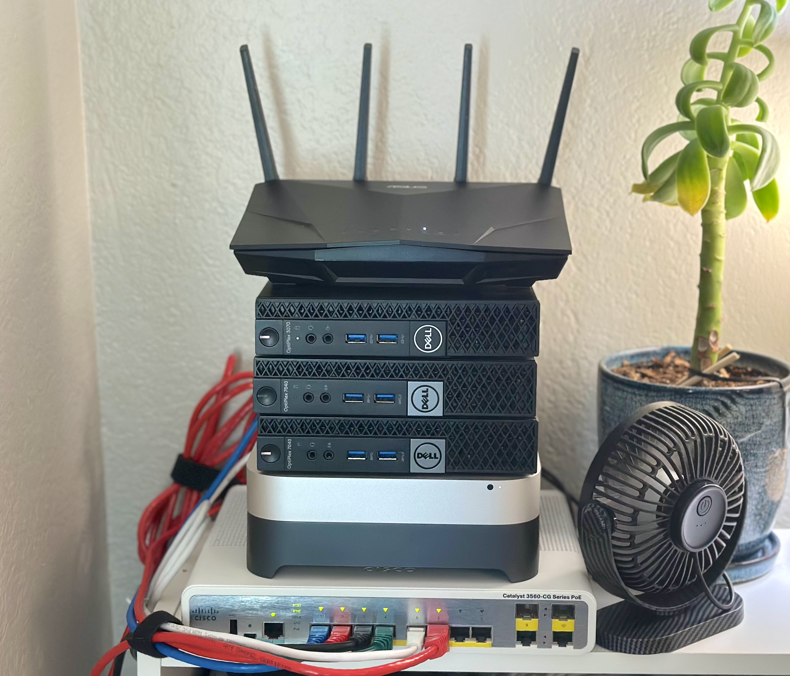

# Enterprise Homelab

Welcome to my Enterprise Homelab.

This repository showcases my enterprise-focused homelab, where I build and document hands-on projects in systems administration, networking, Microsoft infrastructure and identity, Linux, automation, virtualization, and cloud technologies.

  

*Physical compute and network infrastructure supporting the homelab environment.*

## Navigation

| README Section | Description |
|---|---|
| [Roadmap](#roadmap) | Planned infrastructure projects and future lab development |
| [Equipment](#equipment) | Physical compute, networking, and storage hardware |
| [Current Infrastructure](#current-infrastructure) | Current and planned infrastructure components |
| [Architecture Overview](#architecture-overview) | Logical topology and infrastructure domains |
| [Project Portfolio](#project-portfolio) | Hands-on infrastructure projects and their status |
| [Documentation Scope](#documentation-scope) | Types of technical documentation maintained in the repository |
| [Learning Philosophy](#learning-philosophy) | Approach to hands-on learning and documentation |
| [Technology Stack](#technology-stack) | Technologies and platforms used throughout the lab |
| [Core Documents](#core-documents) | Architecture, standards, references, and supporting documentation |

## Roadmap

The roadmap outlines the planned evolution of the homelab, highlighting current priorities and future infrastructure projects.

➡️ **[See Roadmap Doc](docs/roadmap.md)**

## Equipment

The homelab is built on repurposed hardware, managed networking equipment, and dedicated storage platforms. Take a look at the equipment inventory below for more information. 

  

➡️ **[See Equipment Inventory](./docs/equipment-inventory.md)**

## Current Infrastructure

| Category | Current | Planned |
|----------|---------|---------|
| Router / Firewall | ASUS RT-AX5400 | OPNsense Firewall |
| Switching | Cisco Catalyst 3560CG | VLAN Segmentation |
| Storage | Synology DS718+ | — |
| Virtualization | Three-Node Proxmox VE Cluster | Continue expanding virtualized services |
| Identity | Windows Server Active Directory | Additional identity services and hybrid integration |
| Containers | Docker Self-Hosted Services Platform | Continue expanding containerized services |
| Monitoring | Prometheus, Grafana, Loki, Alertmanager, Grafana Alloy, Uptime Kuma | Additional exporters, dashboards, and alerting |
| Networking | Managed Switching, DHCP Reservations, WireGuard | Internal DNS, VLANs, reverse proxy, HTTPS |
| Documentation | GitHub + Markdown | Continue expanding standards, references, and runbooks |

## Architecture Overview

The diagram above shows the target logical topology — traffic flows from the edge router through the firewall and managed switch to the virtualization host, storage, and clients.

Functionally, the environment is organized into several infrastructure domains:

| Domain | Scope |
|--------|-------|
| Network Infrastructure | Routing, switching, VLANs, DNS/DHCP |
| Virtualization | Proxmox hosts, VM lifecycle, storage, and virtual networking |
| Identity & Access Management | Active Directory, Entra ID, RBAC |
| Security Operations | Firewall, segmentation, IDS/IPS |
| Infrastructure Monitoring | Metrics, logging, alerting |
| Media Services | Linux administration, storage, streaming |
| Automation & DevOps | Infrastructure as code, CI/CD |

## Project Portfolio

### Project Status Legend

| Status | Meaning |
|--------|---------|
| 🟢 **Operational** | Deployed, documented, and working as intended |
| 🟡 **In Progress** | Currently being built, configured, or tested |
| ⚪ **Planned** | Defined and included in the project roadmap |

> [!NOTE]
> Projects are documented independently and may progress at different rates depending on current learning objectives and infrastructure priorities.

| Project | Focus Area | Status |
|----------|------------|--------|
| [Active Directory Lab](projects/active-directory-lab/) | Windows Server, AD DS, Group Policy | 🟡 In Progress |
| [Azure Administration Lab](projects/azure-administration-lab/) | Azure infrastructure, RBAC, governance | ⚪ Planned |
| [Backup & Disaster Recovery](projects/backup-disaster-recovery/) | Backup strategy, restore testing, DR runbooks | ⚪ Planned |
| [CI/CD Pipelines](projects/ci-cd-pipelines/) | GitHub Actions, automated build & deploy | ⚪ Planned |
| [Docker & Self-Hosted Services](projects/docker-self-hosted-services/) | Containerized self-hosted applications | 🟡 In Progress |
| [Infrastructure Automation](projects/infrastructure-automation/) | Terraform, Ansible, IaC, configuration management  | ⚪ Planned |
| [Infrastructure Monitoring](projects/infrastructure-monitoring/) | Prometheus, Grafana, alerting, observability | 🟢 Operational |
| [Kubernetes Lab](projects/kubernetes-lab/) | k3s, container orchestration, AKS | ⚪ Planned |
| [Media Services Platform](projects/media-services-platform/) | Linux administration, storage, service deployment | 🟢 Operational |
| [Microsoft 365 & Entra ID Lab](projects/microsoft-365-entra-id/) | Microsoft 365, Entra ID, hybrid identity | ⚪ Planned |
| [Microsoft Intune Lab](projects/microsoft-intune/) | Intune, Autopilot, MDM, compliance, app deployment | 🟡 In Progress |
| [Network Infrastructure](projects/network-infrastructure/) | Routing, switching, VLANs, DNS/DHCP | 🟢 Operational |
| [Network Security](projects/network-security/) | Firewalls, segmentation, VPN, access security | 🟡 In Progress |
| [Proxmox Virtualization Lab](projects/proxmox-virtualization-lab/) | Proxmox, VM lifecycle, lab foundation | 🟢 Operational |
| [Security Operations](projects/security-operations/) | SIEM, detection engineering, incident response | ⚪ Planned |

The homelab is organized into independent project areas. Each project contains its own documentation, architecture, objectives, and lessons learned.

➡️ **[Browse All Projects](./projects/README.md)**

## Documentation Scope

This repository is used to document:

- Project Objectives
- Architecture Diagrams
- Build Notes
- Configuration Examples
- Lessons Learned
- Troubleshooting Procedures
- Future Enhancements

## Learning Philosophy

The primary goal of this homelab is to demonstrate that enterprise IT skills can be developed using affordable hardware, thoughtful design, and consistent documentation.

Rather than focusing solely on deploying software, this repository emphasizes understanding how systems are planned, implemented, documented, and maintained. I use AI as part of my workflow to draft and review documentation, accelerate research, and pressure-test architectural decisions.

## Technology Stack

The technologies used throughout the homelab are documented in the Tool Catalog, organized by infrastructure layer. It serves as a quick reference for the technologies used throughout the environment.

➡️ **[See Tool Catalog](docs/tool-catalog.md)**

## Core Documents

| Document | Description |
|----------|-------------|
| [`docs/homelab-decisions.md`](docs/homelab-decisions.md) | Architecture decisions and reasoning |
| [`docs/homelab-direction.md`](docs/homelab-direction.md) | Strategic direction, goals, and phase sequencing |
| [`docs/reference/`](docs/reference/) | Quick reference guides and cheat sheets |
| [`docs/standards/`](docs/standards/) | Baseline configurations, naming conventions, and documentation standards |
| [`docs/tool-catalog.md`](docs/tool-catalog.md) | Quick reference of technologies used throughout the homelab |

## EC-Builds

This repository is part of the **EC-Builds** project, where I document technical projects, infrastructure builds, and lessons learned while continuing to develop skills in enterprise IT and systems administration.

Follow along as the lab continues to grow.
