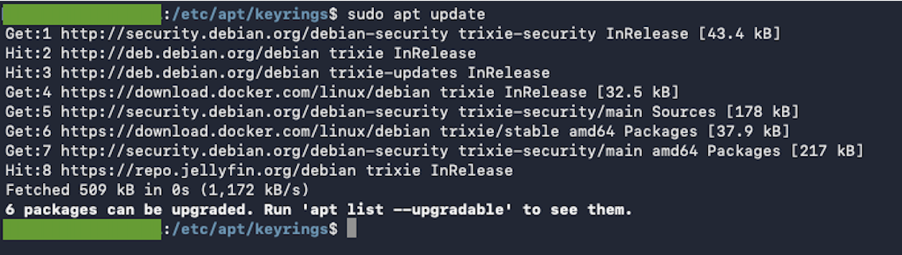

# Docker Installation Guide

Reference guide for installing Docker Engine and Docker Compose on Debian using the official Docker APT repository.

> [!NOTE]
> This guide was created by following and validating the procedures documented in the official Docker installation documentation for Debian:
>
> https://docs.docker.com/engine/install/debian/
>
> The Docker documentation is the authoritative source and should be consulted for the latest installation procedures, package requirements, and platform-specific updates. This guide documents the installation method used and validated within this homelab environment.

---

## Table of Contents

- [Purpose](#purpose)
- [Prerequisites](#prerequisites)
- [Remove Old Docker Packages](#remove-old-docker-packages)
- [Install Prerequisite Packages](#install-prerequisite-packages)
- [Add Docker Repository](#add-docker-repository)
- [Install Docker Engine](#install-docker-engine)
- [Verify Installation](#verify-installation)
- [Test Docker Installation](#test-docker-installation)
- [Configure Non-Root Docker Access](#configure-non-root-docker-access)
- [Post-Installation Validation](#post-installation-validation)
- [Common Troubleshooting](#common-troubleshooting)
- [Installation Checklist](#installation-checklist)
- [Related Documentation](#related-documentation)

---

## Purpose

This document provides a repeatable procedure for installing Docker Engine on Debian systems using the official Docker repository.

This installation method was used in the homelab environment and follows Docker's recommended approach.

## Prerequisites

Verify the operating system:

```bash
cat /etc/os-release
```

Verify network connectivity:

```bash
ping google.com
```

Update package information:

```bash
sudo apt update
```

---

## Remove Old Docker Packages

Remove any older Docker packages if present:

```bash
sudo apt remove $(dpkg --get-selections docker.io docker-compose docker-doc podman-docker containerd runc | cut -f1)
```

> [!NOTE]
> It is normal if some packages are not installed.

---

## Install Prerequisite Packages

Install required packages:

```bash
sudo apt update
sudo apt install -y ca-certificates curl
```

Create the Docker keyring directory:

```bash
sudo install -m 0755 -d /etc/apt/keyrings
```

> [!NOTE]
> The `/etc/apt/keyrings` directory may already exist if other third-party repositories have previously been configured on the system (for example, Jellyfin, Microsoft, Docker, or other vendor repositories).
>
> The `install -d` command is idempotent and can be safely run even if the directory already exists. Existing contents will not be modified.

Download the Docker GPG key:

```bash
sudo curl -fsSL https://download.docker.com/linux/debian/gpg -o /etc/apt/keyrings/docker.asc
```

> [!NOTE]
> Repository signing keys may be stored in either `.asc` or `.gpg` format.
>
> - `.asc` = ASCII-armored public key (human-readable text format)
> - `.gpg` = Binary public key or keyring format
>
> Both formats are commonly used by APT repositories to verify package authenticity and integrity. The file extension itself does not determine whether a repository is trusted. APT uses the key file specified by the repository's `signed-by` parameter when validating package signatures.

Set appropriate permissions:

```bash
sudo chmod a+r /etc/apt/keyrings/docker.asc
```

---

## Add Docker Repository

Add the official Docker repository:

```bash
sudo tee /etc/apt/sources.list.d/docker.sources <<EOF
Types: deb
URIs: https://download.docker.com/linux/debian
Suites: $(. /etc/os-release && echo "$VERSION_CODENAME")
Components: stable
Architectures: $(dpkg --print-architecture)
Signed-By: /etc/apt/keyrings/docker.asc
EOF
```

### Example File Contents

```text
Types: deb
URIs: https://download.docker.com/linux/debian
Suites: trixie
Components: stable
Architectures: amd64
Signed-By: /etc/apt/keyrings/docker.asc
```

---

Update package information:

```bash
sudo apt update
```



*Example output after successfully adding the Docker APT repository and updating package information. The output confirms that the Docker repository is reachable and that package metadata was downloaded successfully.*

---

## Install Docker Engine

Install Docker Engine and related components:

```bash
sudo apt install \
  docker-ce \
  docker-ce-cli \
  containerd.io \
  docker-buildx-plugin \
  docker-compose-plugin
```

Installed components:

| Component | Purpose |
|----------|----------|
| Docker Engine | Container runtime |
| Docker CLI | Docker command-line interface |
| containerd | Container runtime dependency |
| Docker Buildx | Extended image build functionality |
| Docker Compose Plugin | Compose-based deployments |

---

## Verify Installation

Verify Docker Engine:

```bash
docker --version
```

Verify Docker Compose:

```bash
docker compose version
```

Verify Docker service status:

```bash
systemctl status docker
```

Expected result:

```text
active (running)
```

---

## Test Docker Installation

Run the Docker Hello World container:

```bash
sudo docker run hello-world
```

Expected result:

```text
Hello from Docker!
```

This confirms:

- Docker Engine is installed
- Images can be downloaded
- Containers can be created and executed

---

## Configure Non-Root Docker Access

Add the current user to the Docker group:

```bash
sudo usermod -aG docker $USER
```

Apply group membership:

```bash
newgrp docker
```

Alternatively, log out and log back in.

Verify Docker access:

```bash
docker ps
```

The command should execute without requiring `sudo`.

---

## Verify Installed Components

Verify Docker:

```bash
docker --version
```

Verify Compose:

```bash
docker compose version
```

Verify Buildx:

```bash
docker buildx version
```

Verify containerd:

```bash
containerd --version
```

---

## Post-Installation Validation

Recommended validation commands:

```bash
docker ps
docker images
docker network ls
docker volume ls
```

Expected output:

- No errors
- Default Docker networks present
- Docker daemon accessible by the current user

---

## Common Troubleshooting

### Permission Denied

Error:

```text
permission denied while trying to connect to the Docker daemon socket
```

Resolution:

```bash
sudo usermod -aG docker $USER
```

Log out and log back in.

---

### Docker Service Not Running

Check service status:

```bash
systemctl status docker
```

Start the service:

```bash
sudo systemctl start docker
```

Enable automatic startup:

```bash
sudo systemctl enable docker
```

---

### Repository Update Fails

Verify repository configuration:

```bash
cat /etc/apt/sources.list.d/docker.list
```

Verify GPG key:

```bash
ls -l /etc/apt/keyrings/docker.asc
```

Update repositories:

```bash
sudo apt update
```

---

## Installation Checklist

| Task | Status |
|----------|----------|
| Debian verified | ☐ |
| Internet connectivity verified | ☐ |
| Old Docker packages removed | ☐ |
| Docker repository added | ☐ |
| Docker Engine installed | ☐ |
| Docker Compose installed | ☐ |
| Docker service verified | ☐ |
| Hello World container executed | ☐ |
| User added to Docker group | ☐ |
| Non-root access verified | ☐ |

---

## Related Documentation

| Document | Purpose |
|----------|----------|
| [docker-command-reference.md](docker-command-reference.md) | Common Docker and Docker Compose commands used for administration and troubleshooting |
| [docker-concepts.md](docker-concepts.md) | Core Docker concepts including images, containers, volumes, networks, and Compose |
| [docker-container-deployment.md](docker-container-deployment.md) | Standard procedure for deploying and managing Docker Compose applications |

