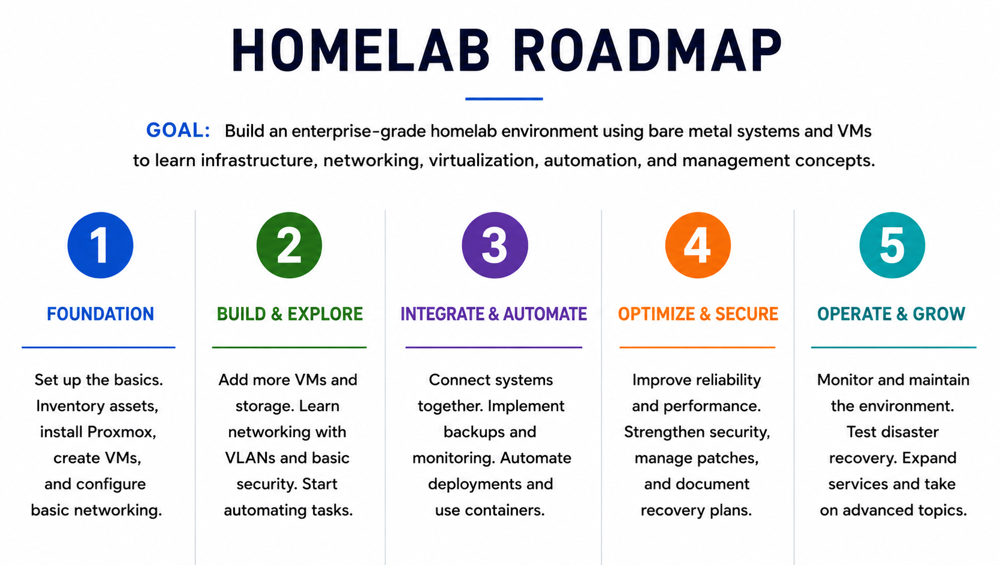

# Roadmap

---

## Overview

This roadmap describes how the homelab is built in stages — from the underlying platform up through enterprise operations, security, and cloud. It complements the [Homelab Direction](homelab-direction.md) document: the direction doc defines *what the lab is for and which capabilities matter most* (security, identity, cloud), while this roadmap describes *the order in which the environment is physically built out*.

The lab is currently in **Phase 1 (Foundation)** — standing up the hypervisor, hosts, and base networking that everything else depends on. Later phases layer identity, automation, security hardening, and cloud on top of that foundation.

The phases build on one another but are not strictly linear — documentation, security, and automation are ongoing threads that mature alongside the infrastructure rather than waiting for a single phase.

## Phases

This roadmap describes how the homelab is built in stages — from the underlying platform up through enterprise operations, security, and cloud. The phases build on one another but are not strictly linear: documentation, security, and automation are ongoing threads that mature alongside the infrastructure rather than waiting for a single phase.

The lab is currently in **Phase 1 (Foundation)** — standing up the hypervisor, hosts, and base networking that everything else depends on.

### Status Legend

| Status | Meaning |
|--------|---------|
| 🟢 Complete | Built, documented, and working as intended |
| 🟡 In Progress | Currently being built, configured, or tested |
| ⚪ Upcoming | Planned, not yet started |
| 📍 You Are Here | Current focus of active work |

### 1. Foundation 🟡 📍 You Are Here
- Hardware Evaluation
- Operating Systems
- Networking Fundamentals
- Documentation Standards

### 2. Build & Explore ⚪ Upcoming
- Linux Services
- Identity Management
- Storage Integration
- Virtualization

### 3. Integrate & Automate ⚪ Upcoming
- Automation
- Monitoring
- Backup Solutions
- Infrastructure Documentation

### 4. Optimize & Secure ⚪ Upcoming
- System Hardening
- Access Control
- Security Monitoring
- Disaster Recovery Planning

### 5. Operate & Grow ⚪ Upcoming
- Continuous Improvement
- Advanced Infrastructure Projects
- Cloud Technologies
- Enterprise Architecture Concepts
