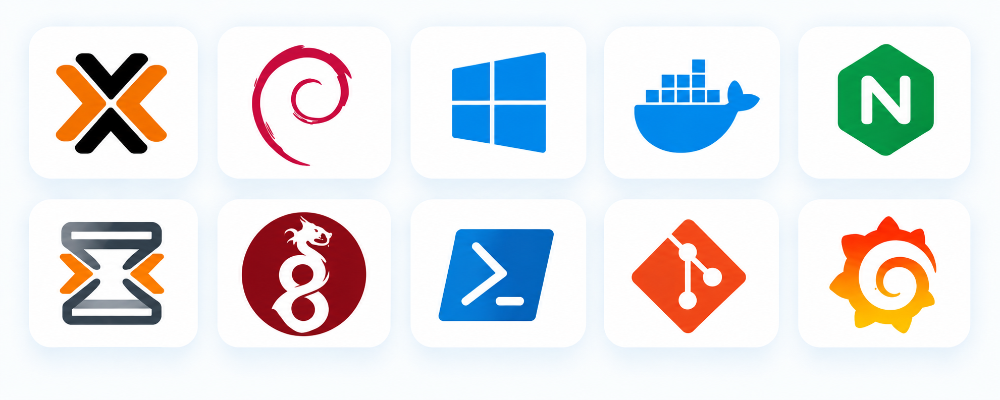

# Homelab Tool Catalog

  

A quick reference to the technologies used throughout the homelab, organized by infrastructure function.

This catalog serves as both a reference for technologies currently used in the homelab and a glossary for tools being researched or considered for future use. Inclusion does not necessarily indicate that a tool is currently deployed; entries may represent active, planned, or evaluated technologies retained for reference.

Physical hardware and individual devices are documented separately in the Equipment Inventory.

## Navigation

- [Networking & Security](#networking--security)
- [Operating Systems & Virtualization](#operating-systems--virtualization)
- [Containers & Application Hosting](#containers--application-hosting)
- [Windows Infrastructure](#windows-infrastructure)
- [Endpoint Administration & Automation](#endpoint-administration--automation)
- [Monitoring & Observability](#monitoring--observability)
- [Documentation & Asset Management](#documentation--asset-management)
- [Storage & Backup](#storage--backup)
- [Self-Hosted Applications](#self-hosted-applications)

## Networking & Security

| Tool | Category | Short Definition | Primary Use |
|---|---|---|---|
| **OPNsense** | Firewall / Router | Open-source firewall and routing platform. | Firewalling, routing, VLANs, and VPN services. |
| **WireGuard** | VPN | Modern encrypted VPN protocol. | Secure remote access to the homelab. |
| **Technitium DNS** | DNS | Self-hosted DNS server. | Internal DNS resolution and filtering. |
| **VLAN (802.1Q)** | Segmentation | Standard for virtual LAN segmentation. | Separates infrastructure into logical security zones. |
| **SNMP** | Monitoring Protocol | Standard network-management protocol. | Collects health and performance data from network devices. |
| **NTP** | Time Synchronization | Network Time Protocol. | Synchronizes system clocks. |
| **Suricata** | IDS/IPS | Network intrusion detection and prevention engine. | Detects and blocks suspicious network traffic. |

## Operating Systems & Virtualization

| Tool | Category | Short Definition | Primary Use |
|---|---|---|---|
| **Proxmox VE** | Hypervisor | Debian-based virtualization platform using KVM and LXC. | Hosts virtual machines and Linux containers. |
| **Debian** | Linux Server OS | Stable Linux distribution. | Hosts Linux infrastructure and application services. |
| **Windows Server** | Server OS | Microsoft enterprise server operating system. | Hosts Windows infrastructure services. |
| **Windows 11 Pro** | Client OS | Microsoft desktop operating system. | Windows administration and endpoint testing. |
| **Windows 10 Pro** | Client OS | Microsoft desktop operating system. | Compatibility and legacy testing. |
| **macOS** | Client OS | Apple desktop operating system. | Administration and macOS endpoint testing. |

## Containers & Application Hosting

| Tool | Category | Short Definition | Primary Use |
|---|---|---|---|
| **Docker** | Container Platform | Application container runtime. | Hosts containerized services. |
| **Docker Compose** | Container Deployment | Declarative multi-container configuration. | Defines and deploys container stacks. |
| **Portainer** | Container Management | Web-based Docker management platform. | Centralized container administration. |
| **Nginx Proxy Manager** | Reverse Proxy | Web-based reverse proxy platform. | Routes and secures internal web services. |
| **Let's Encrypt** | Certificate Authority | Automated public certificate authority. | Issues and renews TLS certificates. |
| **Vaultwarden** | Secrets Management | Self-hosted Bitwarden-compatible password manager. | Stores infrastructure credentials and secrets. |

## Windows Infrastructure

| Tool | Category | Short Definition | Primary Use |
|---|---|---|---|
| **Active Directory Domain Services (AD DS)** | Identity | Windows directory service. | Centralized identity, authentication, and domain management. |
| **DNS Server** | Name Resolution | Active Directory-integrated DNS service. | Name resolution for Windows domain infrastructure. |
| **DHCP Server** | IP Address Management | Windows DHCP service. | Centralized IP address assignment. |
| **Group Policy (GPO)** | Configuration Management | Domain-based policy management. | Centralized Windows user and device configuration. |
| **Microsoft Entra ID** | Cloud Identity | Microsoft's cloud identity platform. | Cloud identity, authentication, and SSO. |
| **Active Directory Certificate Services (AD CS)** | PKI | Microsoft certificate authority platform. | Issues certificates for internal services and systems. |
| **Windows Server Update Services (WSUS)** | Patch Management | Centralized Windows Update platform. | Manages Windows patch deployment. |

## Endpoint Administration & Automation

| Tool | Category | Short Definition | Primary Use |
|---|---|---|---|
| **MeshCentral** | Remote Management | Open-source cross-platform endpoint management platform. | Remote administration and script execution across Windows, macOS, and Linux. |
| **Microsoft Intune** | Endpoint Management | Microsoft's cloud endpoint management platform. | Device configuration, application deployment, compliance, and security policy. |
| **PowerShell** | Automation | Microsoft administration and scripting language. | Windows administration and automation. |
| **SSH** | Remote Administration | Secure remote shell protocol. | Remote Linux and infrastructure administration. |
| **Ansible** | Configuration Management | Agentless automation platform. | Automated configuration and administration of infrastructure. |
| **Python** | Automation | General-purpose programming language. | Administrative scripting and automation. |
| **Windows Admin Center** | Server Management | Browser-based Windows management console. | Remote Windows Server administration. |
| **RDCMan** | Remote Administration | Microsoft Remote Desktop connection manager. | Organizes and manages RDP sessions. |
| **RSAT** | Administration | Windows Server administration tools. | Remote administration of AD and Windows Server roles. |
| **VS Code Remote SSH** | Remote Development | Remote development and editing environment. | Edits and administers Linux systems over SSH. |
| **Ventoy** | Boot & Recovery Utility | Multiboot USB platform for booting multiple ISO images. | Installation, troubleshooting, and recovery of physical systems. |

## Monitoring & Observability

| Tool | Category | Short Definition | Primary Use |
|---|---|---|---|
| **Grafana** | Visualization | Dashboard and visualization platform. | Infrastructure dashboards. |
| **Prometheus** | Metrics | Time-series monitoring platform. | Collects infrastructure and application metrics. |
| **Node Exporter** | Metrics Exporter | Linux system metrics exporter. | Exposes Linux metrics to Prometheus. |
| **Windows Exporter** | Metrics Exporter | Windows system metrics exporter. | Exposes Windows metrics to Prometheus. |
| **SNMP Exporter** | Metrics Exporter | Prometheus SNMP collector. | Collects network-device metrics. |
| **cAdvisor** | Container Monitoring | Container metrics collector. | Monitors Docker resource utilization. |
| **Loki** | Logging | Centralized log aggregation platform. | Stores and queries infrastructure logs. |
| **Promtail** | Log Collection | Log shipping agent. | Sends system logs to Loki. |
| **Alertmanager** | Alerting | Prometheus alert-management service. | Routes monitoring alerts and notifications. |
| **Uptime Kuma** | Availability Monitoring | Self-hosted uptime monitor. | Monitors availability of services and endpoints. |

## Documentation & Asset Management

| Tool | Category | Short Definition | Primary Use |
|---|---|---|---|
| **Obsidian** | Documentation | Markdown knowledge base. | Infrastructure documentation, notes, and runbooks. |
| **NetBox** | IPAM / DCIM | Infrastructure source-of-truth platform. | Documents networks, IP addressing, devices, and infrastructure. |
| **Snipe-IT** | Asset Management | IT asset-management platform. | Tracks hardware, licenses, and asset lifecycle. |
| **Git** | Version Control | Distributed version-control system. | Versions scripts, configuration, and documentation. |
| **Gitea** | Git Server | Self-hosted Git platform. | Hosts internal Git repositories. |

## Storage & Backup

| Tool | Category | Short Definition | Primary Use |
|---|---|---|---|
| **Synology DSM** | NAS Platform | Network-attached storage operating system. | Centralized storage and file services. |
| **Active Backup for Business** | Backup | Synology endpoint and server backup platform. | Protects endpoints, servers, and virtual machines. |
| **Hyper Backup** | NAS Backup | Synology backup and disaster-recovery platform. | Protects NAS data and configuration. |
| **Time Machine** | macOS Backup | Apple's native macOS backup system. | Backs up macOS endpoints. |
| **Proxmox Backup Server** | VM Backup | Proxmox backup platform. | Backs up virtual machines and containers. |

## Self-Hosted Applications

| Tool | Category | Short Definition | Primary Use |
|---|---|---|---|
| **Homepage** | Dashboard | Self-hosted service dashboard. | Central access point for homelab services. |
| **Jellyfin** | Media Server | Open-source media streaming platform. | Hosts and streams personal media. |
