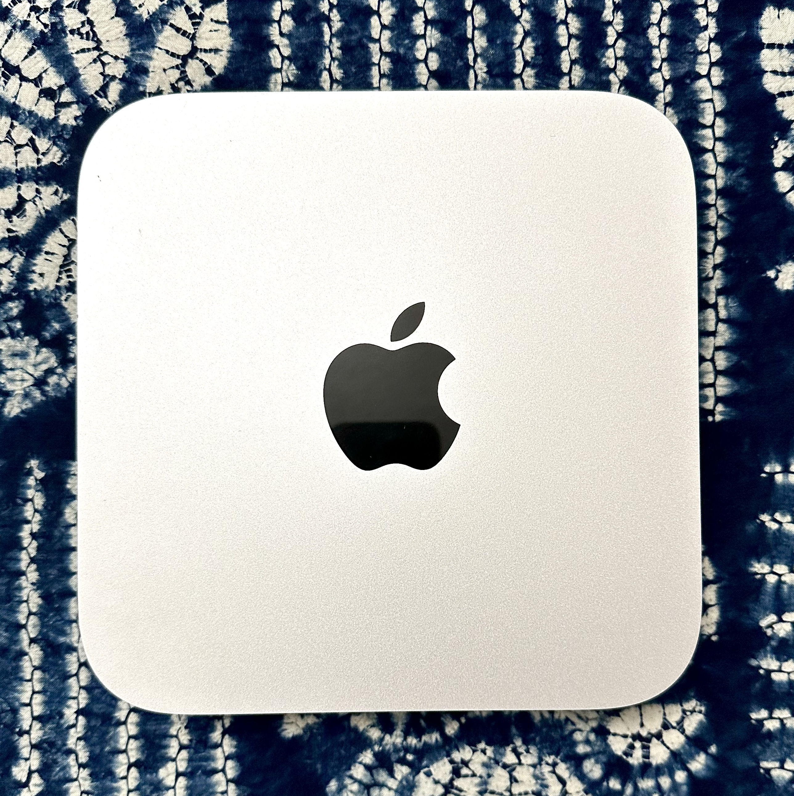

# Mac Mini (Late 2014)

## Overview

The Late 2014 Mac Mini serves as the primary host for the Media Services Platform. Originally a consumer desktop, it was repurposed as a dedicated Debian Linux server, demonstrating that reliable self-hosted infrastructure can be built on affordable, second-hand hardware.

| | |
|---|---|
| **Type** | Server |
| **Role** | Media Services Platform |
| **Hostname (Documentation)** | media-server-lab |
| **Status** | Active |

---

  
   
  <em>Late 2014 Mac Mini (Macmini7,1)</em>

---

## Hardware Specifications

| Component | Details |
|------------|------------|
| Platform | Apple Mac Mini (Late 2014) |
| Model Identifier | Macmini7,1 |
| CPU | Intel Core i5-4260U @ 1.40 GHz (2 cores / 4 threads) |
| Memory | 4 GB DDR3 1600 MHz (2 × 2 GB, soldered) |
| Storage | 256 GB SSD |
| Network | Gigabit Ethernet |
| Operating System | Debian GNU/Linux 13 (Trixie) |

---

## Current Role

- Hosts Jellyfin media streaming service managed via systemd
- Mounts media libraries from the NAS over a read-only SMB/CIFS share
- Runs Docker Engine for containerized services

---

## Platform Considerations

### Advantages

- Low power consumption and quiet operation
- Small physical footprint
- Reliable Intel-based platform with mainline Linux support
- Suitable for lightweight Linux server workloads

### Limitations

- Memory is soldered and cannot be upgraded (4 GB ceiling)
- Older mobile-class processor limits transcoding capacity
- Limited internal storage expansion

---

## Lifecycle Notes

- Repurposed from consumer use; macOS replaced with Debian
- Candidate for eventual replacement or reassignment as the Virtualization Lab (Proxmox) comes online

---

## Related Documentation

- [Media Services Platform](../projects/media-services-platform/)
- [Hardware Details](../projects/media-services-platform/hardware.md)
- [Debian Installation](../projects/media-services-platform/debian-install.md)
