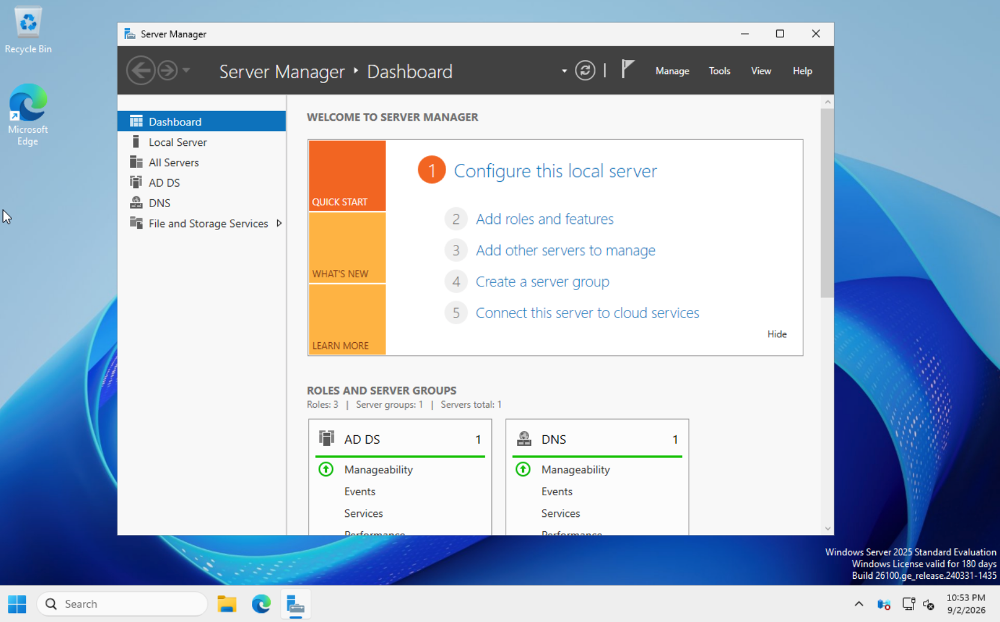

# 🏢 Active Directory Lab

**Status: 🟡 In Progress**

Enterprise identity and access management environment built with Windows Server and Active Directory Domain Services, hosted across the Proxmox virtualization lab.

<p align="left">
  
</p>

*Windows Server 2025 domain controller with Active Directory Domain Services deployed.*

## Architecture

The Active Directory environment will use two domain controllers distributed across separate Proxmox hosts.

```text
Proxmox Cluster
│
├── prox-lab-01
│   └── dc-lab-01
│       ├── Active Directory Domain Services
│       ├── DNS
│       └── DHCP
│
└── prox-lab-02
    └── dc-lab-02
        ├── Active Directory Domain Services
        └── DNS
             │
             ▼
      AD Replication
```

`dc-lab-01` is currently deployed as the first domain controller. DNS configuration, DHCP configuration, and deployment of the second domain controller remain in progress or planned.

Separating the domain controllers across Proxmox hosts will provide continued directory and DNS availability if a virtualization host is unavailable.

## Objectives

- Deploy a multi-domain-controller Active Directory environment
- Distribute domain controllers across separate Proxmox hosts
- Configure and validate Active Directory replication
- Design an OU structure modeling a real business
- Implement Group Policy for security baselines and configuration management
- Manage users, groups, and computers at scale with PowerShell
- Configure AD-integrated DNS
- Configure DHCP services and document scopes
- Establish the on-premises identity foundation for future Microsoft Entra ID integration

## Technologies

- Proxmox VE
- Windows Server
- Active Directory Domain Services
- Active Directory-integrated DNS
- DHCP
- Group Policy Management Console
- Active Directory Sites and Services
- PowerShell
- Windows 10/11 domain-joined clients

## Domain Controllers

| Server | Proxmox Host | Roles | Status |
|---|---|---|---|
| `dc-lab-01` | `prox-lab-01` | AD DS, DNS, DHCP | 🟡 In Progress |
| `dc-lab-02` | `prox-lab-02` | AD DS, DNS | ⚪ Planned |

`dc-lab-01` currently provides the Active Directory Domain Services foundation for the lab. DNS and DHCP configuration remain part of the current deployment phase.

The second domain controller will provide additional directory and DNS services while residing on a separate virtualization host.

FSMO roles will initially reside on `dc-lab-01` and will be documented as part of the deployment.

## Key Tasks

### Completed

- [x] Deploy `dc-lab-01` Windows Server VM on `prox-lab-01`
- [x] Configure static network addressing
- [x] Install Active Directory Domain Services
- [x] Create the Active Directory forest and domain
- [x] Promote `dc-lab-01` as the first domain controller

### In Progress

- [ ] Configure and validate AD-integrated DNS on `dc-lab-01`
- [ ] Configure DHCP and document scopes

### Planned

- [ ] Build OU structure for departments, users, workstations, and servers
- [ ] Create security groups using AGDLP best practices
- [ ] Configure GPOs for password policy, account lockout, drive mappings, and workstation restrictions
- [ ] Bulk-create users with PowerShell
- [ ] Join Windows client VMs to the domain
- [ ] Verify Group Policy application
- [ ] Deploy `dc-lab-02` on `prox-lab-02`
- [ ] Configure `dc-lab-02` to use `dc-lab-01` for DNS during deployment
- [ ] Promote `dc-lab-02` as an additional domain controller
- [ ] Configure and validate DNS on `dc-lab-02`
- [ ] Verify AD DS and DNS replication between `dc-lab-01` and `dc-lab-02`
- [ ] Document FSMO role placement
- [ ] Configure and document Active Directory Sites and Services
- [ ] Generate user and group audit reports with PowerShell
- [ ] Validate directory services following simulated domain controller or Proxmox host failure

## Deployment Progress

```text
dc-lab-01 VM Deployment        ██████████  Complete
Static Network Configuration   ██████████  Complete
AD DS Installation             ██████████  Complete
Forest / Domain Creation       ██████████  Complete
DC Promotion                   ██████████  Complete
DNS Configuration              ░░░░░░░░░░  Next
DHCP Configuration             ░░░░░░░░░░  Planned
OU / Group Policy Design       ░░░░░░░░░░  Planned
Client Domain Join             ░░░░░░░░░░  Planned
dc-lab-02 Deployment           ░░░░░░░░░░  Planned
Replication Validation         ░░░░░░░░░░  Planned
```

The immediate next step is to configure and validate DNS on `dc-lab-01`. Once the first domain controller is providing reliable internal DNS, additional domain services and the second domain controller can be introduced.

## Future Integration

The Active Directory environment will provide the on-premises identity foundation for the Microsoft cloud labs.

```text
Active Directory
      │
      │ Entra Connect
      ▼
Microsoft Entra ID
      │
      ├── Microsoft 365
      └── Microsoft Intune
```

Future phases will include hybrid identity synchronization, Microsoft Entra authentication, Conditional Access, and endpoint management.

## Related Projects

- [Proxmox Virtualization Lab](../proxmox-virtualization-lab/) — virtualization platform hosting the domain controllers and client VMs
- [Microsoft 365 & Entra ID](../microsoft-365-entra-id/) — future hybrid identity and Microsoft cloud integration
- [Microsoft Intune Lab](../microsoft-intune/) — endpoint enrollment, configuration, compliance, and management
- [Security Operations Lab](../security-operations/) — future collection and analysis of Active Directory security events

## Folder Structure

```text
active-directory-lab/
├── docs/            # Architecture, build documentation, GPOs, and lessons learned
├── configs/         # GPO reports and DNS/DHCP documentation
├── scripts/         # PowerShell provisioning and reporting
└── diagrams/        # Visual documentation
```
