# 🖥️ Domain Controller Deployment

<p align="left">
  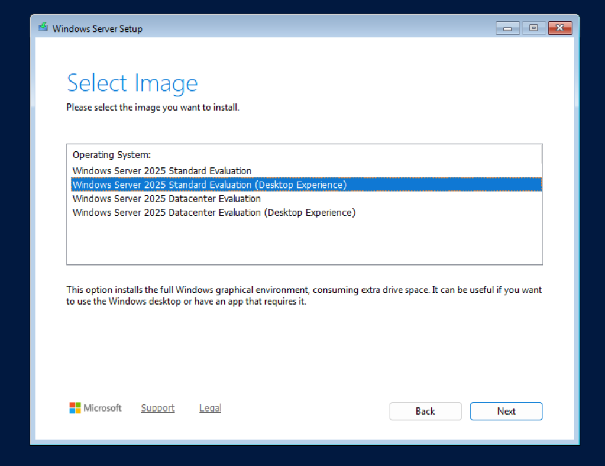
</p>

*Windows Server 2025 Standard Evaluation (Desktop Experience)*


## Overview

This document outlines the deployment process for the primary Windows Server
domain controller in the Active Directory lab.

The deployment establishes the initial Windows Server infrastructure required
for Active Directory Domain Services (AD DS), DNS, and DHCP.

The deployment workflow is:

```text
Windows Server Template
        │
        ▼
     Full Clone
        │
        ▼
Configure Hostname
        │
        ▼
Configure Static IP
        │
        ▼
Validate Networking
        │
        ▼
Install AD DS + DNS
        │
        ▼
Create AD Forest
        │
        ▼
Promote to Domain Controller
        │
        ▼
Validate AD + DNS
        │
        ▼
Configure DHCP
        │
        ▼
Final Validation
```

> [!NOTE]
> Hostnames, IP addresses, domain names, and other environment-specific
> identifiers shown in this document have been sanitized for public release.


## Server Configuration

The primary domain controller uses the following baseline configuration.

| Component | Configuration |
|---|---|
| VM Name | `dc-lab-01` |
| Hostname | `dc-lab-01` |
| Operating System | Windows Server 2025 Standard Evaluation |
| Installation | Desktop Experience |
| CPU | 2 vCPU |
| Memory | 2 GB |
| Storage | 64 GB |
| Network | Static IPv4 |
| Roles | AD DS, DNS |
| Planned Role | DHCP |


## Configure Hostname

After deploying the Windows Server VM from the generalized template, assign
the server its permanent hostname before installing Active Directory roles.

The primary domain controller uses the sanitized hostname:

```text
dc-lab-01
```

The hostname can be changed through:

**Server Manager → Local Server → Computer name**

or through Windows Settings.

Restart the server after changing the hostname.

Verify the hostname:

```powershell
hostname
```

Expected result:

```text
dc-lab-01
```


## Configure Static IP Address

Domain controllers provide foundational infrastructure services and should
use stable network addressing.

Configure the server with a static IPv4 address through:

**Settings → Network & Internet → Ethernet → IP Assignment → Edit**

Change the IP assignment from:

```text
Automatic (DHCP)
```

to:

```text
Manual
```

Enable IPv4 and configure the appropriate network settings.

Example sanitized configuration:

```text
IP Address:      10.0.0.10
Subnet Mask:     255.255.255.0
Default Gateway: 10.0.0.1
DNS Server:      10.0.0.1
```

At this stage, the existing network DNS server remains configured because
the new domain controller is not yet providing DNS services.

After AD DS and DNS are configured, domain clients will use the domain
controllers as their DNS servers.

> [!IMPORTANT]
> The static address assigned to the domain controller also becomes the
> address used to reach the DNS service hosted by that domain controller.

Verify the configuration:

```powershell
ipconfig /all
```

Confirm:

- DHCP is disabled
- The intended IPv4 address is assigned
- The subnet mask is correct
- The default gateway is correct
- A functioning DNS server is configured


## Validate Network Connectivity

Network connectivity should be validated before installing Active Directory.

This separates basic network problems from problems introduced later during
AD DS or DNS configuration.


### Validate Local TCP/IP

Test the local TCP/IP stack:

```powershell
ping 127.0.0.1
```

Expected result:

```text
0% packet loss
```


### Validate Default Gateway

Ping the configured gateway.

Example:

```powershell
ping 10.0.0.1
```

A successful response confirms connectivity between the server and the local
network gateway.


### Validate IPv4 Internet Routing

Test connectivity to an external IPv4 address without relying on DNS:

```powershell
ping 8.8.8.8
```

A successful response confirms that IPv4 routing through the default gateway
is functioning.


### Validate DNS Resolution

Test external DNS resolution:

```powershell
nslookup microsoft.com
```

A successful lookup confirms that the configured DNS infrastructure can
resolve external names.


### Validate HTTPS Connectivity

Test outbound HTTPS connectivity:

```powershell
Test-NetConnection microsoft.com -Port 443
```

Verify:

```text
TcpTestSucceeded : True
```

Successful completion of these tests establishes the following network path:

```text
Domain Controller
      │
      ├── Local TCP/IP          ✓
      ├── Local Gateway         ✓
      ├── IPv4 Routing          ✓
      ├── DNS Resolution        ✓
      └── HTTPS Connectivity    ✓
```


## Install Active Directory Domain Services

Active Directory Domain Services and DNS were installed through Windows
Server Manager.

Open:

**Server Manager → Manage → Add Roles and Features**

Select:

```text
Role-based or feature-based installation
```

Select the local Windows Server as the destination server.


### Select Server Roles

Under **Server Roles**, enable:

```text
Active Directory Domain Services
DNS Server
```

<p align="left">
  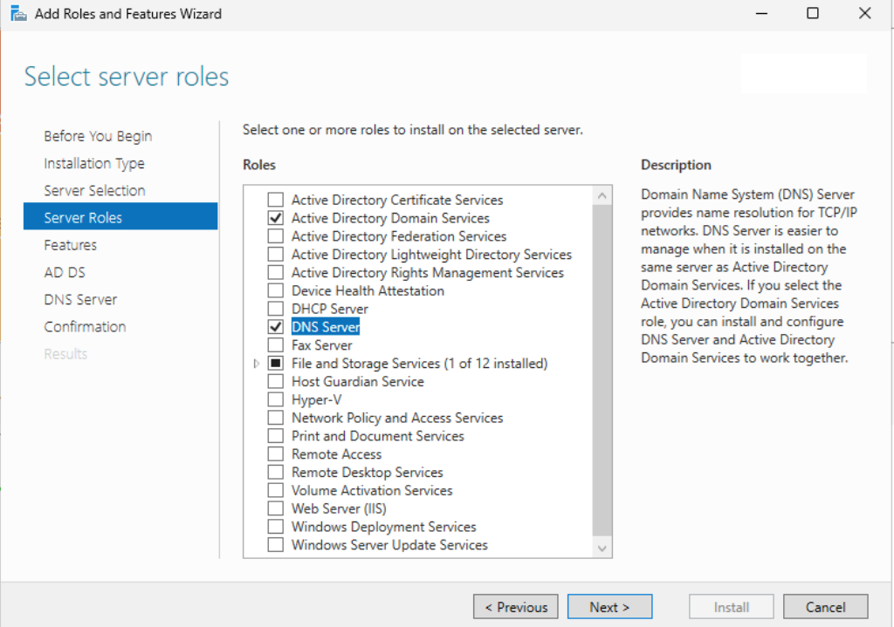
</p>


When prompted, select:

**Add Features**

Windows automatically selects the supporting management components required
for the roles.

These include:

```text
Group Policy Management

Remote Server Administration Tools
└── Role Administration Tools
    ├── AD DS and AD LDS Tools
    │   ├── Active Directory module for Windows PowerShell
    │   ├── AD DS Tools
    │   ├── Active Directory Administrative Center
    │   └── AD DS Snap-Ins and Command-Line Tools
    │
    └── DNS Server Tools
```

DHCP Server was intentionally not installed during this stage.

The initial deployment order is:

```text
AD DS
  │
  └── DNS
       │
       ▼
Domain Promotion
       │
       ▼
AD/DNS Validation
       │
       ▼
DHCP
```

This allows Active Directory and DNS to be established and validated before
introducing DHCP configuration.


### Role Installation

<p align="left">
  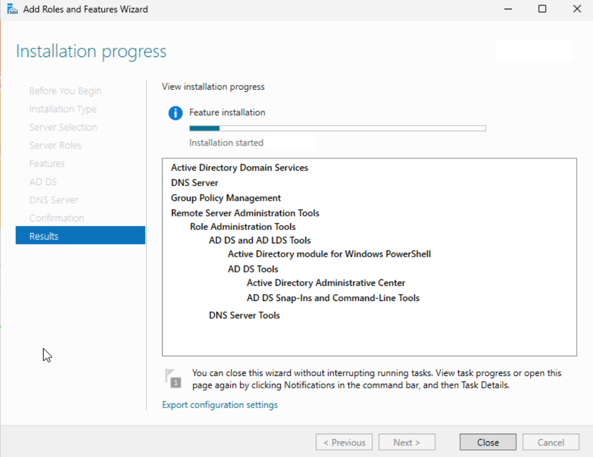
</p>

*Active Directory Domain Services, DNS, and supporting management tools installed through Server Manager.*

After installation completed, Server Manager reported that additional
configuration was required before the server could function as a domain
controller.

<p align="left">
  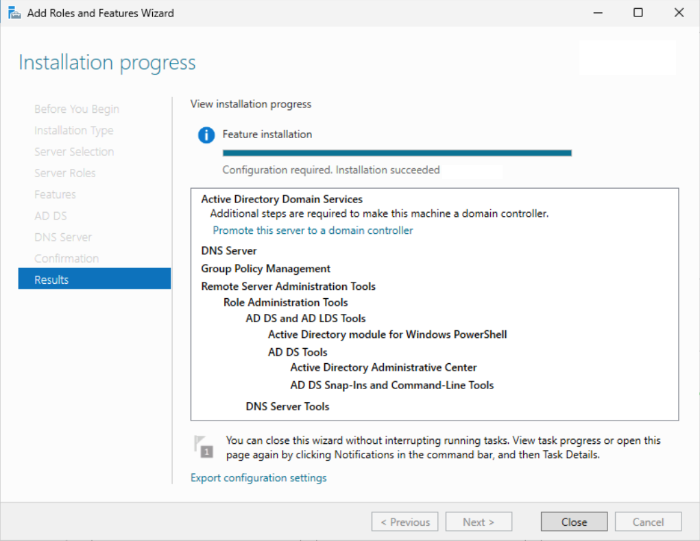
</p>

*AD DS and DNS installation completed successfully and Server Manager reported that domain controller promotion was required.*


## Promote Server to Domain Controller

After installing AD DS, Server Manager displayed a post-deployment
configuration notification.

<p align="left">
  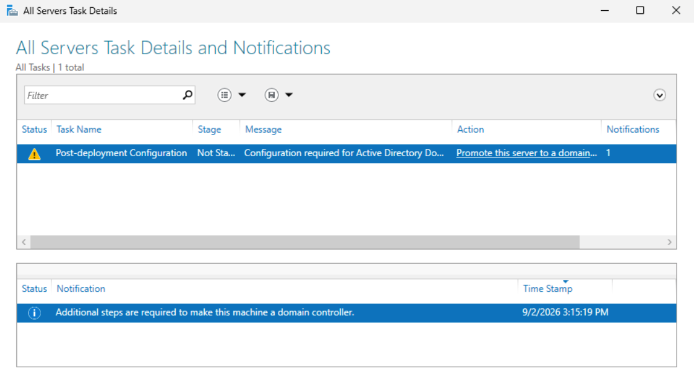
</p>

*Server Manager post-deployment notification indicating that domain controller promotion is required.*

The Active Directory Domain Services Configuration Wizard was launched
through:

**Server Manager → Notifications → Promote this server to a domain controller**


### Create a New Forest

Because this is the first domain controller in the environment, the deployment
operation was configured as:

```text
Add a new forest
```

<p align="left">
  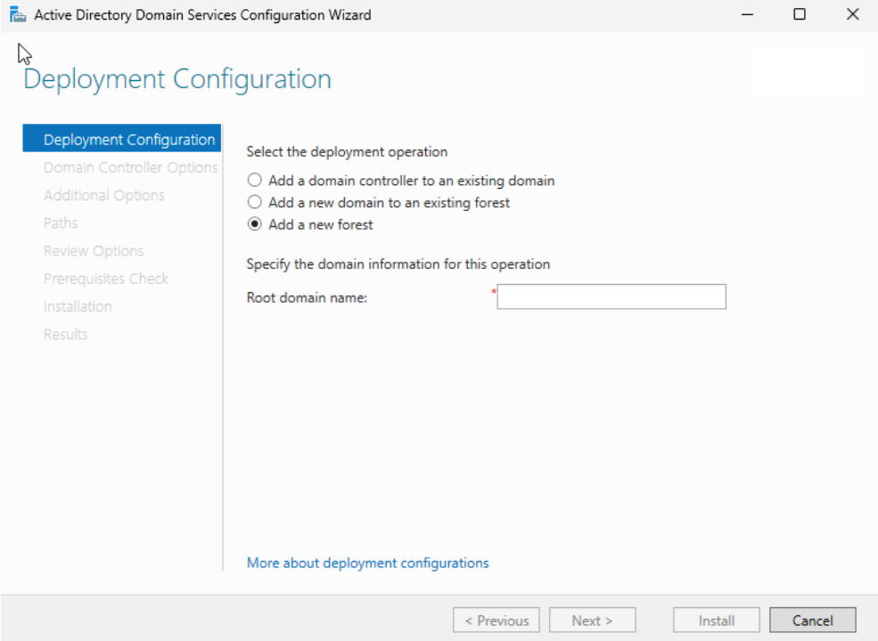
</p>

*Creation of a new Active Directory forest for the lab environment.*

The sanitized Active Directory forest and root domain are represented as:

```text
lab.example.com
```

The resulting public documentation namespace is:

```text
lab.example.com
        │
        └── dc-lab-01.lab.example.com
```

> [!NOTE]
> The domain namespace shown in this document is a sanitized example and does
> not represent the production or internal DNS namespace used by the lab.


### Configure Domain Controller Options

The forest and domain functional levels were configured for Windows Server
2025.

The primary domain controller was also configured as:

```text
DNS Server:       Enabled
Global Catalog:   Enabled
RODC:             Disabled
```

<p align="left">
  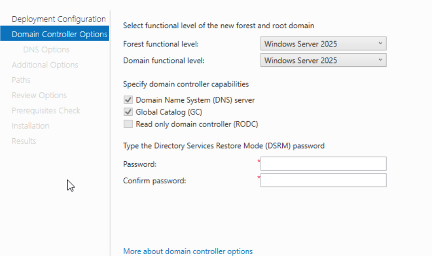
</p>

*Windows Server 2025 forest and domain functional levels with DNS and Global Catalog enabled.*

A Directory Services Restore Mode (DSRM) password was also configured during
this stage.

> [!IMPORTANT]
> The DSRM password is a recovery credential used for Active Directory
> maintenance and recovery. It should be stored securely and must never be
> included in repository documentation.


### DNS Delegation

The configuration wizard reported that a DNS delegation could not
automatically be created because an authoritative parent Windows DNS zone
could not be located.

<p align="left">
  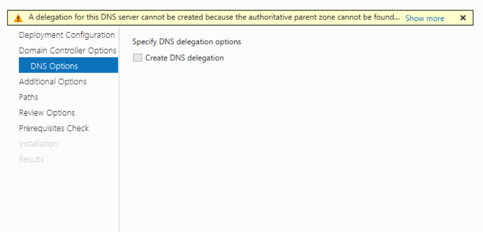
</p>

*DNS delegation was not created for the internal Active Directory namespace.*

DNS delegation was left disabled.

For this lab design, the Active Directory DNS namespace is managed internally
by the domain controllers and does not require a parent DNS delegation.


### Configure NetBIOS Domain Name

The sanitized NetBIOS domain name is represented as:

```text
LAB
```

<p align="left">
  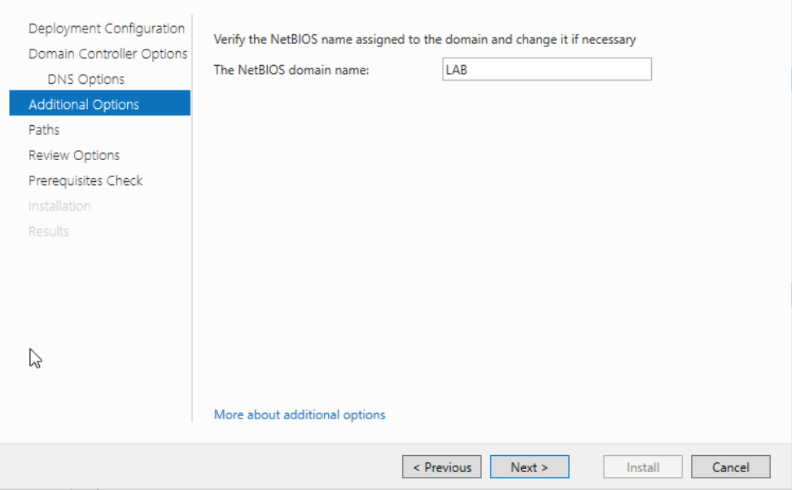
</p>

*NetBIOS domain name configured for the Active Directory lab.*

This provides the legacy NetBIOS domain identifier:

```text
LAB
```

while the sanitized DNS domain is represented as:

```text
lab.example.com
```

Domain accounts can therefore use formats such as:

```text
LAB\username
```

or:

```text
username@lab.example.com
```


### Configure AD DS Paths

The default Windows Server locations were retained for the Active Directory
database, log files, and SYSVOL.

```text
Database:  C:\WINDOWS\NTDS
Logs:      C:\WINDOWS\NTDS
SYSVOL:    C:\WINDOWS\SYSVOL
```

<p align="left">
  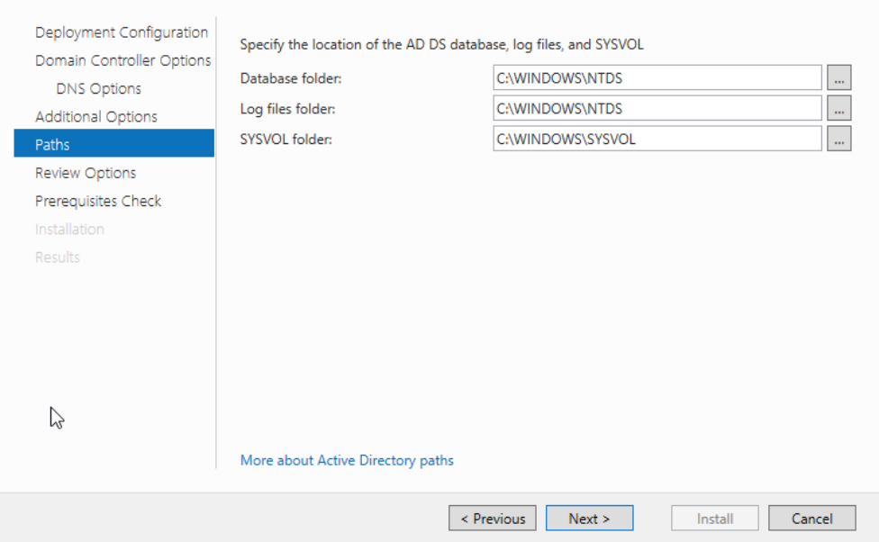
</p>

*Default AD DS database, log, and SYSVOL locations.*

Separate storage was not required for the initial homelab domain controller.


### Review Domain Configuration

Before promotion, the configuration was reviewed to confirm the intended
forest and domain settings.

<p align="left">
  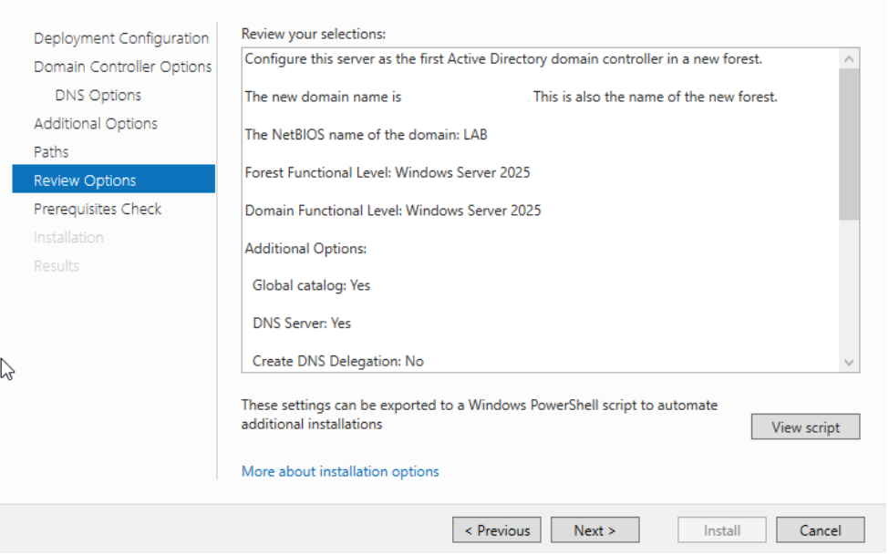
</p>

*Final configuration review before prerequisite validation and domain controller promotion.*

The sanitized configuration is represented as:

| Setting | Configuration |
|---|---|
| Forest | `lab.example.com` |
| Root Domain | `lab.example.com` |
| NetBIOS Domain | `LAB` |
| Forest Functional Level | Windows Server 2025 |
| Domain Functional Level | Windows Server 2025 |
| DNS Server | Yes |
| Global Catalog | Yes |
| Read-Only Domain Controller | No |
| DNS Delegation | No |


### Validate Promotion Prerequisites

The AD DS Configuration Wizard performed prerequisite validation before
allowing the server to be promoted.

<p align="left">
  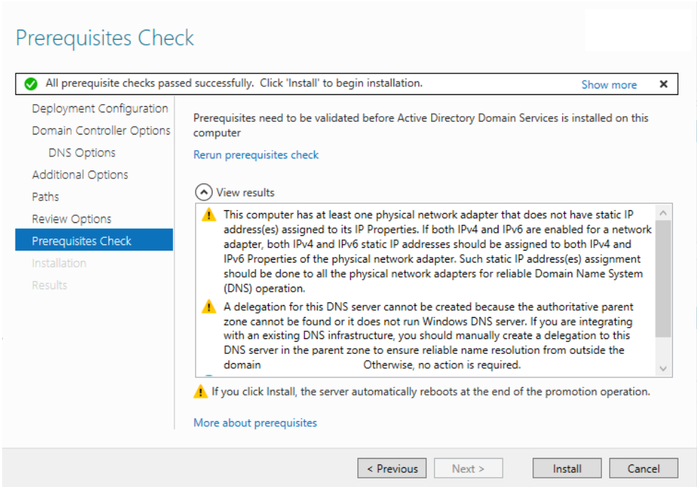
</p>

*Active Directory prerequisite checks completed successfully before promotion.*

All prerequisite checks passed successfully.

Two warnings were reported:

- IPv6 remained enabled without a manually configured static IPv6 address
- DNS delegation could not be automatically created for the parent namespace

The server already had a static IPv4 address configured. IPv6 was left
enabled, and the DNS delegation warning was expected for the internal
Active Directory DNS design.

Neither warning prevented promotion.


### Complete Domain Controller Promotion

After prerequisite validation, the server was promoted as the first domain
controller in the new forest.

The sanitized deployment is represented as:

```text
Active Directory Forest
└── lab.example.com
    │
    └── dc-lab-01
        ├── Active Directory Domain Services
        ├── DNS Server
        ├── Global Catalog
        └── Initial FSMO Roles
```

The server restarted as part of the promotion process.

After promotion completed, the AD DS Configuration Wizard confirmed that
the server was successfully configured as a domain controller.

<p align="left">
  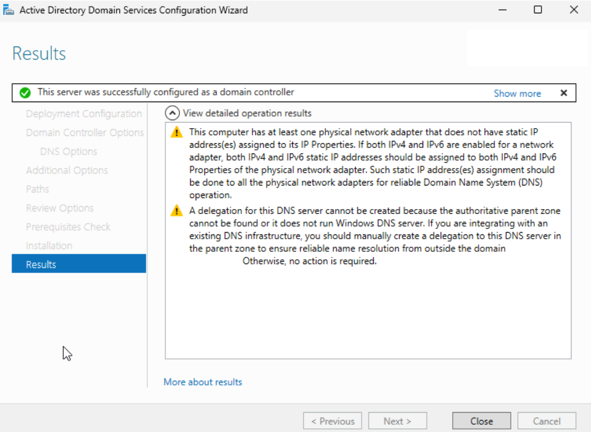
</p>

*Successful promotion of the primary server as the first domain controller in the new Active Directory forest.*

At this stage, the sanitized representation of the Active Directory
environment is:

```text
Forest:         lab.example.com
Domain:         lab.example.com
NetBIOS:        LAB
Primary DC:     dc-lab-01
DNS:            Installed
Global Catalog: Enabled
```


## Configure DHCP

**Status: ⏳ Pending**

DHCP will be installed after the newly created Active Directory and
AD-integrated DNS environment have been validated.

Planned configuration includes:

- DHCP Server role installation
- DHCP authorization in Active Directory
- IPv4 scope creation
- Address pool configuration
- Exclusion ranges
- Default gateway option
- AD DNS server options
- DNS domain option
- Lease configuration
- DHCP validation


## Post-Promotion Validation

**Status: ⏳ Pending**

The next deployment stage will validate the newly promoted domain controller
before DHCP is introduced.

Validation will include:

```text
AD DS
├── Domain available
├── Domain controller discoverable
├── SYSVOL available
├── NETLOGON available
└── FSMO roles assigned

DNS
├── AD-integrated DNS zone created
├── Domain controller records registered
├── SRV records registered
├── Internal domain resolution working
└── External DNS forwarding working
```

After AD DS and DNS validation is complete, DHCP will be installed and
configured.


## Final Validation

**Status: ⏳ Pending**

After DHCP configuration, final validation will confirm:

```text
Active Directory
├── Domain authentication working
├── Domain controller discovery working
└── Domain client can join lab.example.com

DNS
├── Client uses domain controller DNS
├── Internal AD names resolve
└── External names resolve

DHCP
├── Server authorized
├── Scope active
├── Client receives address
├── Client receives AD DNS server
├── Client receives DNS domain
└── Client receives correct gateway
```


## Deployment Status

| Stage | Status |
|---|---|
| Windows Server Deployment | ✅ Complete |
| Hostname Configuration | ✅ Complete |
| Static IP Configuration | ✅ Complete |
| Network Validation | ✅ Complete |
| AD DS Installation | ✅ Complete |
| DNS Server Installation | ✅ Complete |
| Active Directory Forest Creation | ✅ Complete |
| Domain Promotion | ✅ Complete |
| AD/DNS Validation | ⚪ Pending |
| DHCP Installation | ⚪ Pending |
| DHCP Configuration | ⚪ Pending |
| Final Validation | ⚪ Pending |
