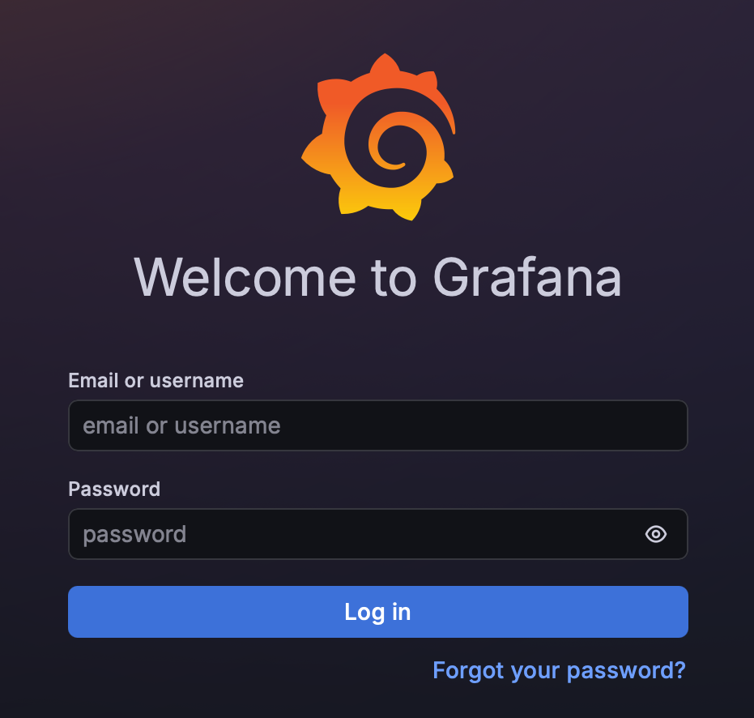
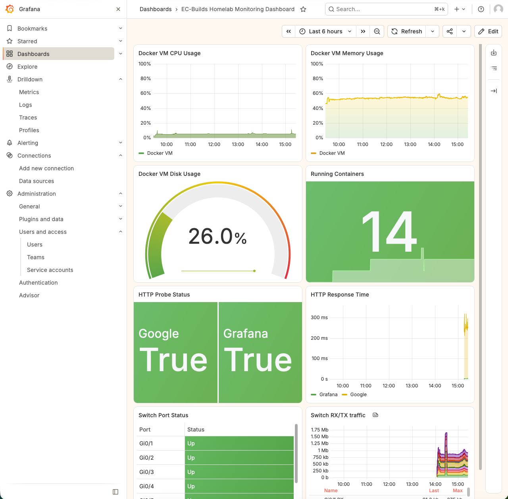

# Grafana Monitoring



A containerized monitoring and observability stack providing centralized visibility into the homelab, with **Grafana as the primary visualization and investigation interface**.

The monitoring environment collects host, container, network, availability, and log telemetry and brings those data sources together through Grafana dashboards.

Detailed information about the individual monitoring technologies is maintained separately at `docs/reference/docker/docker-monitoring-services-reference.md`


## Grafana Dashboard

The Grafana dashboard provides a centralized view of infrastructure health and availability across the homelab.

Current monitoring includes:

- Docker host CPU utilization
- Docker host memory utilization
- Docker host disk utilization
- running container count
- HTTP endpoint status
- HTTP response time
- network interface status
- network RX/TX traffic

Additional panels, telemetry sources, and monitored systems can be added as the environment expands.

### Dashboard Preview



*Centralized Grafana dashboard displaying host resource utilization, container status, endpoint availability, response times, and network interface telemetry.*


## Architecture Overview

```text
                              MONITORED SYSTEMS
                   Servers / VMs / Docker / Network / Apps
                                      │
             ┌────────────────────────┼────────────────────────┐
             │                        │                        │
             ▼                        ▼                        ▼
        Availability                Metrics                   Logs
             │                        │                        │
       ┌─────┴─────┐        ┌─────────┼──────────┐             │
       │           │        │         │          │             │
       ▼           ▼        ▼         ▼          ▼             ▼
  Uptime Kuma   Blackbox   Node     cAdvisor    SNMP          Alloy
                Exporter   Exporter   │         Exporter       │
                    │       │         │          │             ▼
                    └───────┴────┬────┴──────────┘            Loki
                                 │                             │
                                 ▼                             │
                             Prometheus                        │
                                 │                             │
                         ┌───────┴────────┐                    │
                         │                │                    │
                         ▼                ▼                    │
                    Alertmanager      Grafana ◄────────────────┘
                         │                │
                         ▼                ▼
                Email / Notifications  Dashboards
                                      Exploration
```

> This diagram represents the high-level monitoring architecture. Individual integrations may evolve as the environment expands.

Grafana uses **Prometheus** as its metrics data source and **Loki** as its log data source. Uptime Kuma operates alongside the Grafana stack as an independent availability-monitoring service.


## Monitoring Stack

| Service | Role |
|---|---|
| **Grafana** | Dashboards, visualization, and investigation |
| **Prometheus** | Metrics collection and storage |
| **Loki** | Log storage and querying |
| **Grafana Alloy** | Log collection and forwarding |
| **Alertmanager** | Alert routing and notifications |
| **Node Exporter** | Linux host metrics |
| **cAdvisor** | Docker container metrics |
| **SNMP Exporter** | Network device metrics |
| **Blackbox Exporter** | Endpoint availability metrics |
| **Uptime Kuma** | Independent availability monitoring |

Applicable containers share a dedicated Docker monitoring network, allowing services to communicate using container DNS names.

## Monitoring Coverage

The stack observes the homelab from several complementary layers:

| Layer | Example Question | Source |
|---|---|---|
| **Host** | Is the server running out of CPU, memory, or disk space? | Node Exporter |
| **Container** | Which containers are consuming resources? | cAdvisor |
| **Network** | Are network interfaces up and how much traffic are they carrying? | SNMP Exporter |
| **Availability** | Can an application or endpoint actually be reached? | Blackbox Exporter / Uptime Kuma |
| **Logs** | What happened inside a service when a problem occurred? | Alloy + Loki |

These layers provide different perspectives on the same environment. A host can appear healthy while an application is unavailable, or an availability failure can be correlated with resource utilization, network activity, or application logs in Grafana.

## Data Flow

Prometheus collects metrics from the monitoring exporters and provides the metrics data source used by Grafana.

```text
Exporters ───► Prometheus ───► Grafana
```

Container logs follow a separate telemetry path through Grafana Alloy and Loki.

```text
Docker ───► Grafana Alloy ───► Loki ───► Grafana
```

Alerting operates alongside the visualization layer:

```text
Prometheus ───► Alertmanager ───► Notifications
```

Together, these pipelines allow Grafana to provide a centralized interface for monitoring infrastructure metrics, service availability, network activity, and logs.

## Design Approach

The monitoring environment is designed around several principles:

- **Centralized visibility** — infrastructure health is accessible through a common Grafana interface.
- **Separation of responsibilities** — exporters collect specialized telemetry while Prometheus and Loki provide the primary metrics and log backends.
- **Secure monitoring** — authenticated and encrypted protocols are used where supported, and credentials are kept outside public configuration.
- **Containerized deployment** — monitoring components are isolated into individual services and connected through a dedicated Docker network.
- **Scalability** — additional hosts, network devices, applications, and telemetry sources can be added without redesigning the overall monitoring architecture.

## Monitoring Workflow

The different telemetry sources can be used together when investigating an issue.

```text
Grafana
   │
   ├── Availability ──► Is the service reachable?
   │
   ├── Host Metrics ──► Is the underlying system healthy?
   │
   ├── Container ─────► Is the application consuming unusual resources?
   │
   ├── Network ───────► Is connectivity or interface activity abnormal?
   │
   └── Logs ──────────► What happened when the issue occurred?
```

For example, an availability check may indicate that an application has become unreachable. Host and container metrics can then be reviewed for abnormal resource utilization, network telemetry can help identify connectivity issues, and centralized logs can provide additional context around the time of the failure.

This allows the monitoring environment to move beyond simply displaying system statistics and provides a structured path for troubleshooting infrastructure and application issues.

## Security

SNMPv3 provides authenticated and encrypted monitoring of supported network infrastructure.

Credentials, authentication information, notification secrets, and other sensitive values are supplied externally and are not stored in the repository.

Public configuration examples use placeholders for environment-specific information:

```text
<host-IP>
<device-IP>
<hostname>
<username>
<password>
```

## Purpose

This monitoring stack provides a centralized observability platform for the homelab and is designed to expand alongside the infrastructure.

Grafana serves as the primary monitoring interface, while Prometheus, Loki, Alloy, and the monitoring exporters provide the underlying metrics and log pipelines required to observe hosts, containers, applications, endpoints, and network devices.

The result is a monitoring architecture that provides multiple perspectives on infrastructure health while maintaining clear separation between telemetry collection, storage, visualization, and alerting.
