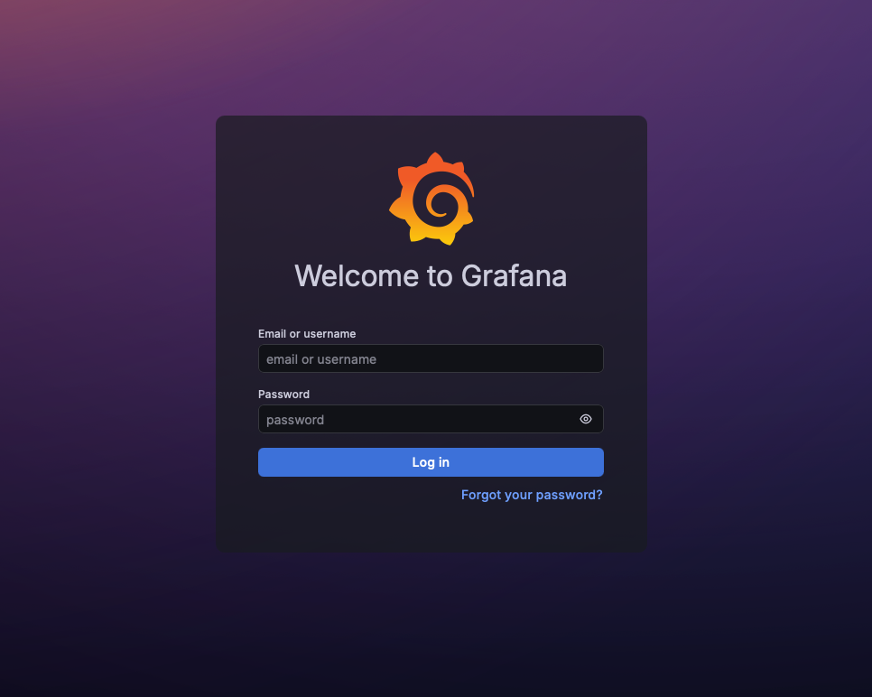
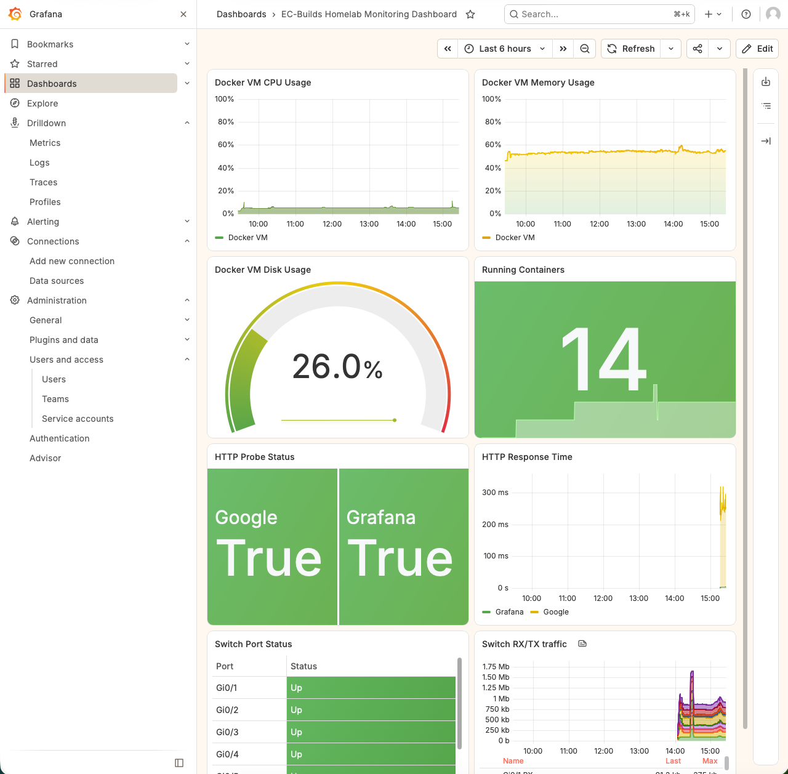

# Grafana Monitoring



Grafana provides the primary visualization and investigation interface for the homelab monitoring environment.

The containerized deployment brings together metrics from **Prometheus** and logs from **Loki**, allowing infrastructure health and system events to be investigated through a common interface.

Two primary dashboards are maintained:

| Dashboard | Purpose | Primary Data Source |
|---|---|---|
| **Metrics Overview** | Infrastructure health, performance, availability, and network telemetry | Prometheus |
| **Logs Overview** | Centralized log activity, severity, source analysis, and event investigation | Loki |

This document provides a broad overview of the Grafana deployment and its role within the Docker Lab. Detailed monitoring architecture, telemetry pipelines, queries, and operational procedures are maintained separately in the `infrastructure-monitoring` lab.

## Grafana Dashboards

Grafana separates metrics monitoring and log monitoring into two primary dashboards.

```text
                         Grafana
                            │
                ┌───────────┴───────────┐
                │                       │
                ▼                       ▼
        Metrics Overview          Logs Overview
                │                       │
                ▼                       ▼
           Prometheus                  Loki
                │                       │
                ▼                       ▼
       Metrics Monitoring         Log Monitoring
```

This separation keeps each dashboard focused while still allowing metrics and logs to be correlated during troubleshooting.

## Metrics Overview

The **Metrics Overview** dashboard provides the primary view of infrastructure health, performance, network telemetry, and service availability.

Prometheus is the primary data source for this dashboard.

Current monitoring includes:

- Docker host CPU utilization
- Docker host memory utilization
- Docker host disk utilization
- running container count
- HTTP endpoint status
- HTTP response time
- network interface status
- network RX/TX traffic

### Dashboard Preview



*Grafana Metrics Overview displaying host resource utilization, container status, endpoint availability, response times, and network telemetry.*

### Metrics Sources

Several monitoring services provide telemetry that ultimately becomes available through Prometheus.

| Source | Purpose |
|---|---|
| **Node Exporter** | Linux host metrics |
| **cAdvisor** | Docker container metrics |
| **SNMP Exporter** | Network device metrics |
| **Blackbox Exporter** | Endpoint availability and response metrics |

The general metrics flow is:

```text
Monitored Systems
       │
       ▼
    Exporters
       │
       ▼
   Prometheus
       │
       ▼
    Grafana
       │
       ▼
Metrics Overview
```

The Infrastructure Monitoring Lab contains the detailed exporter configuration, Prometheus targets, queries, and monitoring architecture.

## Logs Overview

The **Logs Overview** dashboard provides the primary interface for centralized log monitoring and event investigation.

Loki is the primary data source for this dashboard.

The dashboard provides visibility into:

- overall log activity
- errors and critical events
- warnings
- log volume over time
- events by source
- recent errors and warnings
- live and recent logs

Logs can be filtered by source, allowing the same dashboard to provide an environment-wide view or focus on an individual monitored system.

The general log visualization flow is:

```text
Log Sources
     │
     ▼
Collection / Processing
     │
     ▼
    Loki
     │
     ▼
  Grafana
     │
     ▼
Logs Overview
```

Grafana is the visualization layer in this pipeline. Log collection, rsyslog processing, Grafana Alloy processing, severity handling, Loki ingestion, LogQL queries, retention, and validation are documented in the Infrastructure Monitoring Lab.

## Data Sources

Grafana currently uses two primary monitoring data sources.

| Data Source | Telemetry | Used For |
|---|---|---|
| **Prometheus** | Metrics | Metrics Overview |
| **Loki** | Logs | Logs Overview |

This creates a simple separation between the two primary telemetry types:

```text
Metrics ───► Prometheus ───► Grafana
                                │
                                ├──► Metrics Overview
                                │
Logs ──────► Loki ──────────────┤
                                │
                                └──► Logs Overview
```

Grafana does not perform the underlying collection or long-term processing of these telemetry sources. It provides the interface used to query, visualize, and investigate the data maintained by the monitoring backends.

## Role in the Monitoring Stack

Grafana is one component of the broader monitoring environment.

| Service | Role |
|---|---|
| **Grafana** | Dashboards, visualization, and investigation |
| **Prometheus** | Metrics collection and storage |
| **Loki** | Log storage and querying |
| **Grafana Alloy** | Log collection and processing |
| **Alertmanager** | Alert routing and notifications |
| **Node Exporter** | Linux host metrics |
| **cAdvisor** | Docker container metrics |
| **SNMP Exporter** | Network device metrics |
| **Blackbox Exporter** | Endpoint availability metrics |
| **Uptime Kuma** | Independent availability monitoring |

Applicable monitoring containers share a dedicated Docker network, allowing services to communicate using container DNS names.

Grafana primarily consumes telemetry that has already been collected and processed by these supporting services.

## Architecture Overview

```text
                         MONITORED SYSTEMS
                  Hosts / Containers / Network / Apps
                               │
                 ┌─────────────┴─────────────┐
                 │                           │
                 ▼                           ▼
              Metrics                       Logs
                 │                           │
                 ▼                           ▼
             Exporters              Collection / Processing
                 │                           │
                 ▼                           ▼
            Prometheus                      Loki
                 │                           │
                 └─────────────┬─────────────┘
                               │
                               ▼
                            Grafana
                               │
                 ┌─────────────┴─────────────┐
                 │                           │
                 ▼                           ▼
         Metrics Overview              Logs Overview
```

> This diagram represents Grafana's high-level role within the monitoring environment. Detailed telemetry collection and processing architecture is maintained in the Infrastructure Monitoring Lab.

Uptime Kuma operates alongside this architecture as an independent availability-monitoring service, while Alertmanager provides alert routing for Prometheus-based monitoring.

## Monitoring Workflow

Metrics and logs provide complementary views of infrastructure behavior.

```text
                 Grafana
                    │
        ┌───────────┴───────────┐
        │                       │
        ▼                       ▼
 Metrics Overview          Logs Overview
        │                       │
        ▼                       ▼
What is happening?        Why did it happen?
        │                       │
        └───────────┬───────────┘
                    ▼
              Investigation
```

The Metrics Overview dashboard can identify resource utilization, availability, or network behavior that appears abnormal.

The Logs Overview dashboard can then provide event-level context around the same time period.

For example, an availability or performance issue identified through metrics can be investigated alongside centralized logs to determine whether configuration changes, service events, authentication activity, warnings, or errors occurred around the same time.

This allows Grafana to function as a common investigation interface without combining every telemetry type into a single dashboard.

## Design Approach

The Grafana deployment follows several principles:

- **Separate metrics and logs** — dedicated dashboards keep different telemetry types focused and readable.
- **Centralized visualization** — Prometheus metrics and Loki logs are accessible through a common interface.
- **Separation of responsibilities** — Grafana visualizes telemetry while collection and storage remain the responsibility of dedicated monitoring services.
- **Containerized deployment** — Grafana runs as an independent Docker service connected to the monitoring environment.
- **Secure configuration** — credentials, authentication information, and other sensitive values are kept outside public configuration.
- **Scalability** — additional dashboards, data sources, systems, and telemetry can be added as the environment expands.

## Security

Monitoring credentials, authentication information, notification secrets, and other sensitive values are supplied externally and are not stored in the repository.

Grafana is deployed as part of the internal monitoring environment and communicates with supported monitoring services through the dedicated Docker monitoring network.

Security configuration for individual monitoring technologies is documented with the applicable service or within the Infrastructure Monitoring Lab.

## Documentation Scope

This document describes the **Grafana Docker deployment at a high level**, including:

- Grafana's role in the monitoring stack
- the Metrics Overview dashboard
- the Logs Overview dashboard
- primary Grafana data sources
- how Grafana fits into the containerized monitoring environment

Detailed monitoring implementation is intentionally maintained outside this document.

The `infrastructure-monitoring` lab contains the detailed documentation for areas such as:

- monitoring architecture
- metrics collection
- Prometheus configuration and queries
- centralized log collection
- rsyslog integration
- Grafana Alloy processing
- Loki ingestion and querying
- log severity processing
- dashboard design
- alerting
- validation and troubleshooting

## Purpose

The Grafana deployment provides a centralized interface for observing and investigating the homelab.

Two primary dashboards divide the environment into complementary monitoring views:

```text
Metrics Overview
└── Infrastructure health and performance

Logs Overview
└── Centralized events and investigation
```

Prometheus provides the metrics backend, while Loki provides the log backend. Grafana brings both telemetry types together through a common visualization platform without assuming responsibility for their underlying collection and processing.

This keeps the Docker deployment focused on providing the Grafana service while the Infrastructure Monitoring Lab documents how the broader monitoring system is designed, implemented, and operated.
