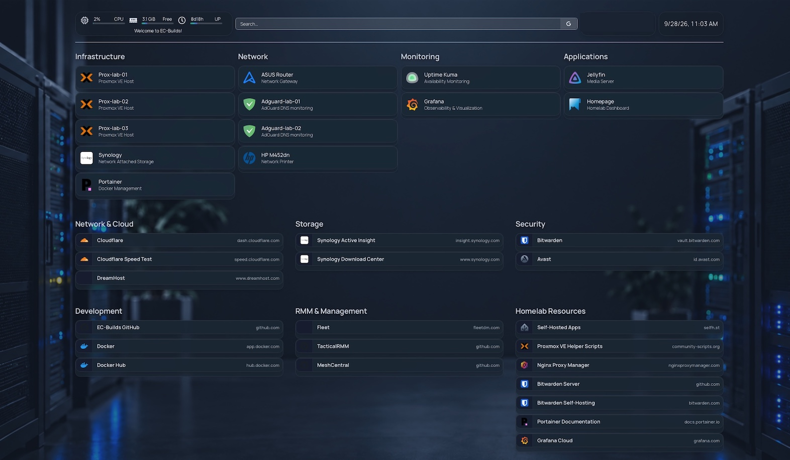

# Homepage

Homepage provides a simple web dashboard for navigating servers, infrastructure, and services throughout the homelab.

The deployment intentionally functions primarily as a centralized bookmark page rather than a monitoring or service-integration platform. Simplicity was the primary design goal.



## Deployment Overview

| Item | Configuration |
|---|---|
| Platform | Docker |
| Application | Homepage |
| Deployment Location | `/opt/docker/homepage` |
| Repository Configuration | `/configs/homepage` |
| Primary Purpose | Homelab navigation dashboard |
| Integrations | None |
| DNS | Internal CNAME |

Homepage runs as a Docker container using the standard deployment location:

```text
/opt/docker/homepage
```

Repository-managed configuration files are available at:

```text
/configs/homepage
```

## Purpose

Homepage provides a single location for quickly accessing commonly used resources without remembering individual URLs, ports, or management interfaces.

```text
Homepage
   │
   ├── Servers
   ├── Infrastructure
   ├── Monitoring
   ├── Management
   └── Applications
```

No application integrations, API connections, or monitoring widgets are currently configured. Monitoring and observability are handled separately by the dedicated monitoring stack.

## Internal DNS

An internal CNAME record was created in the lab DNS environment to provide a friendly address:

```text
homepage.example.com
```

This allows the dashboard to be accessed by name rather than IP address and follows the naming approach used for internally hosted services.

## Design Approach

Homepage is intentionally kept lightweight. It is not intended to replace monitoring, observability, or infrastructure-management platforms.

Its role is simply to provide a convenient entry point for navigating the homelab faster while requiring minimal configuration and maintenance.

A similar dashboard could also be useful in an enterprise environment as a shared administrative landing page. Infrastructure administrators could use a common internal page to access approved management consoles, monitoring platforms, documentation, and other operational tools without maintaining individual bookmark collections.

## Security Considerations

A centralized administrative dashboard can also expose useful information about the environment, including the names and locations of management interfaces. Access should therefore be limited to the administrators who need it.

In the current lab, the dashboard is intended to remain an **internal-only administrative resource**. A stronger implementation would use several layers of protection:

```text
Administrator
     │
     ▼
Trusted / Management Network
     │
     ▼
Access Control
     │
     ▼
Homepage
     │
     ▼
Administrative Services
```

Recommended controls include:

- Keep Homepage accessible only from the internal network rather than exposing it directly to the Internet.
- Restrict access to a trusted or management VLAN when network segmentation is implemented.
- Use firewall rules to permit access only from authorized administrative networks or hosts.
- Keep the internal DNS record available only through internal DNS.
- Use HTTPS for the dashboard and other management interfaces.
- If authentication is required, place Homepage behind an authenticated reverse proxy or another identity-aware access layer.
- Avoid storing credentials, API tokens, secrets, or other sensitive information directly in bookmark configuration.
- Continue treating authentication and authorization on each linked administrative service as the primary security boundary.

For the current homelab, the practical goal is to keep Homepage reachable only from trusted internal systems. As the network matures, access can be further restricted to a dedicated management network and protected through firewall policy and authenticated access.

The dashboard should provide convenient navigation without becoming a way to bypass the security controls of the systems it links to.
