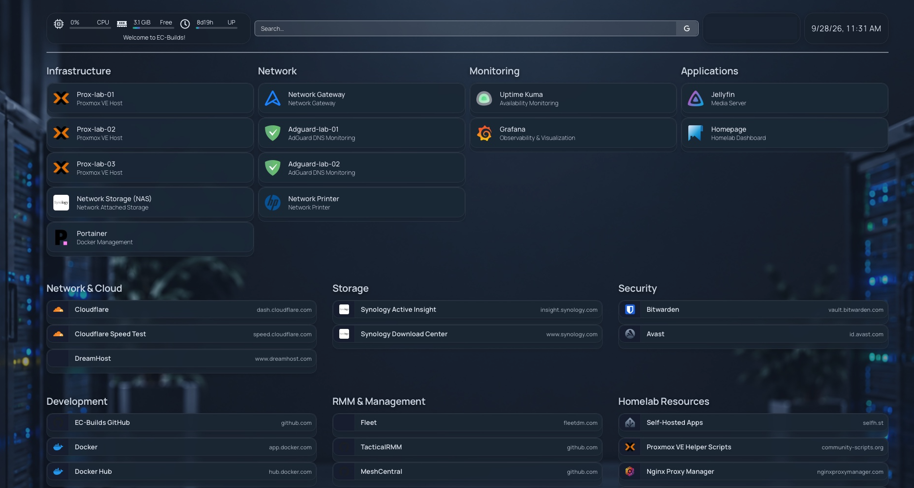

# Homepage



Homepage provides a lightweight web dashboard for navigating servers, infrastructure, and services throughout the homelab.

The deployment intentionally functions as a centralized bookmark page rather than a monitoring or service-integration platform. Simplicity was the primary design goal.

## Deployment Overview

| Item | Configuration |
|---|---|
| Platform | Docker |
| Application | Homepage |
| Deployment Location | `/opt/docker/homepage` |
| Repository Configuration | `/configs/homepage` |
| Primary Purpose | Homelab navigation dashboard |
| Integrations | None |
| Docker API Access | None |
| DNS | Internal CNAME |

Homepage runs as a Docker container using the standard deployment location:

```text
/opt/docker/homepage
```

Repository-managed configuration files are available at:

```text
/configs/homepage
```

## Purpose

Homepage provides a single location for quickly accessing commonly used resources without remembering individual URLs, ports, or management interfaces.

```text
Homepage
   │
   ├── Infrastructure
   ├── Network
   ├── Monitoring
   ├── Applications
   └── External Resources
```

No application integrations, API connections, or monitoring widgets are currently configured. Monitoring and observability are handled separately by the dedicated monitoring stack.

## Internal DNS

An internal CNAME record was created in the lab DNS environment to provide a friendly address:

```text
homepage.example.com
```

This allows the dashboard to be accessed by name rather than IP address and follows the naming approach used for internally hosted services.

## Design Approach

Homepage is intentionally kept lightweight. It is not intended to replace monitoring, observability, or infrastructure-management platforms. Its role is to provide a convenient entry point for navigating the homelab with minimal configuration and maintenance.

A similar dashboard could be useful in an enterprise environment as a shared administrative landing page. Administrators could use a common internal page to access approved management consoles, monitoring platforms, documentation, and other operational resources without maintaining separate bookmark collections.

## Security Considerations

Because an administrative dashboard can reveal information about available infrastructure and management services, access should be limited to authorized administrators.

The current and potential controls are:

| Control | Status |
|---|:---:|
| Internal-only access | Current |
| Internal DNS | Current |
| No credentials or secrets stored in bookmarks | Current |
| No Docker socket or Docker API access | Current |
| Management VLAN restriction | Planned |
| Firewall-based administrator restriction | Planned |
| HTTPS | Planned |
| Authenticated access layer | Future / Optional |

Homepage does not require access to the Docker API for its current role. Docker socket access and the previously considered socket proxy are therefore omitted from the deployment. This follows the principle of least privilege by avoiding an unnecessary connection between the dashboard and the Docker daemon.

The current deployment is intended to remain accessible only from trusted internal systems. As network segmentation is introduced, Homepage can be restricted to a dedicated management network using firewall policy.

For a more controlled environment, Homepage could also be placed behind an authenticated reverse proxy or identity-aware access layer. Each linked administrative service should continue enforcing its own authentication and authorization rather than relying on the dashboard as a security boundary.

The goal is to retain the convenience of a shared administrative landing page without exposing infrastructure information or granting the dashboard unnecessary privileges.
