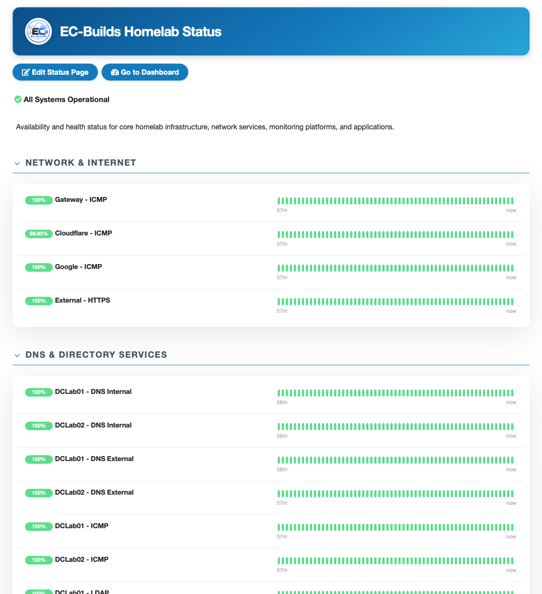

# Uptime Kuma

Availability and service monitoring platform deployed as part of the Docker Lab.

**Status: 🟢 Operational**



Uptime Kuma provides independent availability monitoring for infrastructure, network services, and applications across the homelab.

This document describes the **Uptime Kuma container and its deployment**. Monitor design, dependency layers, notification strategy, monitoring coverage, and operational use are documented separately in the `infrastructure-monitoring` lab.

## Deployment

Uptime Kuma runs as a Docker container on the Docker Monitoring Host.

| Item | Value |
|---|---|
| Deployment | Docker Compose |
| Image | `louislam/uptime-kuma:2` |
| Service directory | `/opt/docker/uptime-kuma` |
| Interface | `3001/TCP` |
| Database | SQLite |
| Restart policy | `unless-stopped` |

The service follows the standard Docker Lab directory structure:

```text
/opt/docker/uptime-kuma/
├── docker-compose.yml
└── data/
```

> [!note]
> For the example Docker Compose configuration and deployment notes, see `/configs/uptime-kuma`.

## Configuration

Uptime Kuma is configured primarily through its web interface.

The container provides the platform used to configure:

- availability monitors
- HTTP/HTTPS checks
- ping checks
- TCP port checks
- DNS checks
- notification integrations
- status pages

Detailed monitor configuration and monitoring strategy are maintained in the Infrastructure Monitoring Lab rather than duplicated here.

## Persistent Storage

Uptime Kuma stores its application configuration and monitoring data in persistent storage on the Docker host.

The persistent data includes information such as:

- application configuration
- monitor definitions
- monitoring history
- notification configuration
- SQLite database data

Persistent storage allows the Uptime Kuma deployment to survive container recreation and image updates.

The application data directory should be included in the appropriate Docker host backup strategy.

## Service Access

Uptime Kuma exposes its web interface on:

```text
3001/TCP
```

The web interface provides access to monitor configuration, monitoring history, status pages, and application administration.

Environment-specific addresses and internal DNS names are intentionally omitted from public documentation.

## Monitoring Integration

The Uptime Kuma container provides the dedicated availability-monitoring service within the broader monitoring environment.

```text
Infrastructure / Services / Applications
                  │
                  ▼
             Uptime Kuma
                  │
                  ▼
       Availability Monitoring
```

Uptime Kuma operates independently from the Prometheus and Loki monitoring pipelines.

```text
Uptime Kuma ───────► Availability

Prometheus ────────► Metrics

Loki ──────────────► Logs

                      │
                      ▼
                   Grafana
```

This separation allows availability monitoring to remain useful even when other monitoring components are unavailable.

The Infrastructure Monitoring Lab documents the detailed Uptime Kuma monitoring strategy, including:

- dependency-based monitoring
- LAN and Internet monitoring
- DNS monitoring
- infrastructure monitoring
- platform service monitoring
- application monitoring
- monitor settings
- notification strategy
- monitoring coverage
- troubleshooting workflows

## Notifications

Uptime Kuma supports external notification integrations for availability alerts.

Notification endpoints and secrets are configured within the application and are not stored in public repository documentation.

Detailed notification behavior and alerting strategy are documented in the Infrastructure Monitoring Lab.

## Security

Uptime Kuma is deployed as an internal monitoring service.

Security considerations include:

- restricting administrative access to trusted users
- keeping the management interface internal
- protecting persistent application data
- keeping notification secrets and webhook URLs out of the repository
- avoiding environment-specific addresses and internal identifiers in public documentation

Credentials, notification secrets, private infrastructure addresses, and other sensitive configuration are not stored in the public repository.

## References

For detailed monitoring implementation and operations, see:

- `infrastructure-monitoring` — Uptime Kuma monitoring strategy, dependency layers, monitor configuration, notifications, and troubleshooting
- `/configs/uptime-kuma` — example Docker Compose configuration and deployment notes
- applicable infrastructure documentation — service-specific monitoring considerations

This document is intentionally limited to the **Uptime Kuma Docker container and its deployment**.
