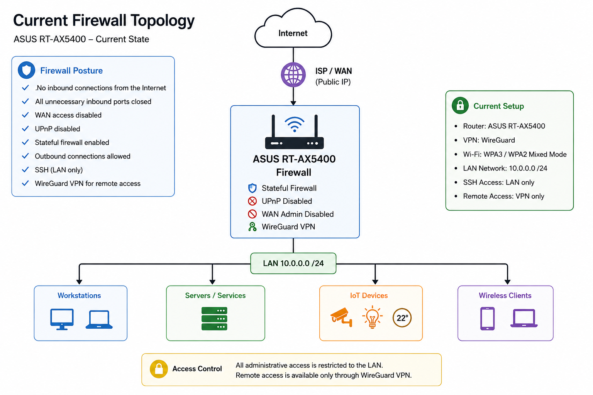

# 🔥 Firewall

**Status: ✅ Current Configuration**

This document describes the current firewall configuration used to secure the home network.

## Overview

The ASUS RT-AX5400 currently serves as the network firewall and perimeter security device.

The firewall follows a **default deny** approach for unsolicited inbound traffic while allowing outbound connections initiated from the LAN.

## Current Configuration

#### WAN Security

- No inbound connections are permitted from the Internet.
- All unnecessary inbound ports are closed.
- Remote administration from the WAN is disabled.
- UPnP is disabled.

#### Remote Access

- WireGuard VPN provides secure remote access to the home network.
- Administrative access is available only after connecting through the VPN.

#### LAN Management

- SSH management is permitted only from the local network (LAN).
- Administrative interfaces are not exposed to the Internet.

## Security Principles

- Default deny for unsolicited inbound traffic
- Least privilege administrative access
- Minimize exposed services
- Secure remote administration through VPN

## Planned Improvements

- Replace the ASUS router with OPNsense or pfSense
- Implement VLAN segmentation
- Configure inter-VLAN firewall rules
- Enable Suricata IDS/IPS
- Centralize firewall and IDS logs
- Implement egress filtering where appropriate

## Security Note

All firewall configurations committed to this repository are sanitized. Public IP addresses, VPN keys, certificates, passwords, and other sensitive information are never included.
