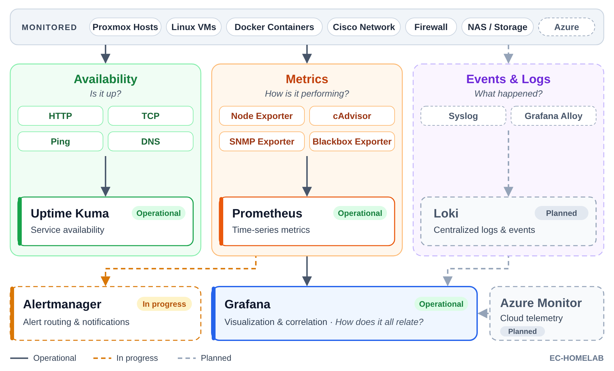

# 📊 Infrastructure Monitoring

**Status:** 🟢 Operational

Availability monitoring today, evolving toward full infrastructure observability through metrics, logging, alerting, and dashboards.

## Monitoring Architecture



*Figure 1. High-level architecture of the Enterprise Homelab monitoring platform, illustrating the flow of availability checks, metrics, logs, visualization, alerting, and notifications.*

## Objectives

- Monitor the health and availability of infrastructure and services
- Collect metrics from hosts, containers, and network devices
- Build dashboards for infrastructure visibility
- Alert on actionable events while avoiding alert fatigue
- Extend monitoring to Azure resources

## Technologies

| Layer | Technology | Status | Primary Purpose |
|---------|------------|:------:|-----------------|
| Uptime Monitoring | Uptime Kuma | 🟢 | Availability and uptime monitoring |
| Metrics Collection | Prometheus | ⚪ | Central metrics collection, storage, and querying |
| Host Monitoring | node_exporter | ⚪ | CPU, memory, disk, filesystem, and network metrics |
| Container Monitoring | cAdvisor | ⚪ | Container performance, resource usage, and health |
| Network Monitoring | SNMP Exporter | ⚪ | Network device metrics via SNMP |
| Visualization | Grafana | ⚪ | Dashboards and observability visualization |
| Log Collection | Promtail | ⚪ | Collects and forwards logs to Loki |
| Log Aggregation | Loki | ⚪ | Centralized log storage and querying |
| Alerting | Alertmanager | ⚪ | Alert routing, grouping, and notification management |
| Notifications | ntfy / Webhooks | ⚪ | Push notifications and third-party integrations |
| Cloud Monitoring | Azure Monitor | ⚪ | Native Azure metrics, logs, alerts, and insights |

## Current Capabilities

| Capability | Status | Description |
|------------|:------:|-------------|
| Uptime Monitoring | 🟢 | Monitor the availability of infrastructure and services using Uptime Kuma. |
| Metrics Collection | ⚪ | Collect infrastructure metrics with Prometheus and exporters. |
| Dashboards | ⚪ | Visualize infrastructure health with Grafana dashboards. |
| Centralized Logging | ⚪ | Aggregate and query logs using Loki and Promtail. |
| Alerting | ⚪ | Route and manage alerts with Alertmanager. |
| Notifications | ⚪ | Send notifications through ntfy and webhooks. |
| Cloud Monitoring | ⚪ | Monitor Azure resources with Azure Monitor. |

## Key Tasks

- [x] Deploy Uptime Kuma
- [ ] Deploy the remaining monitoring stack
- [ ] Install exporters on all hosts and VMs
- [ ] Monitor the Proxmox host (CPU, memory, storage, VM status)
- [ ] Build dashboards for host health, containers, network throughput, and storage
- [ ] Centralize logs with Loki
- [ ] Configure alert rules and notification routing
- [ ] Monitor TLS certificate and domain expiration
- [ ] Test alerting by simulating failures
- [ ] Integrate Azure Monitor for cloud resources

## Folder Structure

```text
infrastructure-monitoring/
├── diagrams/
├── README.md
├── implementation-roadmap.md
├── lessons-learned.md
├── monitoring-strategy.md
├── retention-policy.md
└── uptime-kuma.md
```
