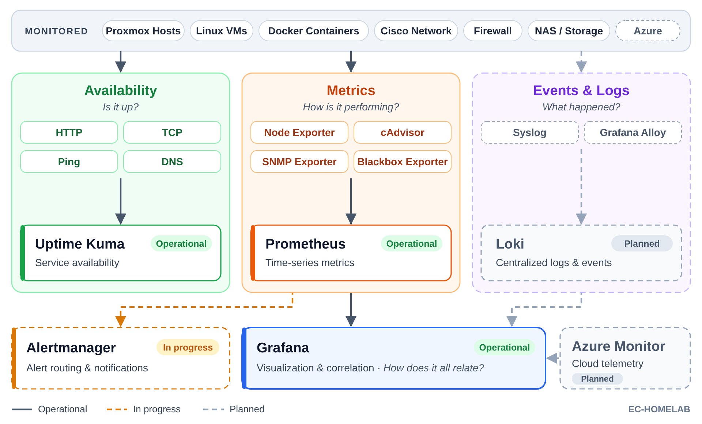

# 📊 Infrastructure Monitoring

**Status: 🟢 Operational**

Centralized monitoring and observability for the Enterprise Homelab, providing visibility into infrastructure availability, performance, events, and logs.

The lab is organized around three complementary monitoring capabilities:

> **Availability** → Is it working?  
> **Metrics** → How is it performing?  
> **Logs** → What happened?

Grafana provides centralized visualization and investigation across the metrics and logging layers.

## Monitoring Architecture



*Figure 1. High-level monitoring and observability architecture.*

The monitoring environment separates telemetry by operational purpose:

| Capability | Primary Components | Purpose |
|---|---|---|
| **Availability** | Uptime Kuma | Service reachability, synthetic checks, outage detection, and notifications |
| **Metrics** | Prometheus, Node Exporter, cAdvisor, SNMP Exporter, Blackbox Exporter | Infrastructure health, performance, utilization, and endpoint telemetry |
| **Logs** | rsyslog, Grafana Alloy, Loki | Centralized collection, processing, storage, and querying of infrastructure and application events |
| **Visualization** | Grafana | Dashboards and investigation across metrics and logs |
| **Alerting** | Uptime Kuma, Prometheus, Alertmanager | Detection and notification of actionable infrastructure conditions |

Detailed component placement, telemetry flows, and failure domains are documented in [`architecture.md`](./architecture.md).

## Monitoring Model

Each monitoring capability answers a different operational question.

```text
Infrastructure
      │
      ├──► Availability ──► Is it working?
      │       │
      │       └── Uptime Kuma
      │
      ├──► Metrics ───────► How is it performing?
      │       │
      │       ├── Exporters
      │       └── Prometheus
      │
      └──► Logs ──────────► What happened?
              │
              ├── rsyslog
              ├── Alloy
              └── Loki

Metrics ──────────────┐
                      ├──► Grafana
Logs ─────────────────┘
```

The layers complement rather than replace one another. Availability identifies impact, metrics provide performance and health context, and logs provide event-level evidence for investigation.

## Objectives

- Detect infrastructure and service outages
- Monitor infrastructure health and performance
- Collect metrics from hosts, containers, endpoints, and network devices
- Centralize infrastructure and application logs
- Monitor network infrastructure through SNMP
- Provide dashboards for operational visibility
- Correlate metrics and logs during troubleshooting
- Generate actionable notifications and alerts
- Maintain a monitoring architecture that can expand as the environment grows

## Monitoring Stack

**Legend:** 🟢 Operational · 🟡 In Progress · ⚪ Planned

| Component | Capability | Purpose | Status |
|---|---|---|:---:|
| Uptime Kuma | Availability | Availability and synthetic monitoring | 🟢 |
| Prometheus | Metrics | Metrics collection and time-series storage | 🟢 |
| Node Exporter | Metrics | Linux host metrics | 🟢 |
| cAdvisor | Metrics | Container metrics | 🟢 |
| SNMP Exporter | Metrics | Network device metrics | 🟢 |
| Blackbox Exporter | Metrics / Availability | Endpoint probing | 🟢 |
| rsyslog | Logs | Central syslog collection | 🟢 |
| Grafana Alloy | Logs | Log collection and processing | 🟢 |
| Loki | Logs | Centralized log storage and querying | 🟢 |
| Grafana | Visualization | Metrics and log visualization | 🟢 |
| Discord Webhook | Notifications | Uptime Kuma availability notifications | 🟢 |
| Alertmanager | Alerting | Metrics alert routing and management | 🟡 |
| ntfy / Webhooks | Notifications | Alertmanager notification delivery | ⚪ |
| Azure Monitor | Cloud | Azure monitoring and telemetry | ⚪ |

## Monitoring Capabilities

### Availability Monitoring

Uptime Kuma provides independent availability and synthetic monitoring across network dependencies, infrastructure, platform services, and applications.

Monitoring is organized by dependency layer to help distinguish an application failure from a broader infrastructure problem.

See [`availability-monitoring.md`](./availability-monitoring.md) for:

- dependency-based monitoring
- LAN and Internet monitoring
- DNS monitoring
- infrastructure and service checks
- application monitoring
- notification strategy
- availability troubleshooting

### Metrics Monitoring

Prometheus provides centralized metrics collection from infrastructure and services.

Metrics are collected through exporters selected for each type of system:

```text
Linux Hosts ───────► Node Exporter ────┐
Containers ────────► cAdvisor ─────────┤
Network Devices ───► SNMP Exporter ────┼──► Prometheus ───► Grafana
Endpoints ──────────► Blackbox Exporter ┘
```

See [`metric-monitoring.md`](./metric-monitoring.md) for:

- host metrics
- container metrics
- network telemetry
- endpoint probing
- Prometheus collection
- Grafana Metrics Overview
- metrics alerting

### Log Monitoring

Infrastructure and application events are centralized through the logging pipeline.

```text
Infrastructure Devices
        │
        ▼
     rsyslog
        │
        ▼
Persistent Logs
        │
        ▼
  Grafana Alloy
        │
        ▼
       Loki
        │
        ▼
     Grafana
```

rsyslog provides traditional syslog collection, Alloy processes and forwards log streams, Loki stores and queries logs, and Grafana provides visualization and investigation.

See [`log-monitoring.md`](./log-monitoring.md) for:

- centralized syslog
- log collection and processing
- source and severity labeling
- Loki storage and querying
- LogQL
- Grafana Logs Overview
- log troubleshooting

## Troubleshooting Model

The monitoring capabilities are designed to be used together during incident investigation.

For example:

```text
Service Alert
     │
     ▼
Availability
Is the service reachable?
     │
     ▼
Metrics
What changed in system behavior?
     │
     ▼
Logs
What events occurred around the failure?
     │
     ▼
Investigation
```

A single infrastructure failure may therefore produce several complementary signals:

| Signal | Monitoring Capability | Example |
|---|---|---|
| Service becomes unreachable | Availability | Uptime Kuma detects outage |
| Resource or network behavior changes | Metrics | Prometheus records telemetry change |
| System generates an event | Logs | Event appears in Loki |
| Administrator investigates | Visualization | Grafana provides metrics and log context |

Correlation does not necessarily establish root cause, but it provides the context needed to investigate efficiently.

## Alerting

Alerting is treated as a function across the monitoring capabilities rather than as a separate telemetry layer.

```text
Uptime Kuma
    │
    └──► Availability Notifications

Prometheus
    │
    └──► Alert Rules
             │
             ▼
        Alertmanager
             │
             ▼
        Notifications
```

Uptime Kuma currently provides remote availability notifications.

Prometheus and Alertmanager provide the foundation for metrics-based alerting as thresholds and baselines are developed.

## Current State

The core observability platform is operational:

```text
Availability   🟢
Metrics        🟢
Logs           🟢
Visualization  🟢
Alerting       🟡
Cloud          ⚪
```

Current work is focused on expanding monitoring coverage, refining dashboards and baselines, and developing actionable alerting.


## Next Steps

- 🟡 Complete Alertmanager routing and notification delivery
- 🟡 Expand metrics coverage across infrastructure
- 🟡 Refine Grafana Metrics Overview
- 🟡 Establish useful alert thresholds from observed baselines
- ⚪ Expand application and infrastructure log coverage
- ⚪ Define and validate telemetry retention policies
- ⚪ Integrate Azure monitoring where applicable
- ⚪ Continue separating monitoring dependencies where practical

## Repository Structure

```text
infrastructure-monitoring/
├── diagrams/
│   └── monitoring-architecture.png
├── README.md
├── architecture.md
├── availability-monitoring.md
├── metric-monitoring.md
├── logs-monitoring.md
├── monitoring-strategy.md
├── retention-policy.md
├── implementation-roadmap.md
└── lessons-learned.md
```
