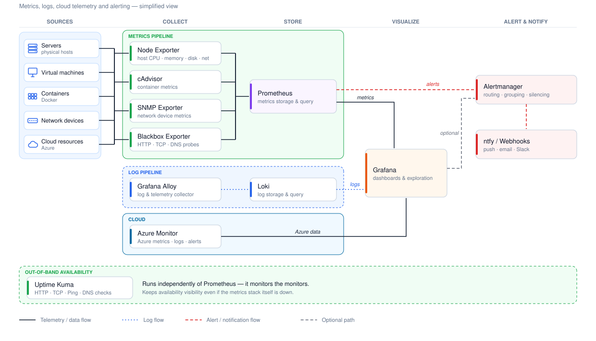

# Monitoring Architecture

The monitoring platform provides centralized visibility into the health, availability, and performance of the homelab infrastructure through independent availability monitoring, metrics collection, centralized logging, dashboards, and alerting.

## Architecture Overview

*Figure 1. High-level monitoring architecture showing metric, log, availability, visualization, and alerting flows across the platform.*

## Components

| Component | Purpose |
|-----------|---------|
| Uptime Kuma | Independent availability monitoring |
| Prometheus | Metrics collection, storage, and querying |
| Node Exporter | Linux host metrics |
| cAdvisor | Docker container metrics |
| SNMP Exporter | Network device metrics |
| Blackbox Exporter | HTTP, TCP, DNS, and endpoint probing |
| Grafana | Dashboards, visualization, and analysis |
| Grafana Alloy | Telemetry and log collection |
| Loki | Centralized log storage and querying |
| Alertmanager | Alert routing, grouping, and silencing |
| ntfy / Webhooks | Notifications and integrations |
| Azure Monitor | Azure metrics, logs, alerts, and insights |

## Data Flow

Infrastructure metrics are collected through purpose-specific exporters and scraped by Prometheus. Grafana queries Prometheus for visualization and analysis, while Prometheus forwards configured alerts to Alertmanager for routing to ntfy and other notification endpoints.

Logs are collected by Grafana Alloy and stored in Loki, which Grafana queries alongside Prometheus metrics. This provides centralized access to both metrics and logs through the Grafana interface while keeping their collection and storage responsibilities separate.

Uptime Kuma operates independently from the Prometheus monitoring stack to provide availability checks for infrastructure and services. Keeping availability monitoring separate provides an additional monitoring path that does not depend on the primary metrics pipeline.

Azure resources are monitored through Azure Monitor and can be queried or visualized through Grafana as the cloud environment expands.

## Design Principles

- Build monitoring in layers.
- Keep availability monitoring independent where practical.
- Monitor infrastructure before expanding into application telemetry.
- Alert only on actionable conditions.
- Separate metrics, logs, and alerting responsibilities.
- Add telemetry sources incrementally as the environment grows.
