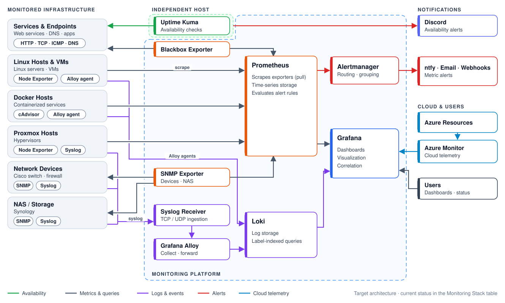

# Monitoring Architecture

This document describes how the observability layers defined in the README are implemented and connected: where each component runs, how telemetry flows between them, how alerts are delivered, and what happens when a monitoring component fails.

**Legend:** 🟢 Operational · 🟡 In Progress · ⚪ Planned

## Architecture Overview



*Figure 1. Detailed monitoring architecture showing availability, metrics, events and logs, visualization, cloud telemetry, and alerting flows.*


## Component Placement

| Component | Runs On | Deployment | Status |
|-----------|---------|------------|:------:|
| Uptime Kuma | Docker Monitoring Host (prox-lab-02) | Docker container | 🟢 |
| Prometheus | Docker Monitoring Host (prox-lab-02) | Docker container | 🟢 |
| Grafana | Docker Monitoring Host (prox-lab-02) | Docker container | 🟢 |
| Alertmanager | Docker Monitoring Host (prox-lab-02) | Docker container | 🟡 |
| SNMP Exporter | Docker Monitoring Host (prox-lab-02) | Docker container | 🟢 |
| Blackbox Exporter | Docker Monitoring Host (prox-lab-02) | Docker container | 🟢 |
| Node Exporter | Each monitored Linux host and VM | Agent / container | 🟢 |
| cAdvisor | Each Docker host | Docker container | 🟢 |
| Loki | Docker Monitoring Host (prox-lab-02) | Docker container | ⚪ |
| Grafana Alloy | Linux and Docker hosts | Agent | ⚪ |
| rsyslog | Docker Monitoring Host (prox-lab-02) | Docker container | 🟢 |
| Azure Monitor | Azure (SaaS) | Grafana data source | ⚪ |

The core monitoring services are consolidated on a single Docker Monitoring Host. This simplifies management, but it creates a shared failure domain (see [Failure Domains](#failure-domains)).


## Data Flow

### Availability 🟢

Uptime Kuma performs direct checks against infrastructure and services, independent of the Prometheus pipeline.

```text
Infrastructure & Services
          ▲
          │  HTTP/HTTPS · TCP · ICMP · DNS
          │
     Uptime Kuma ──> Availability state & status pages
```

Blackbox Exporter also probes endpoints, but its results are stored in Prometheus as metrics. Uptime Kuma answers *is it up?*; Blackbox data supports trending and metric-based alert rules.

### Metrics 🟢

Exporters expose metrics that Prometheus scrapes on a pull model.

```text
Linux Hosts ──────> Node Exporter ────┐
Docker Hosts ─────> cAdvisor ─────────┤
Network Devices ──> SNMP Exporter ────┼──> Prometheus ──> Grafana
Endpoints ────────> Blackbox Exporter ┘
```

SNMP Exporter and Blackbox Exporter act as proxies: Prometheus scrapes the exporter, which then queries the target device or endpoint on Prometheus's behalf.

### Events & Logs ⚪

The planned logging pipeline supports both agent-based collection and centralized syslog collection.

```text
Linux / Docker / Applications ──> Grafana Alloy ─────────┐
                                                         ├──> Loki ──> Grafana
Proxmox / Cisco / Firewall / NAS ──> rsyslog ──> Alloy ──┘
```

Alloy is used where an agent can be installed. Devices and systems that forward syslog send events to the central rsyslog collector, which feeds the Alloy and Loki logging pipeline. Both paths are used together rather than as alternatives.

### Visualization & Correlation 🟢

Grafana queries each telemetry store directly; it does not store telemetry itself.

```text
Prometheus ────── Metrics 🟢 ──┐
Loki ──────────── Logs ⚪ ─────┼──> Grafana
Azure Monitor ─── Cloud ⚪ ────┘
```

### Cloud Monitoring ⚪

Azure resources are monitored through Azure Monitor rather than a Prometheus exporter. Grafana reads Azure Monitor as a data source, so cloud metrics and logs appear alongside on-premises telemetry without passing through Prometheus.

```text
Azure Resources ──> Azure Monitor ──> Grafana
                    (metrics, logs, alerts)
```


## Alerting

Availability and metric alerting use separate paths so that availability notifications do not depend on the Prometheus and Alertmanager pipeline.

```text
Availability Alerting 🟢           Metric Alerting 🟡

Uptime Kuma                        Prometheus (alert rules)
     │                                  │
     ▼                                  ▼
Discord Webhook                    Alertmanager
     │                                  │
     ▼                                  ├──> ntfy      ⚪
  Discord                               ├──> Email     ⚪
                                        └──> Webhooks  ⚪
```

- **Uptime Kuma → Discord** sends down and recovery notifications as soon as a check fails or recovers.
- **Prometheus → Alertmanager** evaluates metric-based rules, such as disk usage, memory pressure, or a failed scrape, and Alertmanager handles grouping, routing, and silencing to reduce noise.
- **Grafana alerting** may be added later for conditions that depend on data sources Prometheus does not hold, such as Loki or Azure Monitor.


## Ports & Protocols

Default ports are listed; adjust if customized.

| Source | Destination | Port / Protocol | Purpose |
|--------|-------------|-----------------|---------|
| Prometheus | Node Exporter | 9100/TCP | Host metrics scrape |
| Prometheus | cAdvisor | 8080/TCP | Container metrics scrape |
| Prometheus | SNMP Exporter | 9116/TCP | SNMP metrics scrape |
| SNMP Exporter | Network devices | 161/UDP | SNMP polling |
| Prometheus | Blackbox Exporter | 9115/TCP | Probe results scrape |
| Prometheus | Alertmanager | 9093/TCP | Alert delivery |
| Grafana | Prometheus | 9090/TCP | Metrics queries |
| Grafana | Loki | 3100/TCP | Log queries ⚪ |
| Alloy | Loki | 3100/TCP | Log push ⚪ |
| Network devices / hosts | rsyslog | 514/UDP or TCP | Syslog forwarding 🟢 |
| Users | Grafana | 3000/TCP | Dashboards |
| Users | Uptime Kuma | 3001/TCP | Status and management |
| Uptime Kuma | Discord | 443/TCP | Webhook notifications |
| Grafana | Azure Monitor | 443/TCP | Cloud data source ⚪ |


## Failure Domains

| Failure | Impact | Still Working |
|---------|--------|---------------|
| Prometheus down | Metrics collection and metric alerts stop | Uptime Kuma checks and Discord alerts |
| Alertmanager down | Metric alerts are evaluated but not delivered | Uptime Kuma checks and Discord alerts |
| Grafana down | Dashboards unavailable | Collection, storage, and all alerting |
| Uptime Kuma down | Availability checks and Discord alerts stop | Prometheus metrics and Blackbox probes |
| Internet outage | Discord and external notifications cannot be delivered | Local collection and dashboards |
| **Docker Monitoring Host or prox-lab-02 down** | **All monitoring and both alerting paths stop** | **Nothing — no notification is sent** |

> **Known limitation:** Uptime Kuma is independent of Prometheus at the application level but shares the same host with it. Losing that host removes both alerting paths at the same moment it would most need to alert. Planned mitigation is to run Uptime Kuma on a different Proxmox host or on a device outside the cluster, and optionally to add an external heartbeat check that alerts when the monitoring host stops reporting.


## Design Principles

- **Build monitoring in layers.** Availability, metrics, logs, visualization, and alerting serve different operational purposes.
- **Keep availability monitoring and alerting independent.** Uptime Kuma and its Discord notifications should not depend on Prometheus, Alertmanager, or the host they run on.
- **Separate metrics from events and logs.** Prometheus shows how infrastructure is running; Loki explains what happened.
- **Centralize visualization, not storage.** Grafana queries each telemetry store directly rather than duplicating data.
- **Prefer purpose-specific collection.** Use exporters for metrics, SNMP for network telemetry, rsyslog for centralized syslog collection, and Alloy where an agent can run.
- **Monitor infrastructure before applications.** Establish visibility into hosts, networks, containers, and core services first.
- **Alert only on actionable conditions.** Every notification should require investigation or intervention.
- **Add telemetry incrementally.** Expand monitoring as infrastructure and operational needs grow.
- **Keep target state distinguishable from deployed state.** Planned components are marked as planned wherever they appear.
