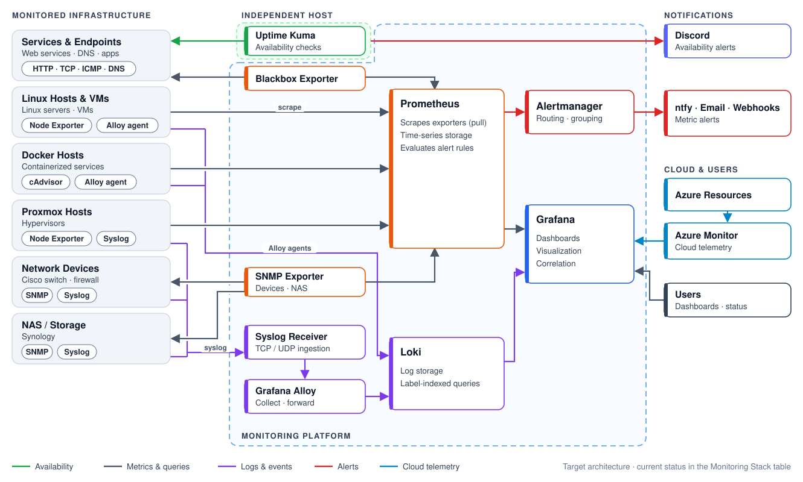

# Monitoring Architecture

This document describes how the monitoring capabilities defined in the Infrastructure Monitoring Lab are implemented and connected: where components run, how telemetry flows between them, how alerts are delivered, and how component failures affect monitoring.

**Legend:** 🟢 Operational · 🟡 In Progress · ⚪ Planned

## Architecture Overview



*Figure 1. Target monitoring architecture showing availability, metrics, logs, visualization, cloud telemetry, and alerting flows.*

The architecture is organized around three primary telemetry capabilities:

```text
Availability ──► Uptime Kuma

Metrics ───────► Exporters ──► Prometheus ──┐
                                            ├──► Grafana
Logs ──────────► rsyslog / Alloy ──► Loki ──┘

Alerting ──────► Uptime Kuma / Prometheus / Alertmanager
```

Detailed monitoring strategy and capability-specific implementation are documented separately.

## Component Placement

| Component | Runs On | Deployment | Status |
|---|---|---|:---:|
| Uptime Kuma | Docker Monitoring Host | Docker container | 🟢 |
| Prometheus | Docker Monitoring Host | Docker container | 🟢 |
| Grafana | Docker Monitoring Host | Docker container | 🟢 |
| Alertmanager | Docker Monitoring Host | Docker container | 🟡 |
| SNMP Exporter | Docker Monitoring Host | Docker container | 🟢 |
| Blackbox Exporter | Docker Monitoring Host | Docker container | 🟢 |
| Node Exporter | Monitored Linux hosts and VMs | Agent / container | 🟢 |
| cAdvisor | Docker hosts | Docker container | 🟢 |
| Loki | Docker Monitoring Host | Docker container | 🟢 |
| Grafana Alloy | Applicable Linux / Docker hosts | Agent / container | 🟢 |
| rsyslog | Docker Monitoring Host | Docker container | 🟢 |
| Azure Monitor | Azure | Cloud service / Grafana data source | ⚪ |

The core monitoring services are currently consolidated on a single Docker Monitoring Host.

This simplifies deployment and management but creates a shared monitoring failure domain. Separating critical availability monitoring from the primary monitoring host remains a future resilience improvement.

## Data Flow

### Availability 🟢

Uptime Kuma performs direct availability and synthetic checks against infrastructure and services independently of the Prometheus metrics pipeline.

```text
Infrastructure / Services / Applications
                    ▲
                    │
          HTTP · TCP · ICMP · DNS
                    │
               Uptime Kuma
                    │
                    ▼
          Availability State
```

Blackbox Exporter also performs endpoint probes, but its results are collected by Prometheus as metrics.

The two systems therefore serve complementary purposes:

```text
Uptime Kuma       → Current availability and notifications
Blackbox Exporter → Probe metrics, trends, and metric-based alerting
```

Detailed monitor organization and dependency-based monitoring are documented in `availability-monitoring.md`.

### Metrics 🟢

Prometheus uses a pull-based model to scrape metrics from exporters.

```text
Linux Hosts ───────► Node Exporter ────┐
Docker Hosts ──────► cAdvisor ─────────┤
Network Devices ───► SNMP Exporter ────┼──► Prometheus ───► Grafana
Endpoints ─────────► Blackbox Exporter ┘
```

Node Exporter and cAdvisor expose metrics directly from monitored systems.

SNMP Exporter and Blackbox Exporter operate as intermediaries:

```text
Prometheus
    │
    ▼
Exporter
    │
    ▼
Target
```

Prometheus stores the resulting time-series data and Grafana queries Prometheus for visualization.

Detailed metrics collection and dashboard implementation are documented in `metric-monitoring.md`.

### Logs 🟢

Centralized logging supports both traditional syslog collection and direct Alloy collection.

```text
Linux / Docker / Applications ──► Grafana Alloy ─────────┐
                                                          │
                                                          ▼
                                                         Loki ──► Grafana
                                                          ▲
                                                          │
Infrastructure / Network ──► rsyslog ──► Log Files ──► Alloy
```

The two collection paths serve different types of sources.

Systems capable of running an agent can use Alloy directly where appropriate.

Infrastructure that supports standard syslog forwarding sends events to the central rsyslog collector. rsyslog normalizes and persists those events before Alloy processes and forwards them to Loki.

```text
Syslog Source
     │
     ▼
  rsyslog
     │
     ▼
Persistent Log Files
     │
     ▼
Grafana Alloy
     │
     ▼
    Loki
     │
     ▼
  Grafana
```

The persistent file layer separates syslog ingestion from downstream log processing and provides local retention independently of Loki.

Detailed log processing, labels, queries, dashboards, and validation are documented in `logs-monitoring.md`.

### Visualization 🟢

Grafana provides centralized visualization and investigation but does not serve as the primary telemetry store.

```text
Prometheus ────── Metrics 🟢 ──┐
                               │
Loki ──────────── Logs 🟢 ─────┼──► Grafana
                               │
Azure Monitor ─── Cloud ⚪ ─────┘
```

Prometheus remains responsible for metrics storage, while Loki stores centralized logs.

Grafana queries each data source independently and provides dashboards for investigating infrastructure behavior across telemetry types.

### Cloud Monitoring ⚪

Azure monitoring remains part of the target architecture.

```text
Azure Resources
       │
       ▼
 Azure Monitor
       │
       ▼
    Grafana
```

Azure Monitor provides the planned cloud telemetry source rather than routing Azure telemetry through the on-premises Prometheus or Loki pipelines.

## Alerting

Availability and metrics alerting use separate paths.

```text
Availability Alerting 🟢          Metrics Alerting 🟡

      Uptime Kuma                     Prometheus
           │                         Alert Rules
           │                              │
           ▼                              ▼
    Discord Webhook                 Alertmanager
           │                              │
           ▼                              ├──► ntfy       ⚪
        Discord                           ├──► Email      ⚪
                                          └──► Webhooks   ⚪
```

Uptime Kuma provides direct availability and recovery notifications through a Discord webhook.

Prometheus evaluates metrics-based alert rules. Alertmanager provides the routing, grouping, silencing, and notification layer for those alerts.

Grafana-based alerting may be introduced later where alert conditions depend on data sources outside Prometheus.

## Ports & Protocols

Default or currently defined service ports are shown below. Environment-specific addressing is intentionally omitted.

| Source | Destination | Port / Protocol | Purpose |
|---|---|---|---|
| Prometheus | Node Exporter | `9100/TCP` | Host metrics |
| Prometheus | cAdvisor | `8080/TCP` | Container metrics |
| Prometheus | SNMP Exporter | `9116/TCP` | SNMP exporter queries |
| SNMP Exporter | Network devices | `161/UDP` | SNMP polling |
| Prometheus | Blackbox Exporter | `9115/TCP` | Endpoint probe metrics |
| Prometheus | Alertmanager | `9093/TCP` | Alert delivery |
| Grafana | Prometheus | `9090/TCP` | Metrics queries |
| Grafana | Loki | `3100/TCP` | Log queries |
| Alloy | Loki | `3100/TCP` | Log ingestion |
| Infrastructure sources | rsyslog | `514/TCP` or `514/UDP` | Syslog forwarding |
| Users | Grafana | `3000/TCP` | Dashboard access |
| Users | Uptime Kuma | `3001/TCP` | Availability monitoring interface |
| Uptime Kuma | Discord | `443/TCP` | Availability notifications |
| Grafana | Azure Monitor | `443/TCP` | Cloud telemetry queries ⚪ |

TCP is preferred for syslog sources that support it. UDP remains available for devices that require traditional UDP syslog.

Plain syslog over TCP or UDP does not provide encryption or sender authentication and is restricted to trusted internal infrastructure.

## Failure Domains

The monitoring architecture contains several independent services, but many currently share the same Docker Monitoring Host.

| Failure | Impact | Still Working |
|---|---|---|
| Prometheus unavailable | Metrics collection and Prometheus alert evaluation stop | Uptime Kuma and logging pipeline |
| Alertmanager unavailable | Prometheus alerts may be evaluated but notification routing stops | Metrics collection, Uptime Kuma, logs |
| Loki unavailable | Centralized log ingestion/storage into Loki stops | rsyslog persistent collection, metrics, Uptime Kuma |
| Alloy unavailable | Affected log forwarding to Loki stops | rsyslog persistent collection where applicable |
| rsyslog unavailable | Central syslog ingestion stops | Direct Alloy collection, metrics, Uptime Kuma |
| Grafana unavailable | Dashboards and centralized investigation unavailable | Telemetry collection and independent alerting |
| Uptime Kuma unavailable | Availability checks and Discord notifications stop | Metrics and logging pipelines |
| Internet unavailable | External monitoring targets and remote notifications may fail | Local telemetry collection and local dashboards |
| Docker Monitoring Host unavailable | Most centralized monitoring services become unavailable | Agents/exporters may continue locally, but centralized collection and alerting are substantially impaired |

### Shared Monitoring Host

The Docker Monitoring Host remains the largest monitoring failure domain.

```text
Docker Monitoring Host
        │
        ├── Uptime Kuma
        ├── Prometheus
        ├── Grafana
        ├── Alertmanager
        ├── rsyslog
        ├── Alloy
        ├── Loki
        └── Exporter Services
```

Although Uptime Kuma is independent of Prometheus at the application level, placing both on the same host means a host-level failure can remove both monitoring paths simultaneously.

A future resilience improvement is to move Uptime Kuma to a separate host or device and optionally introduce an external heartbeat or availability check.

## Persistence Boundaries

Monitoring components use different persistence models.

```text
Metrics
Prometheus
    │
    ▼
Time-Series Storage


Syslog
rsyslog
    │
    ▼
Persistent Log Files
    │
    ▼
Alloy
    │
    ▼
Loki
    │
    ▼
Log Storage
```

This distinction is important during component failures.

For example, an Alloy or Loki outage does not necessarily stop rsyslog from receiving and persisting incoming syslog events. Recovery behavior for other telemetry depends on the individual collector and source.

Backup, retention, and recovery policies are documented separately from the architecture.

## Architecture Boundaries

The Infrastructure Monitoring Lab documents the monitoring system as a whole.

Component-specific Docker deployment details are maintained in the Docker Lab.

```text
Infrastructure Monitoring
        │
        ├── Architecture
        ├── Availability Monitoring
        ├── Metrics Monitoring
        └── Log Monitoring

Docker Lab
        │
        ├── Uptime Kuma
        ├── Prometheus
        ├── Grafana
        ├── rsyslog
        ├── Alloy
        └── Loki
```

This keeps the architecture documentation focused on how components interact while container documentation remains focused on how each service is deployed.

## Design Principles

- **Separate monitoring capabilities by purpose.** Availability, metrics, and logs answer different operational questions.
- **Keep availability monitoring independent where practical.** Availability monitoring should not depend on the metrics or logging pipelines.
- **Separate metrics from logs.** Prometheus records quantitative telemetry; Loki stores event and log data.
- **Centralize visualization, not telemetry storage.** Grafana queries the appropriate telemetry stores rather than duplicating their data.
- **Use purpose-specific collection.** Exporters collect metrics, SNMP provides network telemetry, rsyslog receives traditional syslog, and Alloy processes and forwards logs.
- **Preserve telemetry before downstream processing where practical.** Persistent syslog files provide a buffer between collection and the Loki pipeline.
- **Monitor infrastructure before applications.** Core network, compute, storage, and platform dependencies provide context for application failures.
- **Alert on actionable conditions.** Notifications should identify conditions that warrant investigation or intervention.
- **Expand incrementally.** Monitoring coverage and alerting should grow alongside the infrastructure.
- **Keep deployed and target state distinguishable.** Planned components and integrations remain explicitly identified.
