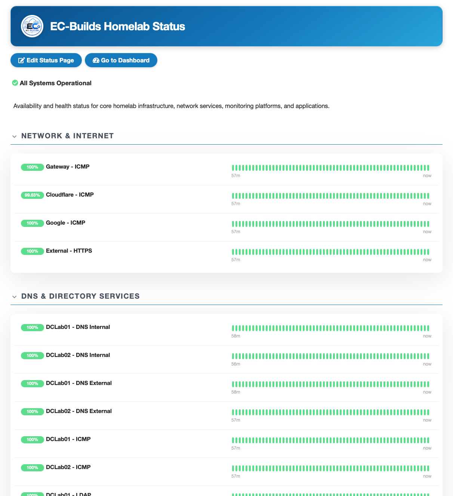
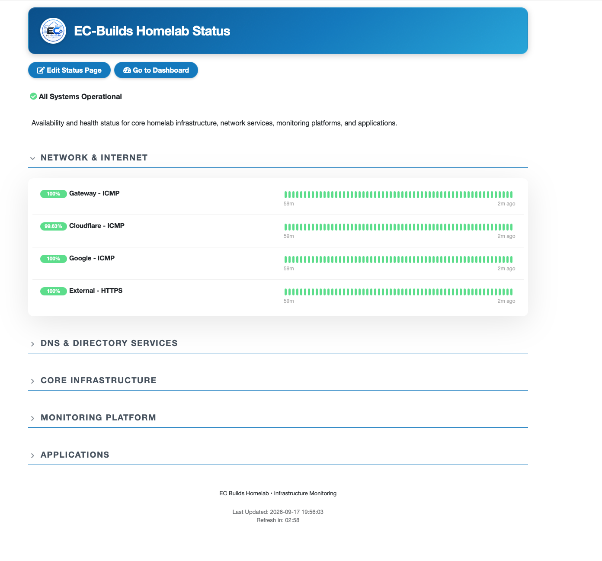

# Uptime Kuma Monitoring

**Status:** 🟢 Operational

Uptime Kuma provides independent availability and service monitoring for infrastructure and services across the Enterprise Homelab.

The monitoring strategy is organized around infrastructure dependencies so failures can be quickly isolated to the local network, Internet connection, DNS infrastructure, core systems, platform services, or applications.

#### Uptime Kuma Dashboard



*Uptime Kuma dashboard monitoring the availability and health of infrastructure and services across the Enterprise Homelab.*


## Objectives

- Monitor infrastructure and service availability
- Detect outages and connectivity failures
- Track uptime and response times
- Validate critical network dependencies
- Perform basic synthetic service checks
- Provide a simple availability layer independent of the broader monitoring stack
- Organize monitoring around infrastructure dependencies to simplify troubleshooting
- Provide remote outage notifications when monitored infrastructure becomes unavailable


## Deployment

| Component | Value |
|---|---|
| Platform | Debian |
| Deployment | Docker Compose |
| Image | `louislam/uptime-kuma:2` |
| Database | SQLite |
| Interface | Port 3001 |
| Storage | Docker Volume at `/opt/docker/uptime-kuma` |


## Monitoring Strategy

Uptime Kuma answers:

> **Is the service available and functioning?**

Performance metrics, resource utilization, historical telemetry, and deeper infrastructure analysis are handled separately by Prometheus and Grafana.


### Six-Layer Monitoring



*Uptime Kuma monitors organized by dependency layer to provide visibility from network connectivity through application availability. LAN and Internet monitoring are combined into a single category on the status page.*

Monitoring is organized into six dependency layers:

```text
Layer 1 - LAN
Gateway
   │
   ▼
Layer 2 - Internet
├── Cloudflare DNS
└── Google DNS
   │
   ▼
Layer 3 - DNS
├── dc-lab-01 DNS
└── dc-lab-02 DNS
   │
   ▼
Layer 4 - Core Infrastructure
├── dc-lab-01
├── dc-lab-02
├── prox-lab-01
├── prox-lab-02
├── prox-lab-03
└── nas-lab-01
   │
   ▼
Layer 5 - Platform Services
├── docker-lab-01
├── Prometheus
├── Loki
└── Nginx Proxy Manager
   │
   ▼
Layer 6 - Applications
├── Grafana
├── Jellyfin
├── Homepage
├── Portainer
├── Uptime Kuma
└── Additional Applications
```

Each layer provides context for the layers above it.

```text
Gateway Available
        │
        ▼
Internet Available
        │
        ▼
DNS Available
        │
        ▼
Infrastructure Available
        │
        ▼
Platform Available
        │
        ▼
Application Available
```

This dependency model helps distinguish an application failure from a failure in the infrastructure supporting it.


## Layer 1 - LAN

The first monitoring layer validates basic connectivity between the monitoring system and the network gateway.

| Monitor | Type | Purpose |
|---|---|---|
| Gateway | Ping | Validate local network and gateway reachability |

A gateway failure may indicate a local network, routing, or gateway problem and can explain failures across multiple higher monitoring layers.


## Layer 2 - Internet

External IP addresses are monitored independently of DNS.

| Monitor | Target | Type | Purpose |
|---|---|---|---|
| Cloudflare DNS | `1.1.1.1` | Ping | Validate external IP connectivity |
| Google DNS | `8.8.8.8` | Ping | Provide an independent Internet reachability test |
| External HTTPS | Public HTTPS endpoint | HTTP(s) | Validate outbound DNS, TCP, TLS, and HTTP connectivity |

Multiple external targets help distinguish an Internet connection failure from an individual external service becoming unavailable.


## Layer 3 - DNS

Both Active Directory DNS servers are monitored independently.

| Monitor | Type | Purpose |
|---|---|---|
| `dc-lab-01` DNS | DNS | Validate DNS resolution through the first DNS server |
| `dc-lab-02` DNS | DNS | Validate DNS resolution through the second DNS server |
| External Resolution via `dc-lab-01` | DNS | Validate external resolution through the first DNS server |
| External Resolution via `dc-lab-02` | DNS | Validate external resolution through the second DNS server |

DNS monitoring tests actual name resolution rather than relying exclusively on host reachability.

This allows monitoring to distinguish between:

```text
Server Reachable
      │
      └── DNS Service Failed

and

Server Unreachable
      │
      └── DNS Unavailable
```


## Layer 4 - Core Infrastructure

Core infrastructure systems are monitored independently from the services they provide.

| System | Monitor Type | Purpose |
|---|---|---|
| `dc-lab-01` | Ping | Domain controller availability |
| `dc-lab-02` | Ping | Domain controller availability |
| `prox-lab-01` | HTTP(s) | Hypervisor management availability |
| `prox-lab-02` | HTTP(s) | Hypervisor management availability |
| `prox-lab-03` | HTTP(s) | Hypervisor management availability |
| `nas-lab-01` | HTTP(s) | NAS management availability |
| NAS SMB | TCP Port | Validate SMB service availability |

Critical domain controller services are also monitored independently:

| Service | Port | Monitor Type |
|---|---:|---|
| DNS | 53 | DNS |
| Kerberos | 88 | TCP Port |
| LDAP | 389 | TCP Port |

These checks provide basic service availability monitoring. Detailed Active Directory health and replication validation are handled separately from Uptime Kuma.


## Layer 5 - Platform Services

Platform services provide functionality used by applications or other infrastructure components.

| Service | Monitor Type | Purpose |
|---|---|---|
| `docker-lab-01` | Ping | Container host availability |
| Prometheus | HTTP(s) | Metrics backend availability |
| Loki | HTTP(s) / Readiness Endpoint | Logging backend availability |
| Nginx Proxy Manager | HTTP(s) | Reverse proxy availability |

Platform monitoring helps distinguish application failures from failures of their supporting services.


## Layer 6 - Applications

Application monitors validate that user-facing services are responding.

| Application | Monitor Type |
|---|---|
| Grafana | HTTP(s) |
| Jellyfin | HTTP(s) |
| Homepage | HTTP(s) |
| Portainer | HTTP(s) |
| Uptime Kuma | HTTP(s) |
| Additional Web Applications | HTTP(s) |

Where an application provides a dedicated health or readiness endpoint, that endpoint is preferred over simply monitoring the root web page.


## Dependency-Based Troubleshooting

The monitoring layers provide a troubleshooting hierarchy.

```text
Application Failure
        │
        ▼
Platform Service?
        │
        ▼
Core Infrastructure?
        │
        ▼
DNS?
        │
        ▼
Internet?
        │
        ▼
LAN / Gateway?
```

Example failure patterns:

```text
Gateway          UP
Cloudflare       DOWN
Google           DOWN

→ Investigate WAN / ISP connectivity
```

```text
Gateway          UP
Cloudflare       UP
Google           UP
dc-lab-01 DNS    DOWN
dc-lab-02 DNS    UP

→ Investigate dc-lab-01 DNS
```

```text
NAS              UP
SMB              UP
Media Server     UP
Jellyfin         DOWN

→ Investigate Jellyfin rather than network or storage
```


## Default Monitor Settings

Baseline settings for most monitors:

| Setting | Value |
|---|---|
| Heartbeat Interval | 60 seconds |
| Retries | 2 |
| Heartbeat Retry Interval | 30 seconds |
| Request Timeout | 10 seconds |
| Resend Notification if Down | Every 10 consecutive failures |
| HTTP Method | GET |
| Accepted HTTP Status | 200-299 |
| IP Family | Auto Select |

These settings provide relatively fast outage detection while allowing brief transient failures to be retried before a monitor is marked down.


## Notifications

Uptime Kuma uses Discord as the primary remote notification channel for homelab availability alerts.

A Discord webhook connects Uptime Kuma to a dedicated notification channel. When a monitored service enters a down state, Uptime Kuma sends an alert through the webhook so infrastructure failures can be identified while away from the homelab.

```text
Infrastructure / Service
          │
          ▼
      Uptime Kuma
          │
     Down Detected
          │
          ▼
    Discord Webhook
          │
          ▼
   Remote Notification
```

Notifications provide:

- Initial notification when a monitor is determined to be down
- Repeated notification after every 10 consecutive failures while an outage persists
- Recovery notification when the monitored service becomes available again
- Remote visibility into homelab availability while away from the environment

The Discord webhook URL is treated as a secret and is never stored in repository documentation or committed to source control.


## Current Monitoring Coverage

Monitoring is currently deployed across the primary infrastructure dependency layers, including:

- Local gateway and Internet connectivity
- Internal and external DNS resolution
- Domain controller reachability and directory services
- Proxmox hypervisors
- NAS availability and SMB
- Container infrastructure
- Monitoring platform services
- User-facing applications

Additional monitors are added as new infrastructure and services are deployed.


## Monitor Types

Uptime Kuma provides several monitor types used throughout the environment.

| Monitor Type | Primary Use |
|---|---|
| HTTP(s) | Web applications, APIs, and management interfaces |
| Ping | Hosts, gateways, and external IP connectivity |
| TCP Port | Specific network services |
| DNS | Internal and external name resolution |

Monitor type is selected based on what needs to be validated rather than using ICMP availability for every system.


## Role in Monitoring Architecture

Uptime Kuma serves as the dedicated availability and synthetic monitoring layer alongside the broader observability platform.

```text
                 Uptime Kuma
                      │
          Availability / Synthetic Tests
                      │
     ┌────────────────┼────────────────┐
     │                │                │
   Network         Services       Applications
     │                │                │
     └────────────────┼────────────────┘
                      │
                 Is it working?


              Prometheus / Grafana
                      │
              Metrics / Telemetry
                      │
     ┌────────────────┼────────────────┐
     │                │                │
    CPU             Memory           Storage
  Network          Containers        Trends
     │                │                │
     └────────────────┼────────────────┘
                      │
            How is it performing?
```

Prometheus and its exporters collect infrastructure and application metrics, while Grafana provides centralized visualization and analysis.

Uptime Kuma remains focused on availability, reachability, synthetic testing, outage detection, and remote notification.


## Monitoring Scope

Uptime Kuma is primarily responsible for:

- Availability monitoring
- Service reachability
- DNS resolution testing
- TCP port availability
- HTTP/HTTPS availability
- External connectivity testing
- Basic synthetic service checks
- Outage notifications
- Remote Discord alerts


## Related Documentation

- Infrastructure Monitoring
- Monitoring Architecture
- Prometheus
- Grafana


## Security Note

Hostnames, addresses, endpoints, and other environment-specific identifiers should be sanitized before public release.

Never include credentials, API tokens, webhook URLs, public IP addresses, notification secrets, or other sensitive configuration data in repository documentation.
