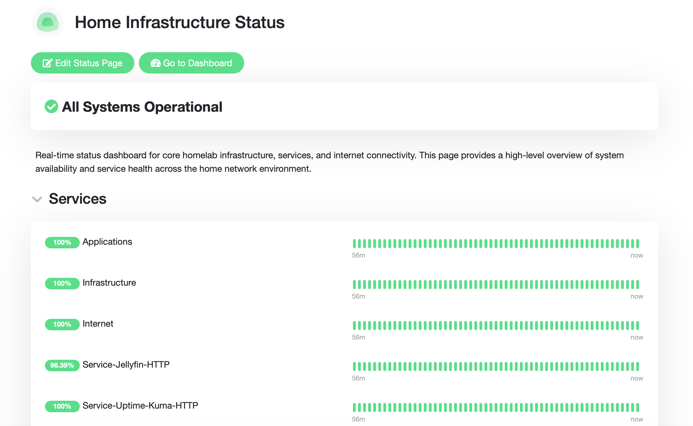

# Uptime Kuma

**Status:** 🟢 Operational

Uptime Kuma provides availability monitoring for the Enterprise Homelab by monitoring the health of infrastructure and services.

*Uptime Kuma dashboard monitoring the availability and health of infrastructure and services across the Enterprise Homelab.*

## Objectives

- Monitor infrastructure availability
- Detect service outages
- Centralize health monitoring
- Establish the foundation for the monitoring platform

## Deployment

| Component | Value |
|---|---|
| Platform | Debian |
| Deployment | Docker Compose |
| Image | `louislam/uptime-kuma:2` |
| Database | Embedded MariaDB |
| Interface | Port 3001 |
| Storage | Docker Volume |

## Current Monitors

- Internet Connectivity
- ASUS Router
- Synology NAS
- Jellyfin
- Uptime Kuma (Self Monitoring)

Additional monitors will be added as the homelab grows.

## Features

- HTTP/HTTPS Monitoring
- Ping Monitoring
- TCP Port Monitoring
- Status Dashboard
- Uptime History
- Response Time Tracking

## Future Integrations

- Prometheus
- Grafana
- Loki
- Node Exporter
- SNMP Exporter
- Alertmanager

## Related Documentation

- Infrastructure Monitoring
- Prometheus
- Grafana
- Loki
- Alertmanager

## Security Note

Sanitize all configurations before committing them to the repository. Never include credentials, API tokens, public IP addresses, or other sensitive information.
