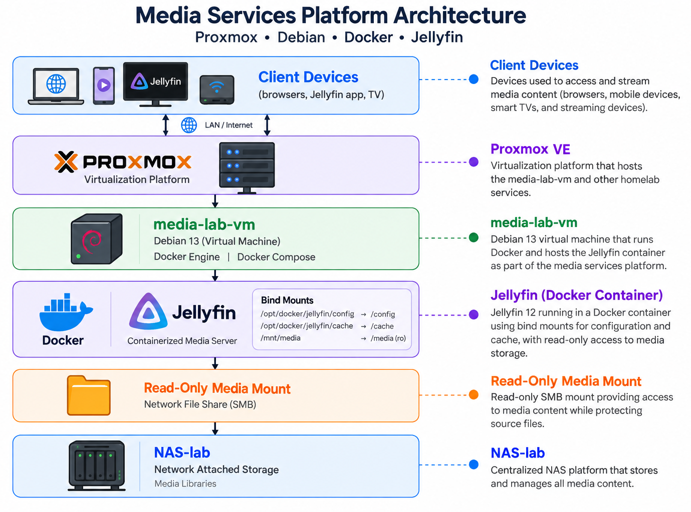
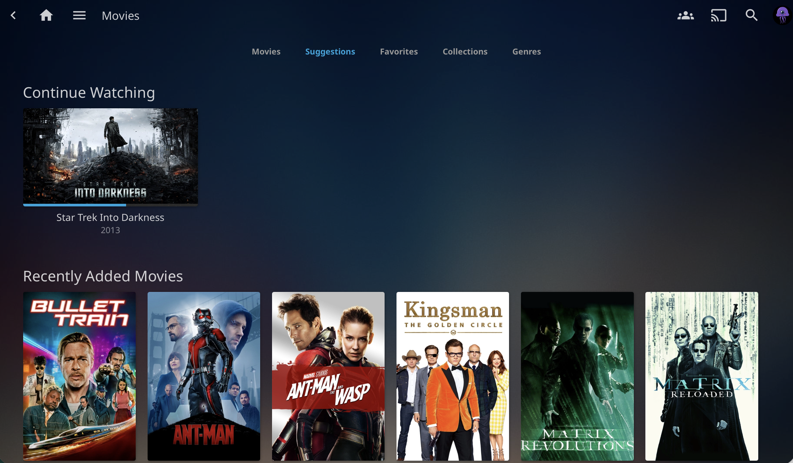

# Media Services Platform (Debian, Docker & Jellyfin)

**Status: 🟢 Operational** — first completed project in the lab, subsequently modernized through virtualization and containerization.

Self-hosted media platform built on Debian and Jellyfin, focused on Linux administration, storage integration, service deployment, permissions, containerization, virtualization, and infrastructure lifecycle management.

The platform was originally deployed as a standalone Debian server running Jellyfin as a native systemd service. After the homelab adopted Proxmox VE and a standardized Docker Compose deployment model, Jellyfin was rebuilt as a containerized service running inside a dedicated Debian virtual machine.

<p align="left">
  
  <br>
  <em>Figure 1. High-level architecture of the Media Services Platform.</em>
</p>

For more information about this diagram, see [architecture.md](./architecture.md).

> [!NOTE]
> **Project Evolution**
>
> This project originally documented Jellyfin deployed directly on Debian as a native systemd service. That implementation served as an early Linux administration project and provided hands-on experience with package management, systemd, storage mounts, permissions, networking, and service troubleshooting.
>
> The platform has since been migrated to a dedicated Debian virtual machine hosted on Proxmox VE, with Jellyfin deployed through Docker Compose using the homelab's standardized `/opt/docker` service structure.
>
> The original implementation remains documented throughout this project to preserve the build history and its learning objectives. Current-state documentation identifies the newer virtualized and containerized architecture where applicable.



## Objectives

### Original Objectives

- Install and configure a Debian server from scratch
- Deploy and manage Jellyfin as a native systemd service
- Configure storage mounts and Linux file permissions for media libraries
- Establish update, maintenance, and monitoring routines
- Document the full build for repeatability

### Platform Evolution

- Migrate the workload from a standalone system to a Proxmox virtual machine
- Standardize Jellyfin deployment using Docker Compose
- Separate application configuration from the container lifecycle using bind mounts
- Preserve external media storage independently from application configuration
- Integrate the service with the broader homelab monitoring and backup architecture
- Improve repeatability, portability, and future migration procedures

## Technologies

### Current Platform

- Proxmox VE virtualization
- Debian 13
- Docker Engine
- Docker Compose
- Jellyfin 12
- Linux storage and mount points
- Docker bind mounts
- Docker networking
- SSH administration

### Original Platform

- Debian 13
- Jellyfin native package installation
- systemd service management
- APT package management
- Linux storage (`fstab`, mount points, permissions, and ownership)
- SSH administration

## Architecture Evolution

The Media Services Platform has progressed through two deployment models:

**Original deployment**

```text
Standalone Debian Host
        │
        ├── Jellyfin (systemd)
        │
        └── Mounted Media Storage
```

**Current deployment**

```text
Proxmox VE
    │
    └── Debian VM (media-lab-vm)
            │
            ├── Docker Engine
            │
            └── Jellyfin Container
                    │
                    ├── /config  → /opt/docker/jellyfin/config
                    ├── /cache   → /opt/docker/jellyfin/cache
                    └── /media   → /mnt/media
```

Jellyfin configuration and cache storage use Docker bind mounts rather than Docker-managed volumes. This keeps persistent application data directly accessible under `/opt/docker/jellyfin`, simplifying inspection, backup, recovery, and future migrations.

Media storage remains external to the Jellyfin container and is mounted read-only at `/media`.

## Completed Work

### Original Build

- [x] Debian server installation and base configuration
- [x] Native Jellyfin deployment and library configuration
- [x] Storage mount configuration with correct permissions
- [x] Client access verified across household devices
- [x] Native systemd service administration
- [x] Initial monitoring integration

### Modernization

- [x] Deploy dedicated Debian VM on Proxmox
- [x] Install and validate Docker Engine
- [x] Establish standardized `/opt/docker` service structure
- [x] Create dedicated Docker network for media services
- [x] Deploy Jellyfin 12 using Docker Compose
- [x] Replace Docker-managed volumes with bind mounts for configuration and cache
- [x] Mount media storage read-only inside the Jellyfin container
- [x] Validate container health, networking, persistent storage, and FFmpeg initialization
- [x] Retire the original Jellyfin application deployment

## Current Docker Layout

```text
/opt/docker/jellyfin/
├── docker-compose.yaml
├── config/
└── cache/
```

Persistent container mappings:

```text
/opt/docker/jellyfin/config  → /config
/opt/docker/jellyfin/cache   → /cache
/mnt/media                   → /media (read-only)
```

Application configuration therefore persists independently of the Jellyfin container itself. Containers can be recreated or upgraded without storing persistent application state inside the container filesystem.

## Future Enhancements

- [x] Migrate to a VM on the Proxmox host ([proxmox-virtualization-lab](../proxmox-virtualization-lab/))
- [x] Migrate to Docker Compose ([docker-self-hosted-services](../docker-self-hosted-services/))
- [ ] Add hardware transcoding (Intel Quick Sync)
- [ ] Include Jellyfin configuration in backup jobs ([backup-disaster-recovery](../backup-disaster-recovery/))
- [x] Add uptime/resource monitoring ([infrastructure-monitoring](../infrastructure-monitoring/))
- [ ] Add container metrics and Jellyfin-specific monitoring
- [ ] Document Jellyfin container backup and recovery testing

## 📁 Folder Structure

| Document | Description |
|-----------|-----------|
| [README.md](./README.md) | Project overview, objectives, architecture evolution, and navigation |
| [Diagrams](./diagrams/) | Architecture diagrams, screenshots, and visual documentation |
| [architecture.md](./architecture.md) | Original and current architecture, component relationships, and system design |
| [backup-strategy.md](./backup-strategy.md) | Backup procedures, recovery considerations, and data protection strategy |
| [client-testing.md](./client-testing.md) | Validation testing, client access verification, and functionality checks |
| [hardware.md](./hardware.md) | Original hardware inventory, specifications, and platform selection rationale |
| [jellyfin-deployment.md](./jellyfin-deployment.md) | Jellyfin deployment history, native installation, and current containerized implementation |
| [lessons-learned.md](./lessons-learned.md) | Key takeaways, migration experience, challenges encountered, and project reflections |
| [media-libraries.md](./media-libraries.md) | Media organization, library structure, storage paths, and content management |
| [monitoring.md](./monitoring.md) | System and service monitoring, health checks, and observability integration |
| [smb-storage.md](./smb-storage.md) | SMB storage integration, mount configuration, and network file access |
| [ssh-configuration.md](./ssh-configuration.md) | SSH hardening, remote access configuration, and administration practices |
| [system-hardening.md](./system-hardening.md) | Security controls, system hardening measures, and security recommendations |
| [troubleshooting.md](./troubleshooting.md) | Troubleshooting procedures, validation testing, and issue resolution documentation |

## 💡 Lessons Learned

The original deployment established practical experience with Linux permissions, storage mounting, systemd, package management, networking, and service troubleshooting.

The subsequent migration introduced additional experience with workload virtualization, Docker Compose, container networking, persistent storage design, bind mounts, service portability, and infrastructure lifecycle management.

See [Lessons Learned](./lessons-learned.md) for detailed notes from both phases of the project.

## Outcome

The Media Services Platform initially demonstrated:

- Debian server deployment
- Linux administration fundamentals
- SMB storage integration
- Native service management with systemd
- Media streaming with Jellyfin
- Client compatibility validation
- Technical documentation practices

The later modernization expanded the project to demonstrate:

- Workload migration to Proxmox VE
- Virtual machine administration
- Docker and Docker Compose
- Container networking
- Persistent container storage
- Bind-mount design
- Application migration and redeployment
- Container health validation
- Infrastructure standardization

Rather than replacing the original project, the migration represents the next stage of its lifecycle. The project now documents both the initial implementation and the process of evolving a standalone Linux service into a virtualized, containerized workload aligned with the broader homelab architecture.
