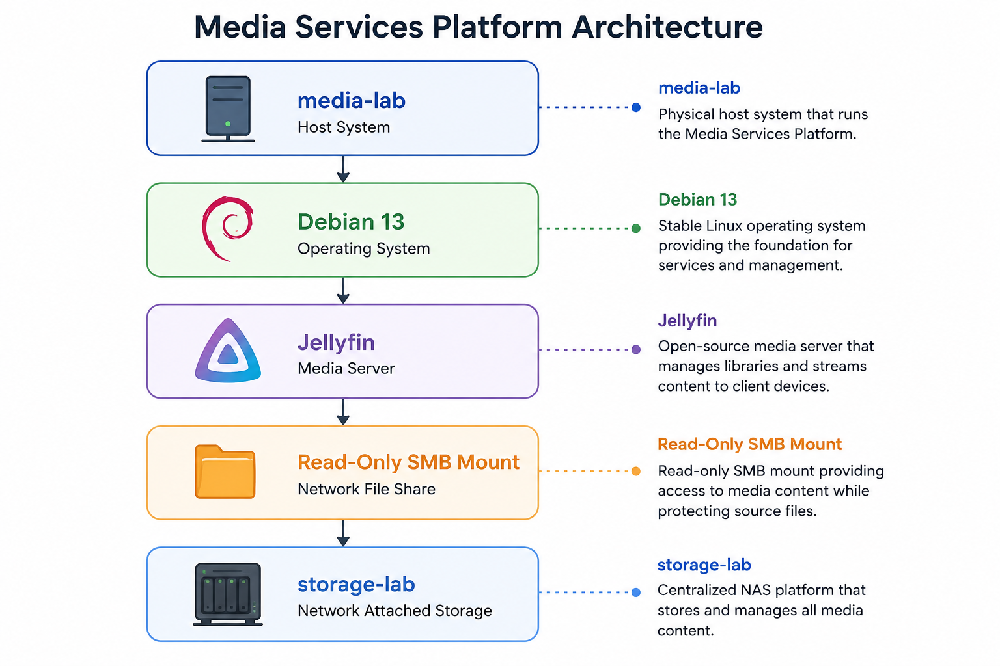

# Architecture

This document provides a high-level overview of the Media Services Platform architecture and the relationship between the core system components.

## Overview

The Media Services Platform is a self-hosted media server environment built on Debian 13 and Jellyfin. Media content is stored centrally on a NAS platform and accessed by the server through a read-only SMB mount.

This design separates application services from storage, allowing media to be managed independently while maintaining a simplified server configuration.

---

## Architecture Diagram



The following diagram illustrates the relationship between the host system, operating system, media services, and centralized storage.

---

## Components

### media-lab

The host system for the Media Services Platform.

**Responsibilities:**

- Runs the Debian operating system
- Hosts the Jellyfin service
- Provides media streaming functionality
- Maintains SMB connectivity to storage

---

### Debian 13

The operating system platform for the project.

**Responsibilities:**

- System administration
- Package management
- Service management through systemd
- Network connectivity
- Storage integration

---

### Jellyfin

Open-source media server application.

**Responsibilities:**

- Media library management
- Metadata retrieval
- User access and authentication
- Content streaming
- Client device compatibility

---

### Read-Only SMB Mount

Network file share mounted from the NAS platform.

**Responsibilities:**

- Provides access to media content
- Prevents accidental modification or deletion of source files
- Centralizes media storage outside the application host

---

### storage-lab

Network-attached storage platform.

**Responsibilities:**

- Primary media storage
- Centralized file management
- Long-term data retention
- Storage expansion and backup integration

---

## Design Considerations

### Storage Separation

Media storage is maintained independently from the application host.

**Benefits:**

- Easier server rebuilds
- Simplified migrations
- Reduced storage requirements on the host
- Centralized media management

---

### Read-Only Access

The SMB share is mounted with read-only permissions.

**Benefits:**

- Reduced risk of accidental file deletion
- Protection against application misconfiguration
- Improved integrity of stored media

---

### Future Virtualization

The current architecture is designed to support migration into a virtualized environment.

**Planned Future State:**

```text
proxmox-lab
    ↓
media-lab
    ↓
Jellyfin
    ↓
Read-Only SMB Mount
    ↓
storage-lab
```

---

## Related Documentation

- [Debian Installation](./debian-install.md)
- [Base System Configuration](./base-system-configuration.md)
- [SMB Storage](./smb-storage.md)
- [Jellyfin Deployment](./jellyfin-deployment.md)

---

## Outcome

The architecture provides a simple, maintainable, and scalable foundation for self-hosted media services while reinforcing Linux administration, storage integration, and service management concepts.
