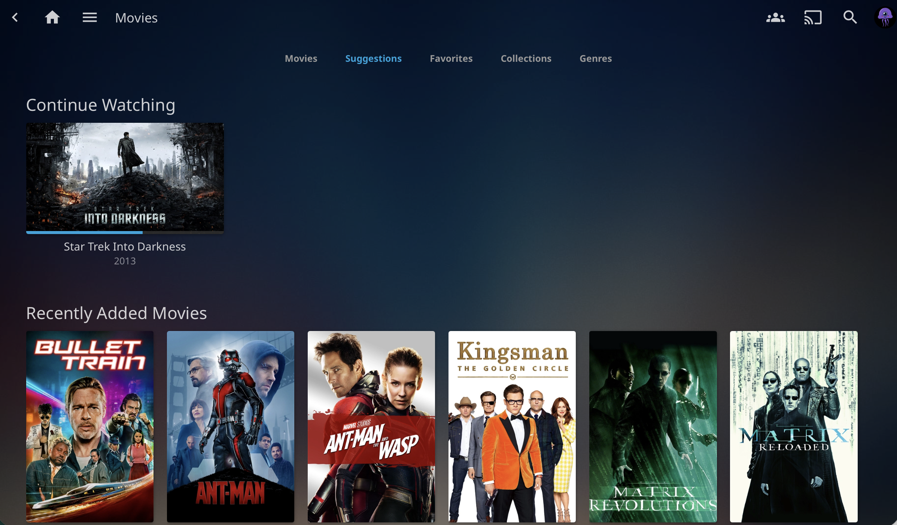

# Client Testing

This document records validation testing performed following the deployment of the Media Services Platform.

## Overview

Client testing was conducted to verify accessibility, functionality, and usability across multiple devices and platforms used within the household.

The objective was to confirm that media content could be reliably accessed from common client devices while maintaining a separation between administrative and standard user access.

---

## Testing Evidence

The following screenshot shows the Jellyfin media library after initial configuration and validation testing.



*Figure 1. Jellyfin media library successfully loaded during client validation testing.*

---

## Network Configuration

The Media Services Platform is hosted on the local network and currently operates over HTTP.

For this environment, HTTP access is acceptable because the service is intended for internal network use only and is not exposed to the public internet.

A DHCP reservation was configured on the router to ensure the server consistently receives the same IP address. This simplifies administration, client configuration, and future troubleshooting.

Service discovery is also supported through Avahi (mDNS).

Users can access the platform using:

```text
http://media-server-lab.local:8096
```

This eliminates the need to remember or manually enter the server's IP address.

---

## Browser Testing

The platform was tested using multiple web browsers.

| Browser | Result |
|----------|----------|
| Safari | Pass |
| Google Chrome | Pass |
| Microsoft Edge | Pass |

### Validation Performed

- Successfully loaded the Jellyfin web interface
- Authenticated using a standard user account
- Verified media library visibility
- Confirmed media playback functionality
- Verified navigation and search functionality

No browser-specific issues were identified during testing.

---

## Roku Testing

The Jellyfin application was tested on the primary Roku television used for media consumption.

### Validation Performed

- Successfully connected to the Jellyfin server
- Authenticated using a standard user account
- Verified media library synchronization
- Confirmed media playback functionality
- Confirmed stable operation during normal use

The Roku client is currently the primary method used to access the Media Services Platform.

---

## User Access Model

A dedicated non-administrative user account was created for day-to-day media consumption.

### Standard User

Used for:

- Media browsing
- Media playback
- General household access

### Administrative User

Used only for:

- Server configuration
- Library management
- User administration
- System maintenance

This separation reduces the risk of accidental configuration changes while following the principle of least privilege.

---

## Outcome

Testing confirmed that the Media Services Platform is accessible from supported client devices and browsers, media playback functions as expected, and user access controls operate correctly.

The platform is considered ready for ongoing household use and future enhancements.
