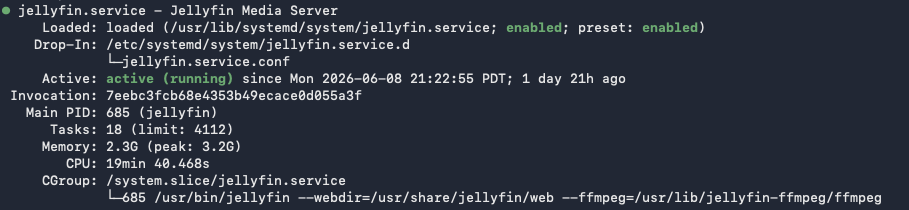

# Jellyfin Deployment

This document outlines the installation, configuration, and validation of Jellyfin on the Media Services Platform.

## Overview

Jellyfin was selected as the media server platform due to its open-source licensing model, active community support, and ability to provide centralized access to media content across multiple devices.

The deployment was performed on Debian 13 and configured to access media stored on a centralized NAS through a read-only SMB mount.

---

## Documentation Reference

Installation procedures were performed using the official Jellyfin documentation as a reference.

Reference:

```text
Official Linux Repository (Manual)
https://jellyfin.org/docs/general/installation/advanced/manual
```

The deployment documented here reflects the final configuration implemented within this environment.

---

## Architecture

```text
media-server-lab
    ↓
Debian 13
    ↓
Jellyfin
    ↓
/mnt/media
    ↓
nas-lab
```

---

## Install Jellyfin

### Repository Prerequisites

Before adding the Jellyfin repository, install the required packages used to download and validate repository signing keys.

### Install Required Packages

```bash

sudo apt install curl gnupg

```

### Create Keyring Directory

Create the keyring directory used to store trusted repository signing keys.

```bash

sudo mkdir -p /etc/apt/keyrings

```

### Import the Jellyfin Signing Key

Download and install the official Jellyfin repository signing key.

```bash

curl -fsSL https://repo.jellyfin.org/jellyfin_team.gpg.key | sudo gpg --dearmor -o /etc/apt/keyrings/jellyfin.gpg

```

### Verification

Confirm that the key file was created successfully.

```bash

ls -l /etc/apt/keyrings/jellyfin.gpg

```

### Add the Jellyfin Repository

Configure the official Jellyfin package repository.

```bash
export VERSION_OS="$( awk -F'=' '/^ID=/{ print $NF }' /etc/os-release )"
export VERSION_CODENAME="$( awk -F'=' '/^VERSION_CODENAME=/{ print $NF }' /etc/os-release )"
export DPKG_ARCHITECTURE="$( dpkg --print-architecture )"

cat <<EOF | sudo tee /etc/apt/sources.list.d/jellyfin.sources
Types: deb
URIs: https://repo.jellyfin.org/${VERSION_OS}
Suites: ${VERSION_CODENAME}
Components: main
Architectures: ${DPKG_ARCHITECTURE}
Signed-By: /etc/apt/keyrings/jellyfin.gpg
EOF
```

> [!NOTE]
> This section was particularly interesting from a learning perspective. While a detailed explanation of each command is outside the scope of this document, the repository configuration provided a practical introduction to Bash scripting concepts on Linux.
>
> The script dynamically identifies the operating system, release codename, and system architecture before generating the repository configuration file. Reviewing and implementing these commands helped build familiarity with shell variables, command substitution, file redirection, and Linux package management.

### Install Jellyfin

```bash
sudo apt update
sudo apt install jellyfin
```

---

## Verify Installation

Verify that the Jellyfin service is running and enabled.

```bash
sudo systemctl status jellyfin
sudo systemctl is-enabled jellyfin
```

Expected output:

```text
active (running)
enabled
```

Example:



*Figure 2. Jellyfin service status showing the application running and enabled at startup.*

>[!NOTE]
>Invocation ID: Unique identifier assigned by systemd for a specific service startup instance. Used primarily for logging and troubleshooting.
>


---

## Media Library Configuration

The following library paths were configured within Jellyfin.

### Movies

```text
/mnt/media/movies
```

### Music

```text
/mnt/media/music
```

Additional libraries may be added in the future as requirements evolve.

---

## Initial Access

Access the Jellyfin web interface from a browser.

```text
http://media-server-lab.local:8096
```

Initial setup includes:

- Creating the administrator account
- Configuring media libraries
- Setting preferred metadata options
- Verifying media discovery
- Testing playback functionality

---

## Service Management

Check service status:

```bash
sudo systemctl status jellyfin
```

Restart the service:

```bash
sudo systemctl restart jellyfin
```

Stop the service:

```bash
sudo systemctl stop jellyfin
```

Start the service:

```bash
sudo systemctl start jellyfin
```

---

## Validation Testing

### Reboot Validation

Verify that Jellyfin starts automatically following a reboot.

Reboot:

```bash
sudo reboot
```

Verify:

```bash
systemctl status jellyfin
ls /mnt/media
```

Expected results:

- SMB storage automatically mounted
- Jellyfin service automatically started
- Media libraries available
- Client devices able to connect

---

### Power Recovery Validation

A power recovery test was performed to verify platform resiliency following an unexpected shutdown.

```text
Power Removed
    ↓
Power Restored
    ↓
Host System Boots
    ↓
Debian Starts
    ↓
SMB Mount Available
    ↓
Jellyfin Starts
    ↓
Media Available
```

The platform successfully recovered without manual intervention.

---

## Security Considerations

Several measures were implemented to improve operational security.

- Media share mounted as read-only
- Dedicated service account used for SMB access
- Administrative and standard Jellyfin accounts separated
- Credentials stored outside application configuration files
- Service configured through systemd for automatic startup

These controls reduce the risk of accidental modification of source media content.

---

## Related Documentation

- [Architecture](./architecture.md)
- [SMB Storage Configuration](./smb-storage.md)
- [Client Testing](./client-testing.md)
- [Troubleshooting](./troubleshooting.md)

---

## Outcome

Jellyfin was successfully deployed on Debian 13 and integrated with centralized NAS storage. The platform automatically starts after system reboots, provides reliable access to media libraries, and serves as the core application within the Media Services Platform project.
