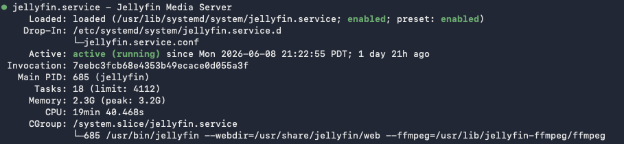

# Jellyfin Deployment

This document records the original native Jellyfin deployment on Debian 13 and preserves the implementation as part of the Media Services Platform's build history.

> [!IMPORTANT]
> **Historical Deployment**
>
> This document describes the original Jellyfin 10.11.10 deployment installed directly on Debian and managed as a native systemd service.
>
> The current Media Services Platform runs Jellyfin 12 as a Docker container inside a dedicated Debian virtual machine hosted on Proxmox VE.
>
> The original deployment remains documented to preserve the project's implementation history and the Linux administration work involved in building and validating the initial platform.

## Overview

Jellyfin was originally deployed directly on Debian 13 using the official Jellyfin APT repository and managed as a native systemd service.

The application accessed media stored on centralized network-attached storage through a read-only SMB mount. This deployment established the original Media Services Platform and provided hands-on experience with Linux package management, repository configuration, systemd, storage integration, service administration, and recovery testing.

## Documentation Reference

Installation procedures were performed using the official Jellyfin documentation as a reference.

Reference:

```text
Official Linux Repository (Manual)
https://jellyfin.org/docs/general/installation/advanced/manual
```

The deployment documented here reflects the final configuration implemented for the original native environment.

## Original Deployment Architecture

```text
Standalone Host
      │
      └── Debian 13
              │
              ├── Jellyfin 10.11.10 (systemd)
              │
              └── /mnt/media
                      │
                      └── SMB → nas-lab
```

Media remained independent of the Jellyfin application and was mounted from centralized storage rather than stored locally on the application host.

## Install Jellyfin

### Repository Prerequisites

Before adding the Jellyfin repository, install the required packages used to download and validate repository signing keys.

### Install Required Packages

```bash
sudo apt install curl gnupg
```

### Create Keyring Directory

Create the keyring directory used to store trusted repository signing keys.

```bash
sudo mkdir -p /etc/apt/keyrings
```

### Import the Jellyfin Signing Key

Download and install the official Jellyfin repository signing key.

```bash
curl -fsSL https://repo.jellyfin.org/jellyfin_team.gpg.key | sudo gpg --dearmor -o /etc/apt/keyrings/jellyfin.gpg
```

### Verification

Confirm that the key file was created successfully.

```bash
ls -l /etc/apt/keyrings/jellyfin.gpg
```

### Add the Jellyfin Repository

Configure the official Jellyfin package repository.

```bash
export VERSION_OS="$( awk -F'=' '/^ID=/{ print $NF }' /etc/os-release )"
export VERSION_CODENAME="$( awk -F'=' '/^VERSION_CODENAME=/{ print $NF }' /etc/os-release )"
export DPKG_ARCHITECTURE="$( dpkg --print-architecture )"

cat <<EOF | sudo tee /etc/apt/sources.list.d/jellyfin.sources
Types: deb
URIs: https://repo.jellyfin.org/${VERSION_OS}
Suites: ${VERSION_CODENAME}
Components: main
Architectures: ${DPKG_ARCHITECTURE}
Signed-By: /etc/apt/keyrings/jellyfin.gpg
EOF
```

> [!NOTE]
> This section was particularly interesting from a learning perspective. While a detailed explanation of each command is outside the scope of this document, the repository configuration provided a practical introduction to Bash scripting concepts on Linux.
>
> The script dynamically identifies the operating system, release codename, and system architecture before generating the repository configuration file. Reviewing and implementing these commands helped build familiarity with shell variables, command substitution, file redirection, and Linux package management.

### Install Jellyfin

```bash
sudo apt update
sudo apt install jellyfin
```

## Verify Installation

Verify that the Jellyfin service is running and enabled.

```bash
sudo systemctl status jellyfin
sudo systemctl is-enabled jellyfin
```

Expected output:

```text
active (running)
enabled
```

Example:



*Figure 1. Jellyfin service status showing the original native application running and enabled at startup.*

> [!NOTE]
> **Invocation ID:** Unique identifier assigned by systemd to a specific service startup instance. It can be useful when correlating service activity with logs during troubleshooting.

### Verify Version

The installed Jellyfin version can be verified directly from the command line:

```bash
jellyfin --version
```

The final version running on the original native deployment was:

```text
Jellyfin.Server 10.11.10.0
```

This provides a documented baseline for comparison with the current Jellyfin 12 containerized deployment.

## Media Library Configuration

The following library paths were configured within Jellyfin.

### Movies

```text
/mnt/media/movies
```

### Music

```text
/mnt/media/music
```

Additional libraries could be added as requirements evolved.

## Initial Access

The Jellyfin web interface was accessed from a browser using:

```text
http://media-server-lab.local:8096
```

Initial setup included:

- Creating the administrator account
- Configuring media libraries
- Setting preferred metadata options
- Verifying media discovery
- Testing playback functionality

## Service Management

The native deployment was managed through systemd.

Check service status:

```bash
sudo systemctl status jellyfin
```

Restart the service:

```bash
sudo systemctl restart jellyfin
```

Stop the service:

```bash
sudo systemctl stop jellyfin
```

Start the service:

```bash
sudo systemctl start jellyfin
```

These commands provided the primary administrative interface for managing the original Jellyfin application lifecycle.

## Validation Testing

### Reboot Validation

Testing was performed to verify that Jellyfin and its required storage automatically recovered following a normal system reboot.

Reboot:

```bash
sudo reboot
```

Verify:

```bash
systemctl status jellyfin
ls /mnt/media
```

Expected results:

- SMB storage automatically mounted
- Jellyfin service automatically started
- Media libraries available
- Client devices able to connect

### Power Recovery Validation

A power recovery test was also performed to verify platform resiliency following an unexpected shutdown.

```text
Power Removed
    │
    ▼
Power Restored
    │
    ▼
Host System Boots
    │
    ▼
Debian Starts
    │
    ▼
SMB Mount Available
    │
    ▼
Jellyfin Starts
    │
    ▼
Media Available
```

The platform successfully recovered without manual intervention.

This test helped validate that the complete service dependency chain—not only the Jellyfin process—could recover following a loss of power.

## Security Considerations

Several measures were implemented to improve operational security and reduce unnecessary access.

- Media storage mounted as read-only
- Dedicated service account used for SMB access
- Administrative and standard Jellyfin accounts separated
- Credentials stored outside application configuration files

These controls reduced the risk of accidental modification of source media content and limited unnecessary privileged access.

## Platform Evolution

The native deployment remained operational until the Media Services Platform was migrated into the broader Proxmox VE environment.

During the modernization, Jellyfin was rebuilt as a clean Jellyfin 12 deployment running through Docker Compose inside a dedicated Debian virtual machine. Media remained on the existing centralized NAS, allowing the application layer to be replaced without migrating the significantly larger media library.

The original native service was stopped and retained temporarily during validation of the new environment, providing a rollback path while client access, media playback, storage integration, and the new containerized deployment were verified.

The migration ultimately changed the application lifecycle from:

```text
APT Package
    │
    ▼
Native Jellyfin Service
    │
    ▼
systemd
```

to:

```text
Docker Compose
    │
    ▼
Jellyfin Container
    │
    ▼
Docker Engine
    │
    ▼
Debian VM
    │
    ▼
Proxmox VE
```

Persistent Jellyfin configuration is now maintained using bind mounts under `/opt/docker/jellyfin`, while media continues to remain external to the application workload.

For the current service definition, see [Jellyfin Docker Compose YAML](../../configs/docker/jellyfin/docker-compose.yaml).

## Related Documentation

- [Architecture](./architecture.md)
- [SMB Storage Configuration](./smb-storage.md)
- [Client Testing](./client-testing.md)
- [Troubleshooting](./troubleshooting.md)

## Outcome

The original Jellyfin 10.11.10 deployment successfully established the Media Services Platform on Debian 13 and integrated the application with centralized NAS storage.

The deployment provided reliable media access, automatic service startup, persistent network storage, and recovery following system reboots and power interruptions.

Although the native deployment has since been replaced by the virtualized and containerized Jellyfin 12 platform, it established the Linux administration, storage, service management, troubleshooting, and validation practices that informed the current architecture.
