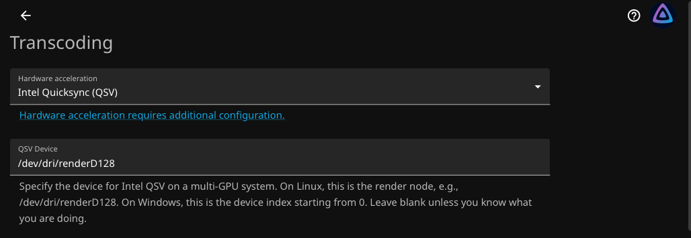
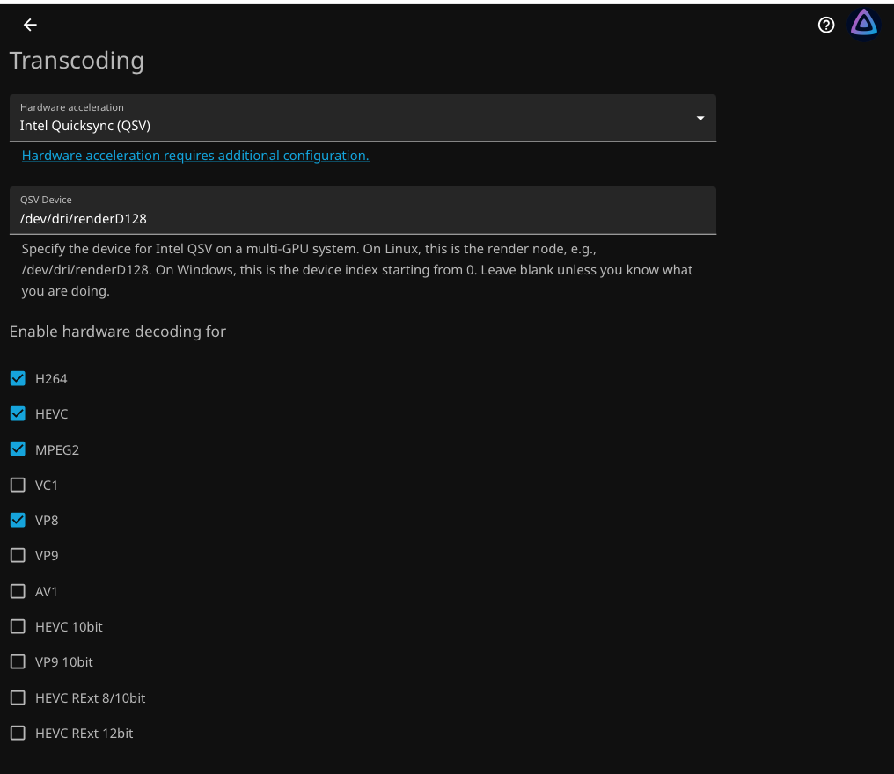
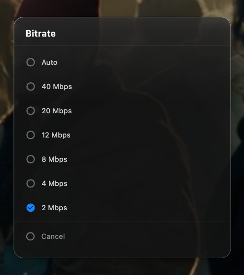
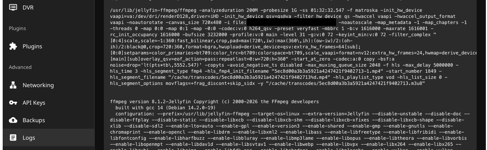

# Jellyfin Hardware Acceleration and GPU Passthrough



## Overview

Jellyfin originally ran with 2 vCPUs and relied entirely on CPU-based transcoding. This worked well for normal playback, but even relatively simple transcoding tasks, particularly playback involving subtitles, could push both assigned CPU cores close to 100% utilization.

Increasing the VM's CPU allocation would have worked, but resources on the Proxmox host are limited and those additional cores are better left available for other VMs and services.

The host's Intel Core i7-6700T includes an Intel HD Graphics 530 integrated GPU that was not being used. Instead of assigning more CPU resources to Jellyfin, the unused GPU was passed through to the media VM and configured for Intel Quick Sync hardware acceleration.

Jellyfin can now offload supported video decoding, processing, encoding, and trickplay workloads to the integrated GPU. This significantly reduces CPU utilization during transcoding and allows the media server to remain at 2 vCPUs.


## Architecture

```text
Intel HD Graphics 530
        |
        v
prox-lab-03
        |
        | PCI Passthrough
        v
media-lab-vm
        |
        | i915
        v
/dev/dri/renderD128
        |
        | Docker Device Passthrough
        v
Jellyfin
        |
        v
Intel Quick Sync / VA-API
```

The GPU crosses two separate boundaries: first from the Proxmox host into the Debian VM, and then from Debian into the Jellyfin container. Each layer must expose the device correctly before Jellyfin can use it.


## Environment

### Proxmox Host

```text
Hostname: prox-lab-03
CPU: Intel Core i7-6700T
GPU: Intel HD Graphics 530
GPU PCI Address: 00:02.0
GPU PCI ID: 8086:1912
```

### Jellyfin VM

```text
VM ID: <VMID>
Hostname: media-lab-vm
OS: Debian
vCPU: 2
RAM: 4 GB
Machine: q35
BIOS: OVMF
CPU Type: host
```

Jellyfin runs in Docker inside `media-lab-vm`.


## GPU Passthrough

The first step was making the unused Intel HD Graphics 530 available to the media VM.

Normally, the integrated GPU belongs to the Proxmox host. Because Proxmox does not need the GPU for this deployment, it can instead be dedicated to `media-lab-vm` using PCI passthrough. This gives the VM direct access to the physical GPU rather than emulating one in software.

> [!Note]
> For detailed PCI passthrough configuration, commands, and example output, see the **Proxmox PCI Passthrough** reference document: [Proxmox PCI Passthrough](../../docs/reference/proxmox/proxmox-PCI-device-passthrough.md).

The GPU is isolated in its own IOMMU group and made available for passthrough through `vfio-pci`. VFIO allows Proxmox to hand control of the physical PCI device to the VM instead of using it directly on the host.

```text
Intel HD Graphics 530
PCI Address: 00:02.0
PCI ID: 8086:1912
Host Driver: vfio-pci
```

The physical device is assigned to the VM as:

```text
hostpci0: 0000:00:02.0,pcie=1
```

Once the VM starts, Debian takes ownership of the passed-through GPU using the Intel `i915` driver and creates the render device used for hardware acceleration:

```text
Intel HD Graphics 530
Guest Driver: i915
Render Device: /dev/dri/renderD128
```

At this point, the physical Intel GPU is available directly inside `media-lab-vm`.


## Docker GPU Access

Getting the GPU into the VM only makes it available to Debian. Jellyfin runs inside Docker, so the container also needs access to the GPU.

`/dev/dri/renderD128` is the GPU's render device and provides applications access to hardware acceleration without requiring direct access to the GPU's display output.

The Intel render device is exposed to the Jellyfin container by adding the following entries to `docker-compose.yaml`. See the [Jellyfin Docker Config](../../configs/docker/jellyfin/docker-compose.yaml) for the example Compose configuration used by this deployment.

```yaml
devices:
  - /dev/dri/renderD128:/dev/dri/renderD128

group_add:
  - "<render-gid>"
```

After making the changes, the Jellyfin container was recreated:

```bash
docker compose up -d
```

The container was then checked to verify that `/dev/dri/renderD128` was available and that Jellyfin had permission to use it.

The supplementary render group grants the container permission to access the GPU render device. The render group GID is system-specific and should be verified if the VM is rebuilt or migrated.

At this point, the complete hardware path is:

```text
Physical GPU
    ↓
Proxmox PCI Passthrough
    ↓
Debian
    ↓
/dev/dri/renderD128
    ↓
Docker
    ↓
Jellyfin
```


## Jellyfin Hardware Acceleration

With the GPU available inside the container, Jellyfin can use Intel Quick Sync instead of relying entirely on the VM's CPU for supported media processing.

Jellyfin is configured to use:

```text
Hardware Acceleration: Intel QuickSync (QSV)
Device: /dev/dri/renderD128
```

Quick Sync provides Intel's hardware-accelerated media capabilities, while VA-API provides the Linux interface Jellyfin and FFmpeg use to access the GPU.

The Intel HD Graphics 530 does not accelerate every video format, so only capabilities confirmed on the installed hardware are enabled.



*Jellyfin configured to use Intel Quick Sync through `/dev/dri/renderD128`, with hardware decoding enabled only for supported codecs.*

| Codec | Decode | Encode |
|---|---|---|
| H.264 | Yes | Yes |
| HEVC Main | Yes | No |
| MPEG-2 | Yes | No |
| VP8 | Yes | No |
| JPEG | Yes | Yes |
| VC-1 | No | No |
| VP9 | No | No |
| AV1 | No | No |
| HEVC 10-bit | No | No |

H.264 is the primary hardware encoding path for this deployment.

Low-power encoding, HEVC encoding, AV1 encoding, and hardware tone mapping remain disabled because they were not part of the validated hardware configuration.


## Trickplay Acceleration

Jellyfin also generates trickplay images, which are the preview thumbnails shown while seeking through a video.

This processing previously competed for the same limited CPU resources as normal Jellyfin workloads. Because the Intel GPU supports JPEG acceleration, trickplay can also make use of the GPU.

The current configuration uses:

```text
Hardware Decoding: Enabled
Hardware Accelerated MJPEG Encoding: Enabled
Scan Behavior: Non Blocking
Process Priority: Below Normal
```

This keeps background trickplay generation from unnecessarily consuming the media VM's two CPU cores.


## Validation

The final step was confirming that Jellyfin was actually using the GPU. Seeing the device inside Debian or Docker only proves that it is accessible; it does not prove that transcoding is being hardware accelerated.

A forced transcode was used to verify the complete path. Playback was limited from `Auto` to `2 Mbps`, with subtitles enabled to ensure that Jellyfin performed a video transcode rather than continuing to direct play or remux the source.



*Playback limited to `2 Mbps` as part of the controlled hardware transcoding test.*

Because the source bitrate was higher than the selected limit and the playback session required video processing, Jellyfin had to transcode the stream. This created a controlled workload that could be used to verify the hardware acceleration path.

To verify hardware acceleration, the FFmpeg log associated with the active playback session was inspected.

The FFmpeg logs can be reviewed through the Jellyfin web interface under **Dashboard → Logs** by opening the FFmpeg transcode log associated with the active playback session.

They can also be inspected directly from the Docker host:

```bash
docker exec jellyfin sh -c 'latest=$(ls -t /config/log/FFmpeg.Transcode-*.log | head -1); echo "Log: $latest"; grep -E "init_hw_device|hwaccel|h264_qsv|scale_vaapi|hwmap|overlay_qsv" "$latest"'
```

The resulting log entries show which hardware devices, decoders, filters, and encoders FFmpeg actually initialized for the transcode.

Jellyfin initialized the Intel GPU through VA-API and Quick Sync:

```text
-init_hw_device vaapi=va:/dev/dri/renderD128,driver=iHD
-init_hw_device qsv=qs@va
-hwaccel vaapi
```

Hardware H.264 encoding was confirmed by:

```text
-codec:v:0 h264_qsv
```

Jellyfin also used GPU-accelerated video processing:

```text
scale_vaapi
hwmap=derive_device=qsv
overlay_qsv
```

Together, these entries confirm that the GPU was not simply visible to the container, but was actively being used by FFmpeg during the transcode.



*FFmpeg transcode log confirming Intel VA-API initialization, Quick Sync H.264 encoding, and GPU-accelerated video processing.*

This confirms the complete acceleration path:

```text
Source Media
     ↓
Hardware Decode
     ↓
GPU Video Processing
     ↓
Quick Sync H.264 Encode
     ↓
Client
```


## Results

The goal was not simply to add GPU passthrough. It was to solve a resource constraint in the media VM without allocating more CPU resources to it.

Before hardware acceleration, the 2-vCPU Jellyfin VM could push both cores close to 100% during relatively simple transcoding involving subtitles. Increasing the VM to 4 vCPUs would have solved the immediate problem, but those additional CPU resources are more useful elsewhere in the lab.

The Intel HD Graphics 530 was already available in the Proxmox host and was otherwise unused.

After passing the GPU through and enabling Intel Quick Sync, supported media processing is offloaded from the CPU to the integrated GPU. CPU utilization during the same type of transcoding workload is now substantially lower.

The VM remains at:

```text
2 vCPU
4 GB RAM
```

Two vCPUs are sufficient for the current workload because the CPU no longer has to perform all video processing itself.

The result is a more efficient use of the hardware already available in the system rather than solving the problem by simply assigning the VM more resources.


## Deployment Status

```text
[x] Resource constraint identified
[x] Unused integrated GPU identified
[x] GPU isolated for PCI passthrough
[x] GPU passed through to media-lab-vm
[x] Intel GPU available inside Debian
[x] GPU exposed to Jellyfin container
[x] Intel Quick Sync enabled
[x] Hardware decoding and encoding validated
[x] Trickplay hardware acceleration enabled
[x] CPU utilization reduction confirmed
[x] 2-vCPU allocation retained
```


## Related Documentation

- [Proxmox PCI Passthrough](../../docs/reference/proxmox/proxmox-PCI-device-passthrough.md)
- [Jellyfin Docker Config](../../configs/docker/jellyfin/docker-compose.yaml)
- Jellyfin Docker Deployment
- Media Storage / SMB Mounting
- Media VM Resource Allocation
