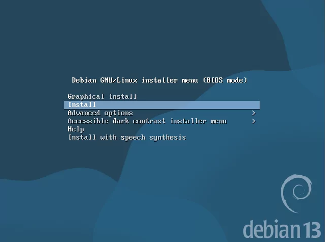

# Platform Deployment

This document outlines the Debian deployment used to establish the Media Services Platform and its transition from dedicated physical hardware to the Proxmox virtualization environment.

## Overview

Debian 13 was selected as the operating system for the Media Services Platform due to its stability, maintainability, and suitability for self-hosted services.

The platform was originally deployed as a bare-metal Debian server on a **Late 2014 Mac Mini**. As the homelab architecture expanded, the Media Services Platform is being migrated to a **Debian virtual machine running Docker within the Proxmox environment**.

```text
Original Deployment                    Target Deployment

Late 2014 Mac Mini                     Proxmox Cluster
        │                                    │
        ▼                                    ▼
    Debian 13                            Debian VM
        │                                    │
        ▼                                    ▼
      Docker                               Docker
        │                                    │
        ▼                                    ▼
     Jellyfin                             Jellyfin
        │                                    │
        └──────────► NAS Storage ◄───────────┘
```

The migration consolidates application hosting within the virtualization environment while freeing the Mac Mini for another homelab infrastructure role.


## Implementation Summary

| Component | Configuration |
|---|---|
| Operating System | Debian 13.5.0 |
| Original Platform | Late 2014 Mac Mini |
| Original Deployment | Bare Metal |
| Target Platform | Proxmox Virtual Machine |
| Desktop Environment | None |
| Administration | SSH |
| Application Runtime | Docker |
| Media Application | Jellyfin |
| Media Storage | Network-attached storage via SMB/CIFS |


## Original Bare-Metal Deployment

The Media Services Platform was initially deployed on a **Late 2014 Mac Mini** as a dedicated physical Debian server.

Debian 13.5.0 was installed without a desktop environment, creating a minimal headless server managed primarily through SSH.

The installation used the following configuration:

| Setting | Selection |
|---|---|
| Operating System | Debian 13.5.0 |
| Hardware | Late 2014 Mac Mini |
| Hostname | `media-server-lab` |
| Desktop Environment | None |
| SSH Server | Installed |
| Standard System Utilities | Installed |
| Partitioning | Guided (Entire Disk) |
| Network | Ethernet |
| Package Repository | Debian Official Mirrors |

The original deployment established the Linux foundation used for Docker, Jellyfin, and network storage integration.


## Installation Media

The original bare-metal deployment used Debian installation media created on macOS and written to a USB drive.

Detailed procedures for downloading and verifying Debian installation images and creating bootable USB installation media are maintained separately in the Debian reference documentation.


## Booting the Mac Mini

The Late 2014 Mac Mini was booted from the Debian installation USB using the Apple startup manager.

```text
Power On
    │
    ▼
Hold Option (⌥)
    │
    ▼
Select EFI Boot
    │
    ▼
Debian Installer
```

After selecting **EFI Boot**, the Debian installer loaded successfully.



*Figure 1. Debian 13 installer menu displayed after selecting EFI Boot from the Apple startup manager.*


## Original Deployment Validation

Following installation, the bare-metal Debian deployment was validated by confirming:

- Debian booted successfully
- Ethernet connectivity was available
- SSH remote administration was functional
- System updates could be applied
- The server operated without a desktop environment
- Automatic startup following power loss functioned correctly
- The host was ready for Docker and media-service deployment


## Migration to Proxmox

As the homelab expanded into a multi-node Proxmox environment, maintaining dedicated physical hardware exclusively for the media workload became unnecessary.

The Media Services Platform is therefore being migrated from the Mac Mini to a dedicated Debian virtual machine within Proxmox.

The migration changes the underlying compute platform while preserving the existing application architecture:

```text
Proxmox Host
      │
      ▼
Debian Media VM
      │
      ├── SSH Administration
      │
      ├── SMB/CIFS Mount
      │       │
      │       └────► NAS Media Storage
      │
      └── Docker
            │
            ▼
         Jellyfin
```

The Debian VM continues to provide the operating-system layer, Docker provides the application runtime, and the NAS remains responsible for centralized media storage.

Moving the workload into Proxmox also provides VM-level resource management, backup and recovery capabilities, and greater flexibility to migrate or recreate the media server while freeing the Late 2014 Mac Mini for another infrastructure role.


## Post-Installation Configuration

Following Debian deployment, the Media Services Platform requires several additional configuration layers:

```text
Debian Installation
        │
        ▼
Base System Configuration
        │
        ▼
SSH Configuration
        │
        ▼
SMB Storage Integration
        │
        ▼
Docker
        │
        ▼
Jellyfin
```

Detailed implementation procedures are maintained in their respective project and reference documents.


## Related Documentation

- [Base System Configuration](../../docs/reference/debian/debian-baseline.md)
- [SSH Configuration](./ssh-configuration.md)
- [Jellyfin Deployment](./jellyfin-deployment.md)
- [SMB Storage](./smb-storage.md)
- [Secure SMB Mount](../../docs/reference/debian/debian-smb-secure-mount.md)


## Outcome

The Media Services Platform was originally established as a bare-metal Debian server on a Late 2014 Mac Mini, providing the initial environment for Docker, Jellyfin, and centralized NAS storage.

The platform is being migrated to a dedicated Debian VM within the Proxmox environment. This preserves the existing Debian, Docker, Jellyfin, and NAS-based architecture while consolidating compute resources and freeing the Mac Mini for another homelab infrastructure role.
