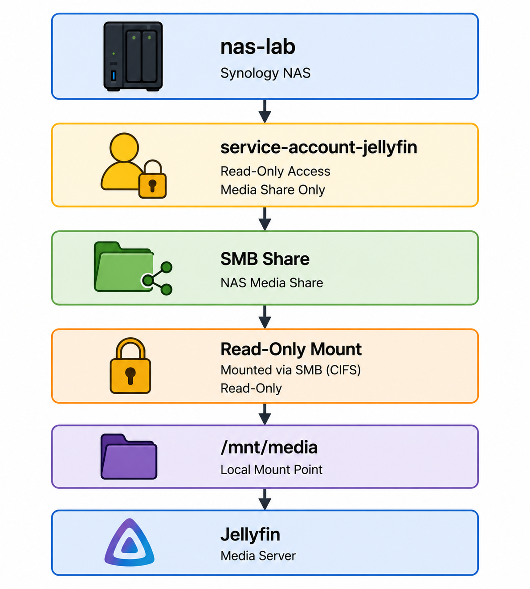

# SMB Storage Configuration

This document outlines the storage integration used by the Media Services Platform.

## Overview

Media content is stored centrally on network-attached storage (NAS) and made available to Jellyfin through the Debian media server.

The Debian host mounts the media share using SMB/CIFS. The share is mounted at `/mnt/media` using a dedicated read-only service account and is then exposed to the Jellyfin Docker container as a read-only bind mount.

```text
NAS Media Share
      │
      │ SMB/CIFS
      │ Read-only service account
      ▼
Debian Host
      │
      │ /mnt/media
      ▼
Docker
      │
      │ /mnt/media:/media:ro
      ▼
Jellyfin
    /media
```

This design keeps NAS authentication at the operating-system layer. Jellyfin does not receive NAS credentials or connect directly to the SMB share.


## Storage Architecture

<p>
  
  <br>
  <br>
  <em>Figure 1. Read-only storage path from NAS storage through the Debian host to Jellyfin.</em>
</p>


## Storage Configuration

The media share is mounted on the Debian host at:

```text
/mnt/media
```

The implementation uses:

| Component | Configuration |
|---|---|
| Protocol | SMB/CIFS |
| Mount Point | `/mnt/media` |
| Authentication | Dedicated service account |
| NAS Permissions | Read-Only |
| Host Mount | Read-Only |
| Credential Storage | Protected host credentials file |
| Container Access | Read-Only bind mount |

### How the Mount Works

The Debian host:

- Stores the SMB credentials in a protected file.
- Establishes the SMB mount through `/etc/fstab`.
- Exposes the mounted filesystem to the application.

The detailed SMB mount and credential-protection procedure is maintained separately in the [Secure SMB Mount](../../reference/linux/smb-secure-mount.md) reference guide.


## Docker Integration

The mounted media directory is exposed to the Jellyfin container using a read-only bind mount.

```yaml
volumes:
  - /mnt/media:/media:ro
```

This provides the following storage path:

```text
NAS
 │
 ▼
/mnt/media        Debian host
 │
 ▼
/media            Jellyfin container
```

The container receives filesystem access to the media but does not receive the credentials used to authenticate to the NAS.

Jellyfin therefore interacts with `/media` as a normal filesystem path while the Debian host handles the underlying SMB connection.


## Security Model

Storage access follows a defense-in-depth approach:

```text
NAS Permissions
      │
      │ Read-Only
      ▼
Debian SMB Mount
      │
      │ Read-Only
      ▼
Docker Bind Mount
      │
      │ Read-Only
      ▼
Jellyfin
```

A dedicated service account limits NAS access to the required media share, while read-only controls at the NAS, host, and container layers protect source media from unintended modification.

Detailed credential handling and SMB security configuration are documented in the [Secure SMB Mount](../../reference/linux/smb-secure-mount.md) reference guide.


## Validation

The storage integration is validated by confirming:

- The NAS media share is accessible through `/mnt/media`
- The SMB share becomes available automatically following a system startup or reboot
- The host mount is read-only
- The Jellyfin container can access the media through `/media`
- Source media cannot be modified through the container


## Related Documentation

- [Architecture](./architecture.md)
- [Base System Configuration](./base-system-configuration.md)
- [Jellyfin Deployment](./jellyfin-deployment.md)
- [Secure SMB Mount](../../reference/linux/smb-secure-mount.md)
- [Troubleshooting](./troubleshooting.md)


## Outcome

The Media Services Platform uses centralized NAS storage while keeping storage authentication separate from the Jellyfin application.

The Debian host manages SMB authentication and establishes the NAS connection through the persistent filesystem configuration. The NAS media share is presented locally through `/mnt/media`, which is then passed to the Jellyfin container as `/media`.

Jellyfin therefore receives only read-only filesystem access to the media library while NAS credentials and SMB connectivity remain managed by the Debian host.
