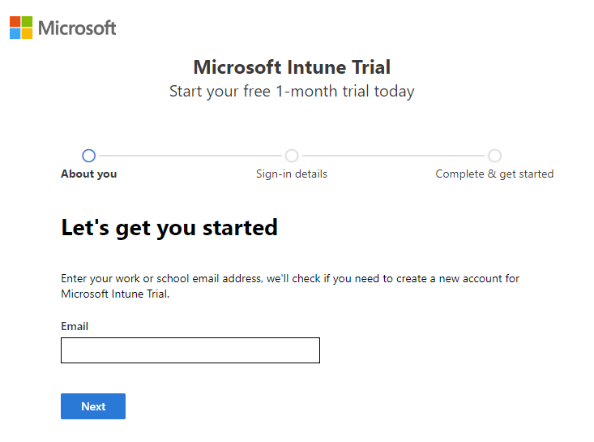
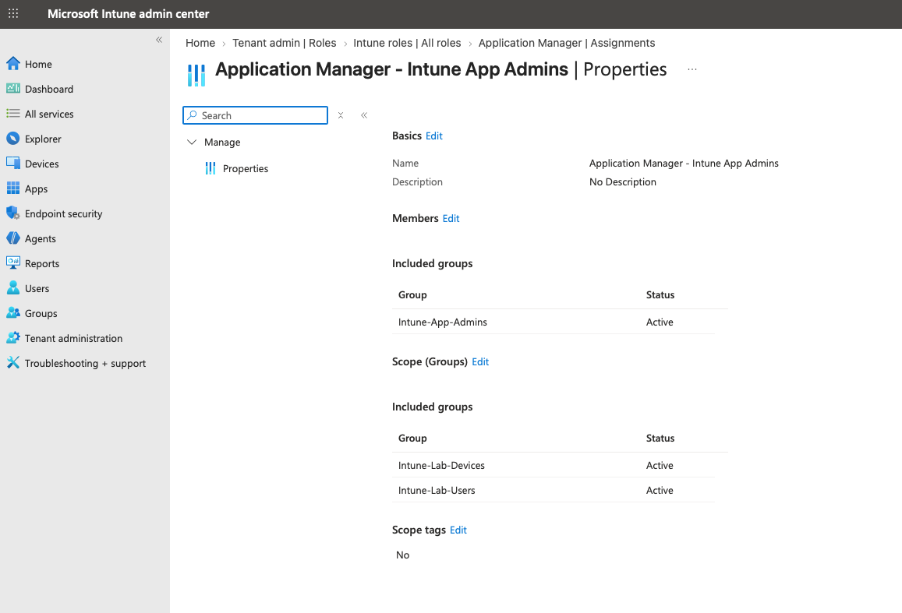
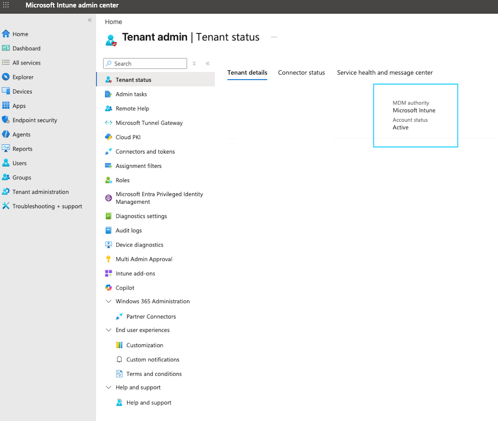

# 01 · Identity & Access

**Status: 🟡 In Progress**

Establishes the Microsoft Entra and Intune foundation used throughout the lab: the tenant, licensing, administrative access, and the identity baseline that later supports compliance-based access control.

## Tenant Setup

I created a dedicated Microsoft Entra tenant and Intune environment through Microsoft's **30-day Microsoft Intune Plan 1 trial**. The signup process was straightforward and followed Microsoft's documented trial setup.

<!-- TODO: Confirm screenshots are sanitized (tenant domain, admin UPN, email, phone). -->

## Licensing

The Intune trial also provisions a trial **Enterprise Mobility + Security (EMS)** subscription, which includes Microsoft Entra ID Premium capabilities alongside Intune.

This matters because several capabilities used with Intune depend on Entra licensing rather than Intune Plan 1 alone. **Automatic MDM enrollment** requires Microsoft Entra ID P1 or P2, and Entra Premium is also what enables **Conditional Access**. In production, Intune and Entra licensing may be purchased separately or bundled, so it's worth confirming which license actually provides each capability.

## Administrative Access

The account that created the subscription was automatically assigned **Global Administrator**. Because that role carries far more access than routine endpoint management needs, I separated the two:

| Account | Role | Used for |
|---|---|---|
| Original tenant account | Global Administrator | Tenant-level tasks that require elevated permissions |
| Lab administrator | Intune Administrator | Day-to-day Intune configuration and validation |
| Emergency access | Global Administrator | Break-glass recovery, excluded from Conditional Access |

<!-- TODO: Create the emergency access account before building Conditional Access policies. -->

In production, least privilege would go further, delegating narrower responsibilities through Entra and Intune RBAC roles rather than a single broad administrative role.

### Entra RBAC vs. Intune RBAC

While setting up delegated administration, I looked for the **Application Manager** role among Microsoft Entra directory roles and didn't find it. That led to an important distinction between Intune's two permission systems:

| RBAC system | Scope | Examples |
|---|---|---|
| **Microsoft Entra RBAC** | Directory and service-level administration | Global Administrator, Intune Administrator, User Administrator |
| **Microsoft Intune RBAC** | Granular endpoint-management delegation | Application Manager, Policy and Profile Manager, Help Desk Operator |

Entra roles grant broad directory or service-wide access. Intune RBAC delegates specific responsibilities and limits *where* they apply through scope groups and scope tags.

### Validating Delegated Access

To test the model, I assigned the Intune **Application Manager** role:

| Setting | Value |
|---|---|
| Admin group | `Intune-App-Admins` |
| Scope groups | `Intune-Lab-Users`, `Intune-Lab-Devices` |
| Scope tags | `Default` |

I then signed in as a member of `Intune-App-Admins` to confirm the boundary:

| Test | Expected | Result |
|---|---|---|
| Create and assign an application | Allowed | <!-- TODO --> |
| Edit a compliance policy | Denied | <!-- TODO --> |

<!-- TODO: Add screenshot of the denied action. -->

For the rest of the initial lab, I use the broader Intune Administrator role. Finer-grained delegation can be expanded later.

> For a deeper breakdown of role assignments, admin groups, scope groups, and scope tags, see [Intune RBAC Role Assignments](../../docs/reference/intune/intune-rbac-role-assignments.md).

## Multifactor Authentication & Security Defaults

On first administrative sign-in, I was required to register an additional authentication method. I registered **Microsoft Authenticator** and confirmed MFA-protected access to the Intune and Entra admin centers.

New tenants typically have **Security Defaults** enabled. Security Defaults and Conditional Access can't be used together, so Security Defaults will be disabled — after the emergency access account is in place — before Conditional Access policies are created in this area.

## MDM Authority

The trial set **Microsoft Intune** as the tenant's MDM authority automatically; I confirmed it under **Tenant administration → Tenant details**.

## Compliance-Based Access

*Planned:* connect device compliance to access decisions with Conditional Access so that only compliant, managed devices can reach company resources — and verify the result from both a compliant and a noncompliant device.

## Results

- Tenant and licensing in place, with the Intune–Entra licensing dependency identified.
- Privileged and routine administration separated.
- Delegated administration configured and tested through Intune RBAC.
- Identity baseline prepared for Conditional Access.

## References

- [Sign up for a free trial and configure a Microsoft Intune tenant](https://learn.microsoft.com/en-us/intune/fundamentals/free-trial-sign-up)
- [Microsoft Intune licensing](https://learn.microsoft.com/en-us/intune/fundamentals/licensing)
- [Set up automatic enrollment for Windows devices](https://learn.microsoft.com/en-us/mem/intune/enrollment/quickstart-setup-auto-enrollment)
- [Assign Microsoft Intune roles for role-based access control](https://learn.microsoft.com/en-us/intune/intune-service/fundamentals/role-based-access-control/assign-role)
