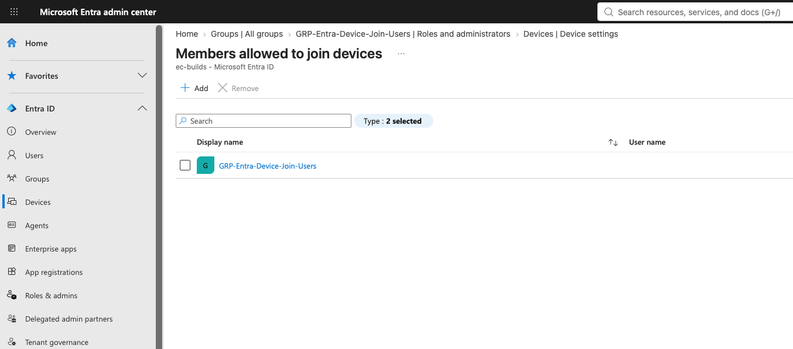
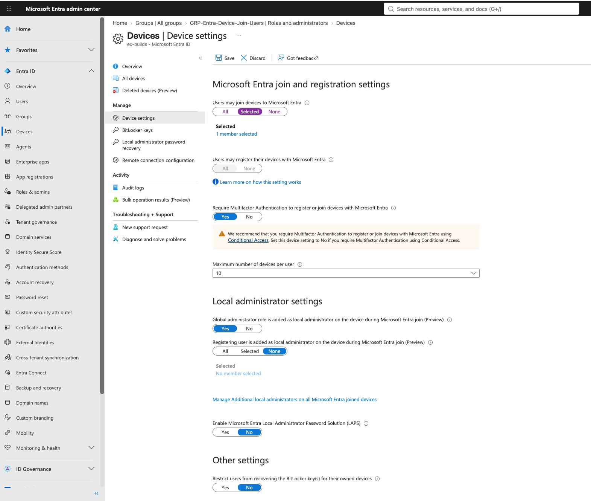
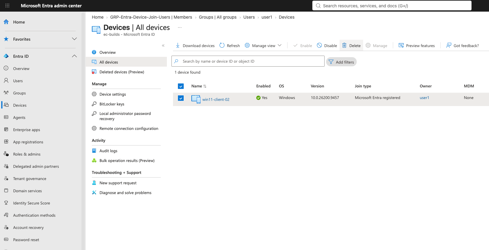
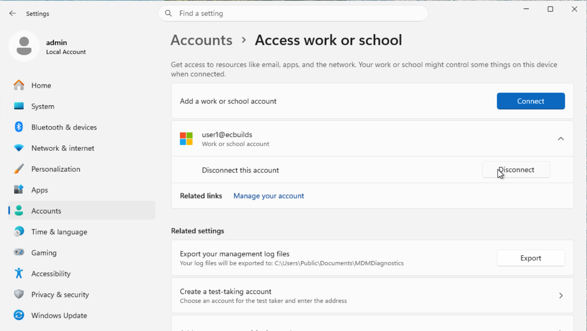
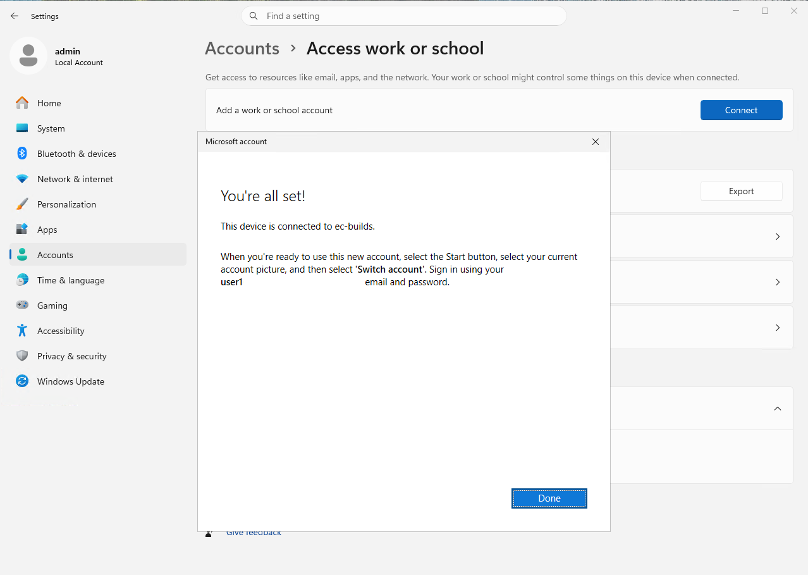
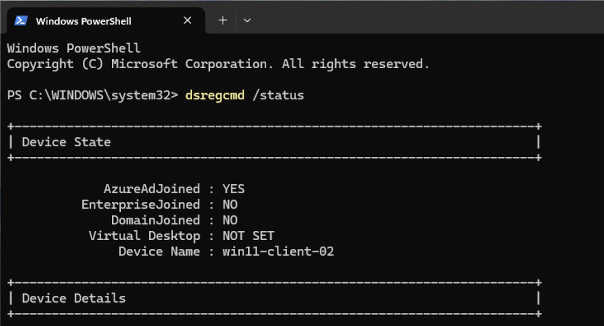
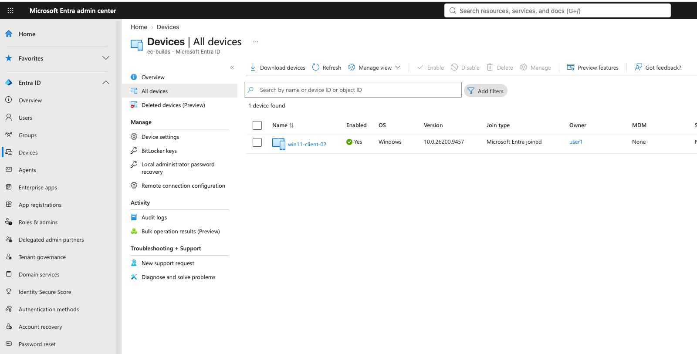

# Microsoft Entra ID Device Join

Microsoft Entra ID device joining was configured to provide centralized identity for company-owned Windows devices in the lab.

The deployment allows authorized users to join Windows devices to Microsoft Entra ID and sign in to those devices using their organizational credentials.

> **Note:** Intune enrollment is documented separately. The licensing used in this lab does not provide the Microsoft Entra ID Premium functionality required for automatic MDM enrollment, so Intune enrollment is performed manually.

## Deployment

The following configuration was deployed:

| Component | Configuration |
|---|---|
| Device Identity | Microsoft Entra Joined |
| Authorized Join Group | `GRP-Entra-Device-Join-Users` |
| Group Type | Security |
| Membership | Assigned |
| Users Allowed to Join | Selected group only |
| MFA for Device Join | Required |
| Maximum Devices per User | 10 |
| Intune Enrollment | Manual |

## Device Join Access

A dedicated security group was created:

```text
GRP-Entra-Device-Join-Users
```

Users who are authorized to provision company devices are added to this group.



*The `GRP-Entra-Device-Join-Users` security group is selected as the group authorized to join company devices to Microsoft Entra ID.*

Microsoft Entra device settings were then configured so that only members of the selected group are permitted to join devices.

```text
Users may join devices to Microsoft Entra:
    Selected

Authorized group:
    GRP-Entra-Device-Join-Users

Require MFA to register or join:
    Yes

Maximum devices per user:
    10
```



*Microsoft Entra device settings restrict device joining to the authorized security group, require MFA during device registration or join, and limit each user to 10 devices.*

This prevents general tenant users from joining devices unless they have been explicitly granted permission.

## Registered vs. Joined Testing

During initial testing, a Windows VM was connected using a work or school account. This resulted in the device becoming **Microsoft Entra registered**.

| Entra Registered | Entra Joined |
|---|---|
| Primarily BYOD | Primarily company-owned devices |
| Existing local Windows account remains primary | Entra identity can be used for Windows sign-in |
| Provides access to organizational resources | Device becomes part of the organization's Entra environment |
| `WorkplaceJoined : YES` | `AzureAdJoined : YES` |

Registration would be appropriate for a BYOD scenario where a user needs access to company applications and data from a personal computer.

The initial test device appeared in Microsoft Entra with a **Join type** of **Microsoft Entra registered** and no MDM management.



*The initial test connection created a Microsoft Entra registered device rather than a Microsoft Entra joined device, demonstrating the identity state typically associated with a work or school account connected to an existing local Windows profile.*

Because this lab is designed around company-owned endpoints, the registered connection was removed.



*The registered work or school account was disconnected from Windows before the device was reconfigured using Microsoft Entra Join.*

## Device Join

Authorized users can join company Windows devices using their organizational credentials.

The resulting deployment flow is:

```text
GRP-Entra-Device-Join-Users
            │
            ▼
Authorized User
            │
            ▼
Windows Device
            │
            ▼
Microsoft Entra Join
            │
            ▼
MFA
            │
            ▼
Microsoft Entra Joined Device
```

After authentication and MFA, Windows confirms that the device has been connected to the organization and that the organizational account can be used to sign in.



*Windows confirms the successful Microsoft Entra Join and identifies the organizational account that can subsequently be used to sign in to the device.*

## Verification

Device join status can be verified from Windows with:

```powershell
dsregcmd /status
```

The expected state for a cloud-only Entra joined device is:

```text
AzureAdJoined : YES
EnterpriseJoined : NO
DomainJoined : NO
```



*The `dsregcmd /status` output verifies that the Windows endpoint is Microsoft Entra joined, is not joined to an on-premises Active Directory domain, uses TPM-protected device credentials, and successfully authenticates its device identity.*

The device can also be verified in the Microsoft Entra admin center with a **Join type** of:

```text
Microsoft Entra joined
```



*The Microsoft Entra admin center confirms that the endpoint is enabled, owned by the authorized organizational user, and has a Join type of Microsoft Entra joined.*

## Intune Enrollment

Microsoft Entra device identity and Intune device management are treated as separate components of the lab.

Automatic MDM enrollment is unavailable with the licensing currently used in the lab.
