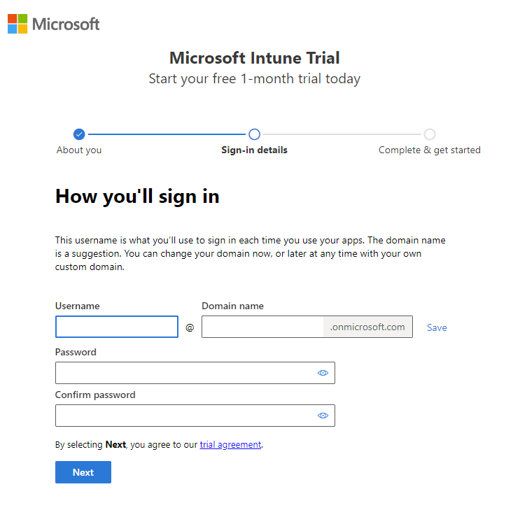
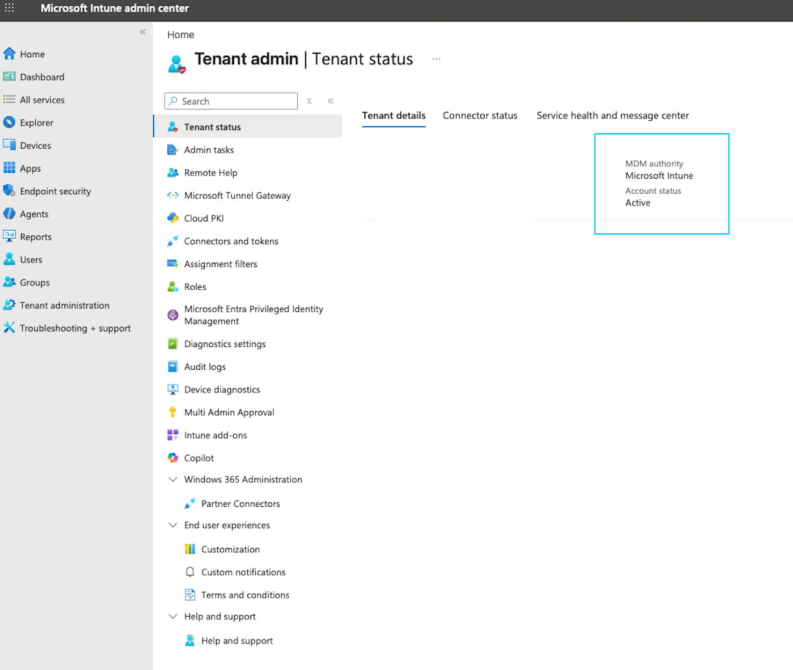
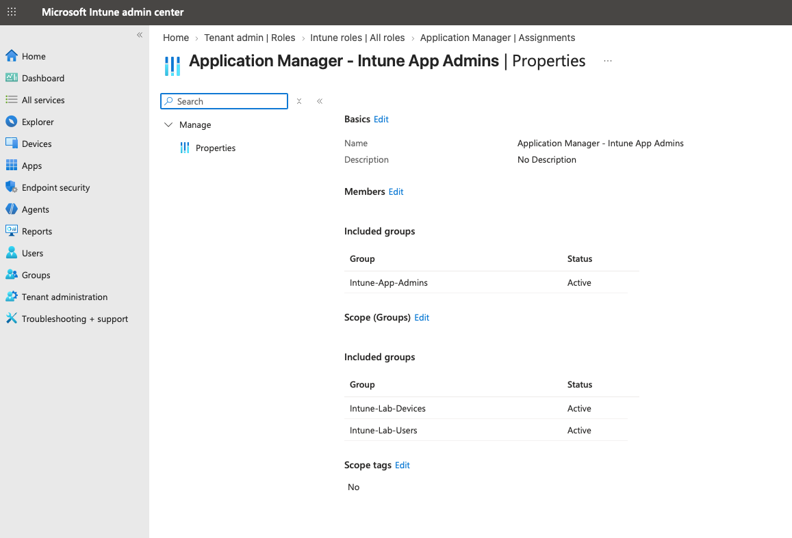

# 01 · Tenant & Identity

## Intune Trial and Tenant Setup

I used Microsoft's **30-day Microsoft Intune Plan 1 trial** to create a dedicated Microsoft Entra tenant and Intune environment for the lab. For the most part, I followed Microsoft's documented **Sign up for a free trial** process, and the initial tenant setup was straightforward.


### Setup Process

The trial signup created the Microsoft Entra tenant and Intune subscription used throughout the lab. The initial setup consisted of:

1. Starting the Microsoft Intune Plan 1 trial.
2. Creating a new organizational account.
3. Providing the required organization and verification information.
4. Selecting the initial `.onmicrosoft.com` tenant domain and administrator username.
5. Completing account verification and trial activation.
6. Signing in to the Microsoft Intune admin center with the newly created tenant account.



The account used to create the subscription was automatically assigned the **Microsoft Entra Global Administrator** role. Because this role provides significantly more access than required for routine Intune administration, I separated privileged tenant administration from day-to-day Intune management.

## Administrative Access

The lab uses **role-based access control (RBAC)** to separate tenant-level administration from Intune administration and follow the principle of least privilege.

The original Global Administrator identity was configured as a dedicated privileged administrative account and is reserved for tenant-level tasks requiring elevated permissions.

Routine Intune administration is performed using accounts assigned only the permissions required for their responsibilities.

### Entra RBAC vs. Intune RBAC

During setup, I identified an important distinction between the two administrative permission systems used in the environment:

| RBAC System | Scope | Examples |
|---|---|---|
| **Microsoft Entra RBAC** | Directory and tenant-level administration | Global Administrator, Intune Administrator, User Administrator |
| **Microsoft Intune RBAC** | Granular Intune administration | Application Manager, Intune Role Administrator, Policy and Profile Manager |

Although both systems control administrative access, Intune-specific roles such as **Application Manager** are assigned within Intune rather than Microsoft Entra ID.

This distinction allows administrative responsibilities to be delegated without granting broader tenant permissions than necessary.

## Multifactor Authentication

Multifactor authentication was configured for administrative access.

Microsoft requires MFA for users signing in to administrative services including:

- Microsoft Intune admin center
- Microsoft Entra admin center
- Microsoft Azure portal

Administrative accounts therefore require an additional authentication factor before accessing the management environment.

## MDM Authority

After activating the trial, I verified the tenant's **Mobile Device Management (MDM) authority** in the Intune admin center.

```text
Tenant administration
└── Tenant details
    └── MDM authority: Microsoft Intune
```



The trial configured Microsoft Intune as the MDM authority automatically, so no additional configuration was required.


## Intune RBAC

Intune-specific administrative permissions were delegated using security groups and scoped role assignments. The Application Manager role was assigned to the `Intune-App-Admins` administrative group, with management limited to the lab user and device groups.




## Results

At the end of the tenant and identity setup:

- Microsoft Entra tenant created and Intune Plan 1 trial activated.
- Privileged tenant administration separated from day-to-day Intune administration across Entra and Intune RBAC.
- MFA enforced for all administrative sign-in.
- MDM authority confirmed as Microsoft Intune.
- Tenant prepared for users, groups, licensing, and endpoint enrollment.

## Reference

Microsoft Learn — [Step 1: Sign up for a free trial and configure a Microsoft Intune tenant](https://learn.microsoft.com/en-us/intune/fundamentals/free-trial-sign-up)
