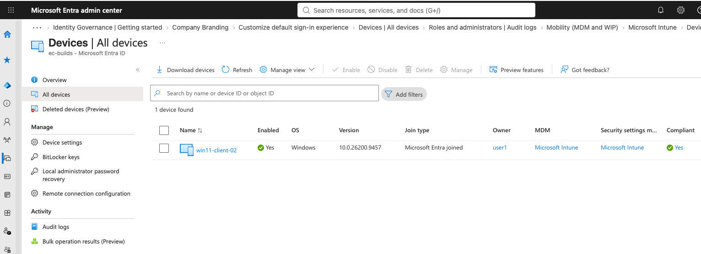

# Microsoft Intune Windows Enrollment



Microsoft Intune was configured to provide cloud-based management for Windows endpoints in the EC-Builds lab.

The current deployment demonstrates manual MDM enrollment, Windows enrollment restrictions, device ownership classification, policy synchronization, and the separation between Microsoft Entra device identity and Microsoft Intune device management.

> **Current State:** Manual Intune enrollment is operational. The test device is successfully managed by Intune and reports as compliant. Because the current manual enrollment workflow is classified by Intune as a **personal device**, additional work is planned to implement a corporate-owned enrollment workflow.

## Deployment

The current Intune enrollment configuration includes:

| Component | Configuration |
|---|---|
| MDM Platform | Microsoft Intune |
| Endpoint Platform | Windows 11 |
| Device Identity | Microsoft Entra Joined |
| Intune Enrollment | Manual |
| Windows MDM Enrollment | Allowed |
| Personally Owned Windows Enrollment | Blocked by default |
| Non-Windows Enrollment | Blocked |
| Test Device | `WIN11-CLIENT-02` |
| Device Management | Intune |
| Current Ownership Classification | Personal |
| Compliance | Compliant |

Automatic MDM enrollment is not currently used in the lab. Microsoft Entra device identity and Microsoft Intune management are therefore configured and tested as separate components.

## Enrollment Restrictions

The default Intune device platform restriction was hardened for a Windows-focused environment.

The configured policy allows Windows MDM enrollment while blocking platforms that are not currently supported by the lab.

| Platform | Enrollment |
|---|---|
| Android Enterprise | Block |
| Android Device Administrator | Block |
| iOS/iPadOS | Block |
| visionOS | Block |
| tvOS | Block |
| macOS | Block |
| Windows MDM | Allow |
| Personally Owned Windows | Block |


*The default device platform restriction limits enrollment to Windows MDM and blocks personally owned Windows devices.*

The completed restriction provides a deny-by-default enrollment posture for platforms that are outside the scope of the current environment.


*The enrollment restriction summary verifies that unsupported platforms and personally owned Windows devices are blocked.*

## Manual Enrollment Workflow

The test endpoint was already connected to Microsoft Entra ID before Intune enrollment was performed.

Initial testing from the standard user session showed that Windows required administrative privileges to modify the device management configuration.


*Windows indicates that an administrator account is required to change device management settings.*

The enrollment was therefore initiated from a local administrator session using the **Enroll only in device management** workflow.

The organizational identity used for enrollment remained the standard test user rather than granting that user additional Intune administrative privileges.

This demonstrated an important separation between:

- **Local Windows privileges**, which control whether the Windows device management configuration can be changed.
- **Microsoft Entra user identity**, which identifies the organizational user performing the enrollment.
- **Intune administrative roles**, which provide administrative access to Intune and are not required simply for a user to enroll a device.

## Enrollment Restriction Testing

During the first enrollment attempt, the default Windows enrollment restriction was configured with:

```text
Windows (MDM):       Allow
Personally owned:    Block
```

Windows began registering the device and applying organizational policy.


*Windows begins registering the endpoint with the organization and applying device management policy.*

The enrollment was then rejected with error:

```text
0x80180014
Your organization does not support this version of Windows.
```


*The enrollment attempt is rejected while personally owned Windows enrollment is blocked.*

Although the Windows error refers to the version of Windows, testing showed that the failure corresponded with the Intune enrollment restriction.

To validate the cause, **Personally owned Windows devices** was temporarily changed from **Block** to **Allow** and the same enrollment process was repeated.

The enrollment then completed successfully.

This provided a practical validation of the enrollment restriction:

```text
Manual Windows Enrollment
          │
          ▼
Intune evaluates device
          │
          ▼
Device classified as Personal
          │
     ┌────┴────┐
     │         │
Personal     Personal
Blocked      Allowed
     │         │
     ▼         ▼
0x80180014   Enrollment
             succeeds
```

## Successful Intune Enrollment

After personally owned enrollment was temporarily permitted, Windows successfully established an MDM connection to EC-Builds.

The device now displays both its Microsoft Entra ID connection and its separate MDM management connection.


*Windows shows both the existing Microsoft Entra ID connection and the newly established EC-Builds MDM connection.*

This demonstrates that Microsoft Entra device identity and Microsoft Intune device management are separate components even when they are used together on the same endpoint.

## Device Ownership

After enrollment, the device was verified in the Microsoft Intune admin center.

Intune reported:

| Property | Result |
|---|---|
| Managed by | Intune |
| Ownership | Personal |
| Compliance | Compliant |
| Operating System | Windows |


*The Intune device inventory confirms that the manually enrolled endpoint is managed and compliant but classified as Personal.*

This explains why the original enrollment attempt failed when personally owned Windows enrollment was blocked.

The manual enrollment method used in this test did not provide Intune with a corporate ownership signal before enrollment, so the endpoint was treated as a personal device.

## Device Management Verification

The Windows management interface confirms that the endpoint is actively managed by EC-Builds.

The device receives organizational policy from the Microsoft Intune MDM service and can manually synchronize with the management service.


*Windows confirms active EC-Builds management, applied security policy, and successful synchronization with Microsoft Intune.*

> **Security Note:** Device-specific management identifiers shown in screenshots are redacted before publication.

This confirms the complete management path:

```text
Windows Endpoint
      │
      ├── Microsoft Entra ID
      │       └── Device identity
      │
      └── Microsoft Intune MDM
              ├── Management
              ├── Policy
              ├── Compliance
              └── Synchronization
```

## Findings

Several behaviors were identified during deployment and troubleshooting.

| Finding | Result |
|---|---|
| Intune Administrator role is not required for normal device enrollment | Administrative roles control Intune administration rather than serving as the enrollment mechanism |
| Local Windows permissions affect manual enrollment | The standard Windows session could not change device management settings |
| Enrollment restrictions are device restrictions | They control which device types and ownership classifications may enroll rather than acting as a simple user enrollment permission |
| Manual MDM enrollment can be classified as Personal | The test endpoint appeared in Intune with `Ownership: Personal` |
| Blocking personally owned Windows devices was successfully enforced | Enrollment failed while the restriction was enabled |
| Allowing personal Windows enrollment permitted the test | The same device successfully enrolled after the restriction was temporarily relaxed |
| Entra connection and Intune enrollment are separate | Windows displays independent Entra ID and MDM connections |
| Intune management is operational | The device reports as managed, compliant, and successfully synchronizes policy |

## Current Security Baseline

The desired enrollment restriction remains:

```text
Windows MDM              Allow
Personally owned Windows Block
Other platforms          Block
```

This represents the intended production-style posture for the lab.

Personally owned enrollment was enabled temporarily to validate manual Intune enrollment and determine how Intune classified the test endpoint.

The successful test confirmed that the restriction operates as expected.

## Planned Corporate Device Enrollment

The current test device is managed successfully, but Intune classifies it as **Personal**.

The next phase of the project is therefore to implement a supported workflow that establishes corporate ownership before or during enrollment.

The target state is:

```text
Corporate Windows Device
          │
          ▼
Corporate ownership established
          │
          ▼
Microsoft Entra Joined
          │
          ▼
Microsoft Intune Enrollment
          │
          ▼
Ownership = Corporate
          │
          ▼
Configuration + Security
          │
          ▼
Compliance
```

Windows Autopilot will be evaluated as the preferred long-term provisioning method because it can provide an enterprise device provisioning workflow in which organization-owned endpoints are registered and prepared for deployment before the end user begins using them.

Additional investigation will determine the most appropriate corporate-device enrollment method for the licensing and capabilities available in the lab.

Until that workflow is implemented, the current manually enrolled device remains useful for testing:

- Intune configuration profiles
- Security policies
- Compliance policies
- Application deployment
- Windows Update management
- PowerShell scripts and remediations
- Device inventory and reporting
- Remote management actions
- Policy synchronization

## Next Steps

The next phase of the Intune lab will focus on:

1. Establishing a repeatable **corporate-owned Windows enrollment** workflow.
2. Evaluating **Windows Autopilot** for corporate device provisioning.
3. Returning the default enrollment restriction to **Personally owned Windows = Block** after enrollment testing.
4. Validating corporate ownership in the Intune device inventory.
5. Expanding Windows configuration and endpoint security policies.
6. Deploying applications through Intune.
7. Creating and testing compliance policies.
8. Testing Windows Update management.
9. Expanding PowerShell automation and reporting.
10. Documenting the complete endpoint lifecycle from provisioning through retirement.

The current deployment establishes the foundation for that work by demonstrating successful Microsoft Entra identity integration, manual Intune MDM enrollment, enrollment restriction enforcement, device compliance, and policy synchronization.
