# Microsoft Intune Windows Enrollment

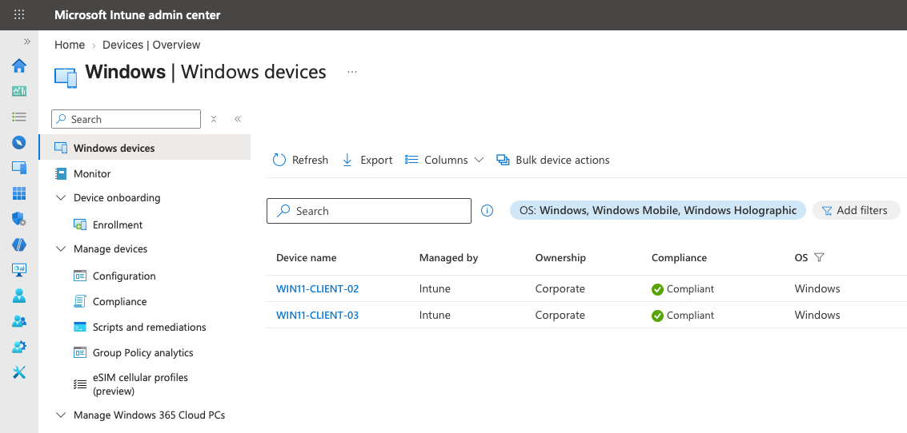

Microsoft Intune was configured to provide cloud-based management for Windows endpoints in the EC-Builds lab.

The deployment demonstrates manual MDM enrollment, Windows enrollment restrictions, device ownership classification, policy synchronization, and the separation between Microsoft Entra device identity and Microsoft Intune device management.

> **Current State:** Manual Intune enrollment is operational. The test device is successfully managed by Intune and reports as compliant. The manual enrollment method initially classified the endpoint as Personal, so its ownership was manually changed to Corporate after enrollment.

## Deployment

| Component | Configuration |
|---|---|
| MDM Platform | Microsoft Intune |
| Endpoint Platform | Windows 11 |
| Device Identity | Microsoft Entra Joined |
| Intune Enrollment | Manual |
| Windows MDM Enrollment | Allowed |
| Personally Owned Windows Enrollment | Blocked by default |
| Non-Windows Enrollment | Blocked |
| Test Device | `WIN11-CLIENT-02` |
| Device Management | Intune |
| Initial Ownership | Personal |
| Current Ownership | Corporate |
| Compliance | Compliant |

Automatic MDM enrollment is not currently used in the lab. Microsoft Entra device identity and Microsoft Intune management are therefore configured and tested as separate components.

## Enrollment Restrictions

The default Intune device platform restriction was hardened for a Windows-focused environment.

| Platform | Enrollment |
|---|---|
| Android Enterprise | Block |
| Android Device Administrator | Block |
| iOS/iPadOS | Block |
| visionOS | Block |
| tvOS | Block |
| macOS | Block |
| Windows MDM | Allow |
| Personally Owned Windows | Block |

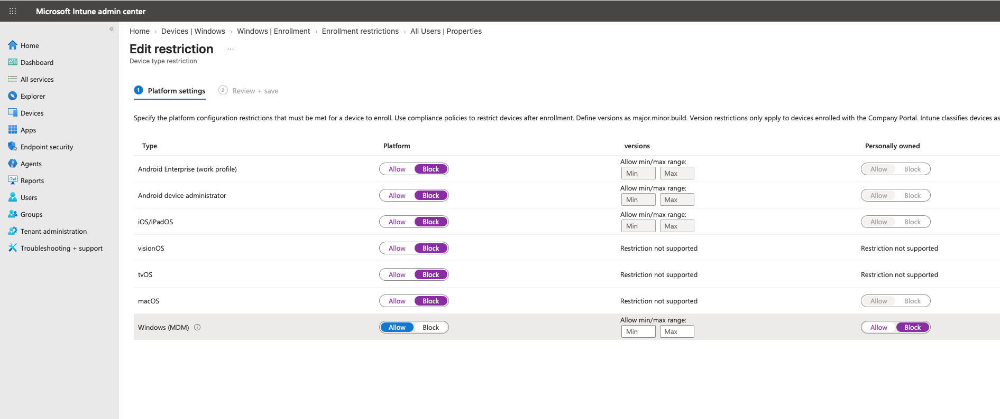


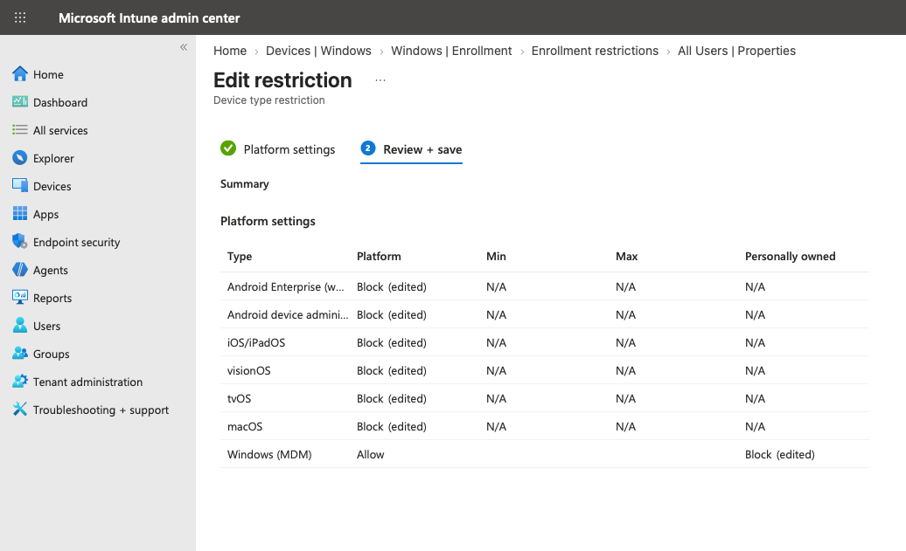


## Manual Enrollment

The test endpoint was already Microsoft Entra joined before Intune enrollment was performed.
Initial testing from the standard Windows user session showed that administrative privileges were required to modify the device management configuration.


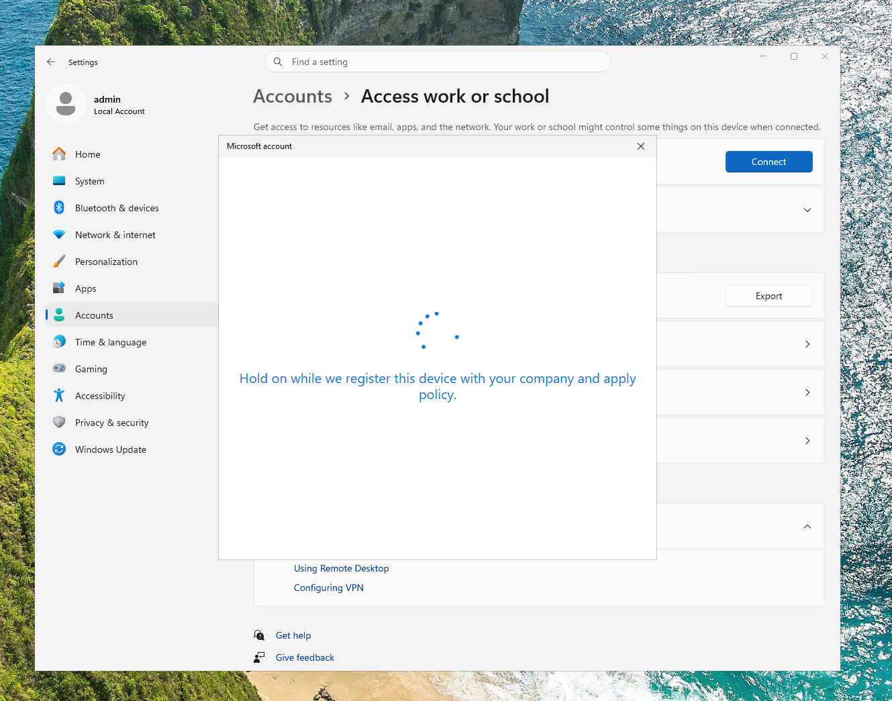


Enrollment was therefore initiated from a local administrator session using **Enroll only in device management**, while the standard organizational test account was used as the enrollment identity.
This demonstrated the separation between local Windows privileges, Microsoft Entra user identity, and Intune administrative roles. An Intune administrative role is not required simply for a user to enroll a device.

## Enrollment Restriction Testing

The initial enrollment attempt was performed with the following restriction:

```text
Windows (MDM):       Allow
Personally owned:    Block
```

Windows began registering the device and applying organizational policy.

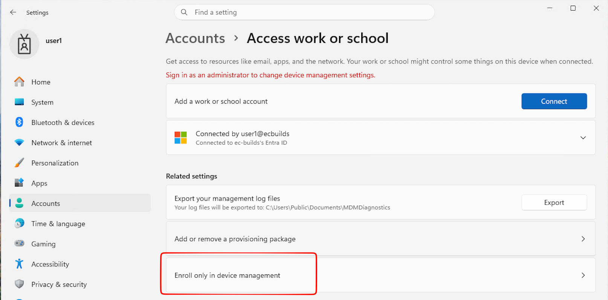


Enrollment was then rejected with:

```text
0x80180014
Your organization does not support this version of Windows.
```

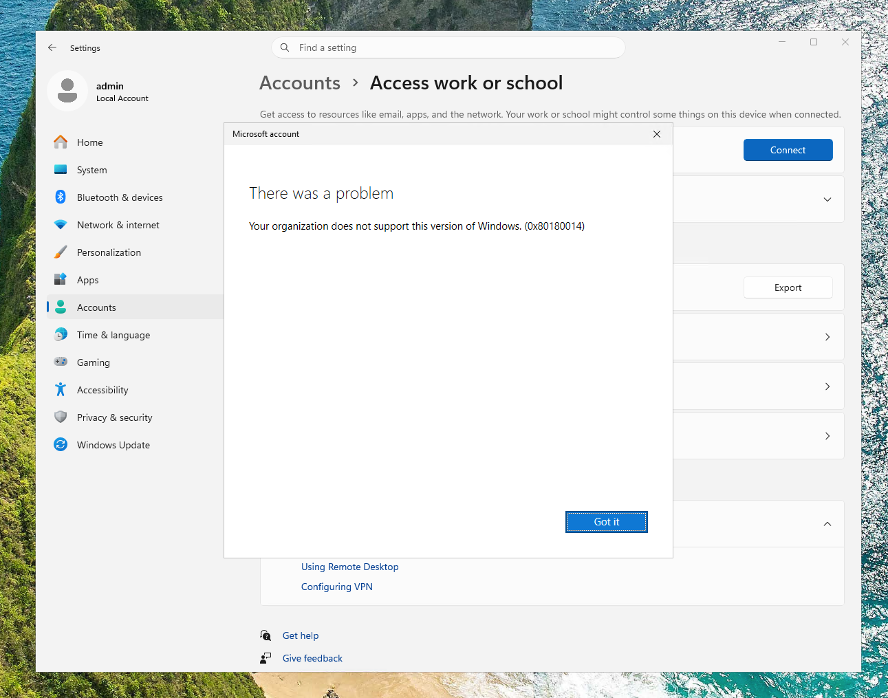

*The enrollment attempt is rejected while personally owned Windows enrollment is blocked.*

To isolate the cause, **Personally owned Windows** was temporarily changed from **Block** to **Allow** and the same enrollment process was repeated.

The enrollment completed successfully, and Intune subsequently classified the endpoint as Personal. This confirmed that the ownership restriction was responsible for blocking the original enrollment attempt.

## Successful Enrollment and Verification

After personally owned enrollment was temporarily permitted, Windows successfully established an MDM connection to EC-Builds.

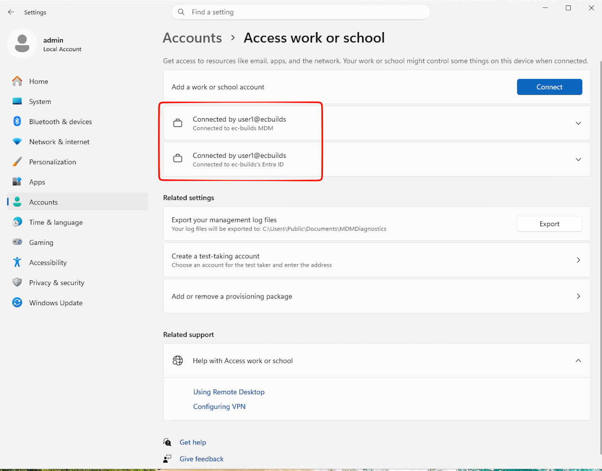

*Shows both the Microsoft Entra ID connection and the separate EC-Builds MDM connection.*

The device was then verified in Microsoft Intune:

| Property | Result |
|---|---|
| Managed by | Intune |
| Initial Ownership | Personal |
| Compliance | Compliant |
| Operating System | Windows |

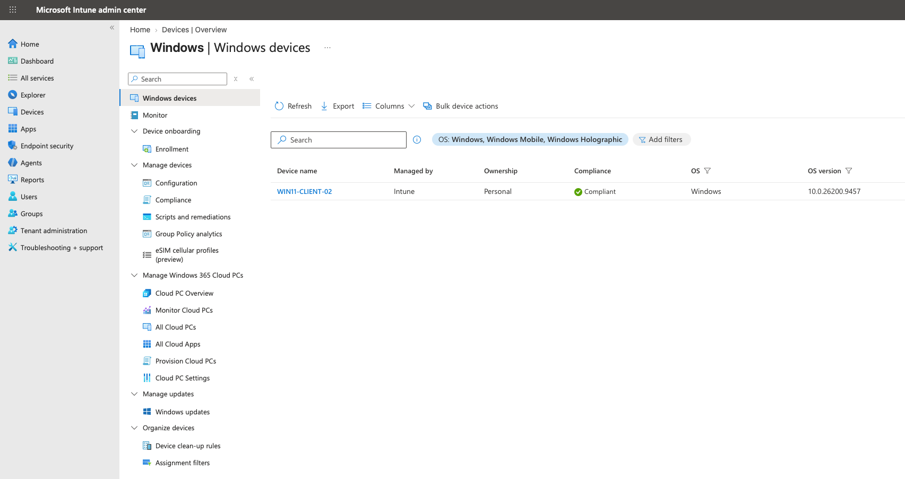


The Windows management interface also confirms active MDM management and successful policy synchronization.

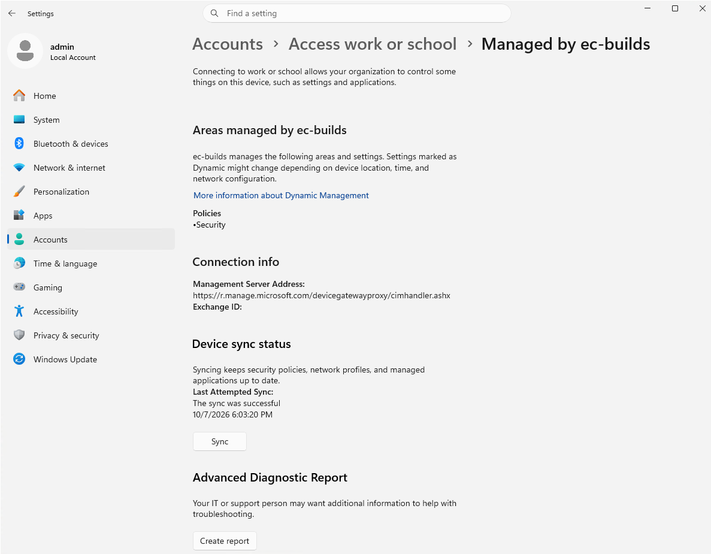

*Windows confirms active EC-Builds management and synchronization with Microsoft Intune.*

> **Security Note:** Device-specific management identifiers shown in screenshots are redacted before publication.

The completed management path is:

```text
Windows Endpoint
      │
      ├── Microsoft Entra ID
      │       └── Device Identity
      │
      └── Microsoft Intune
              ├── Device Management
              ├── Configuration
              ├── Security
              ├── Compliance
              └── Applications
```

## Device Ownership

The manual MDM enrollment method used in this deployment did not provide Intune with a corporate ownership signal during enrollment.

As a result, the organization-owned lab endpoint initially appeared as:

```text
Ownership: Personal
```

Because the device represents an organization-owned endpoint, its ownership classification was manually corrected after enrollment.

In the Intune admin center, the device ownership property can be edited through:

```text
Devices
  → Windows
    → Select Device
      → Properties
        → Edit
          → Ownership
```

The ownership property was changed from **Personal** to **Corporate**.

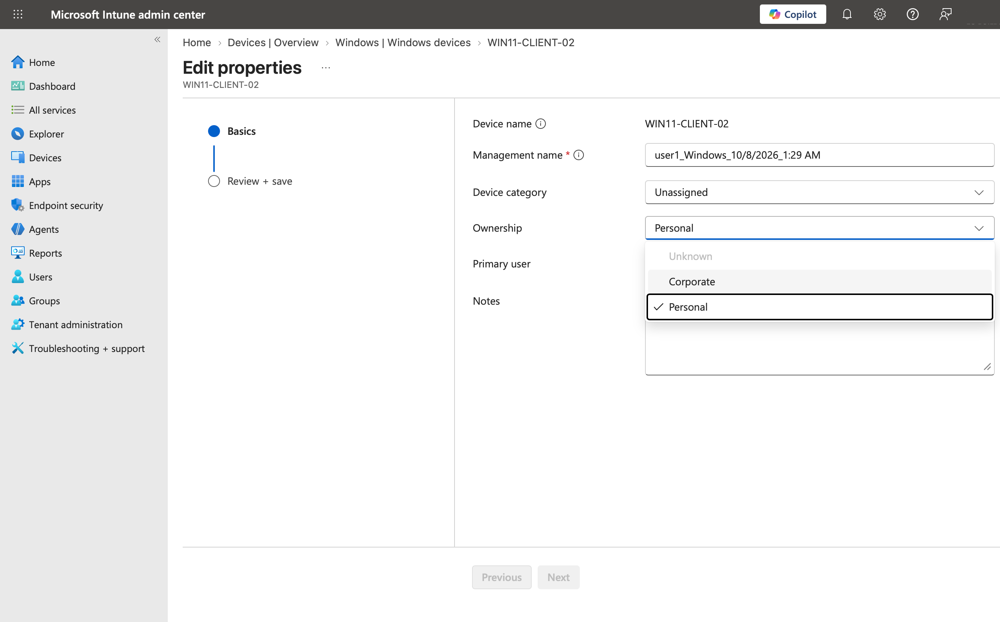

*Image shows ownership change via Intune admin dashboard*

Entra Dashboard:

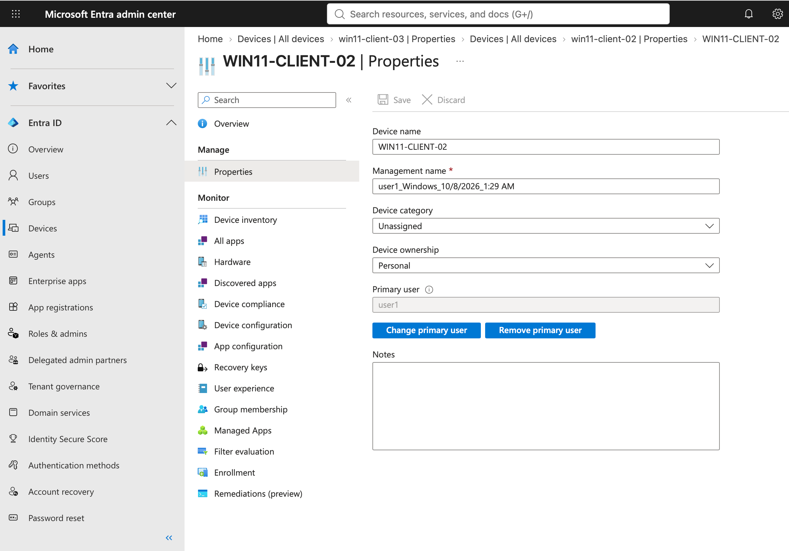

*The Intune device properties can be modified via Entra as well*

The resulting workflow was:

```text
Microsoft Entra Joined
        │
        ▼
Manual Intune Enrollment
        │
        ▼
Ownership = Personal
        │
        ▼
Corporate Ownership Verified
        │
        ▼
Administrator Changes Ownership
        │
        ▼
Ownership = Corporate
```

This approach is practical for the current lab because the ownership of each endpoint is known and the number of managed devices is limited.

However, changing ownership after enrollment does not bypass an enrollment restriction. The device must first successfully enroll before its ownership can be manually corrected.

## Findings

| Finding | Result |
|---|---|
| **Microsoft Entra join and Intune enrollment are separate** | Entra establishes device identity while Intune provides MDM management, policy, compliance, applications, and lifecycle management. |
| **Enrollment method affects device ownership classification** | The tested manual MDM enrollment method classified the organization-owned endpoint as Personal, causing enrollment to fail while personally owned Windows devices were blocked. |
| **Device ownership can be corrected after enrollment** | After verifying that the endpoint was organization-owned, its Intune ownership classification was manually changed from Personal to Corporate. |

## Future Corporate Enrollment

The intended security baseline remains:

```text
Windows MDM              Allow
Personally owned Windows Block
Other platforms          Block
```

The current manual workflow successfully provides Intune management but initially identifies enrolled devices as Personal. For the current lab, known organization-owned endpoints can be manually changed to Corporate after enrollment.

For additional information about corporate and personally owned device classification, see the [Microsoft Intune Reference Guide](/docs/reference/microsoft/intune).

A future phase of the lab will evaluate **Microsoft Entra Connect Sync** between the existing on-premises Active Directory environment and Microsoft Entra ID.


For Microsoft's documented ownership classifications and supported corporate enrollment methods, see:

[Microsoft Learn — Identify devices as corporate-owned](https://learn.microsoft.com/en-us/intune/device-enrollment/add-corporate-identifiers)
