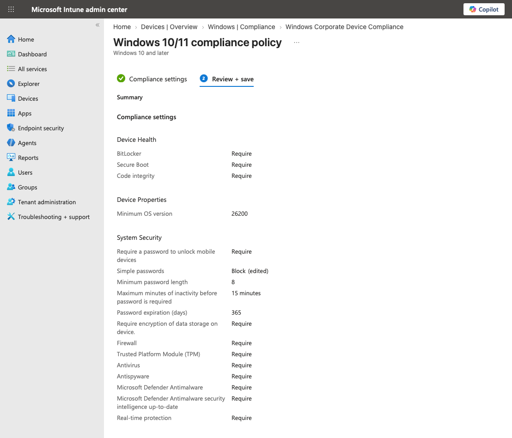
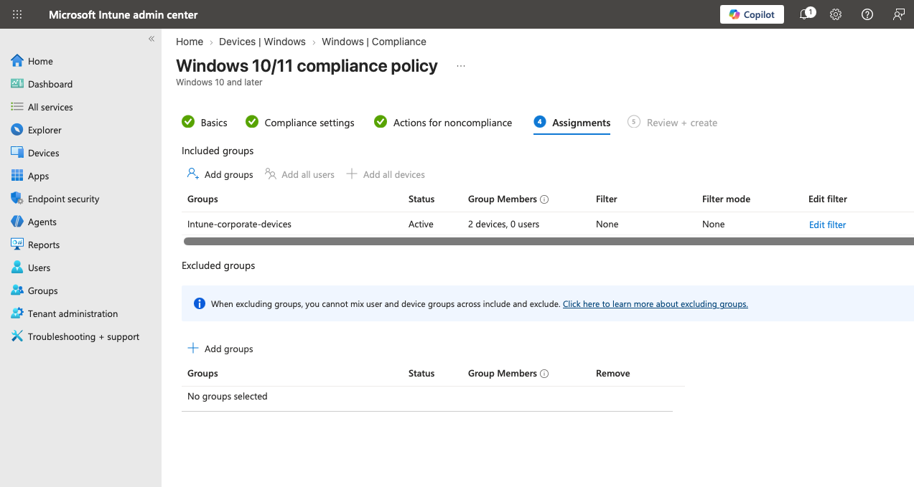
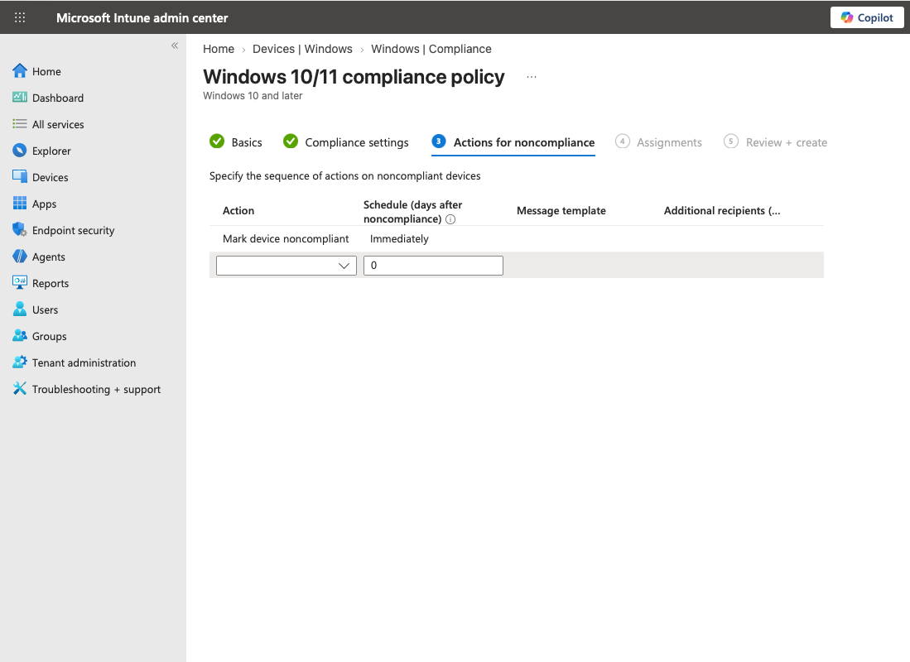

# Microsoft Intune Windows Compliance Policy

A baseline Windows compliance policy was deployed in Microsoft Intune to evaluate the security posture of corporate Windows endpoints.

The policy establishes the minimum requirements that managed Windows devices must meet to be considered compliant. Devices that fail one or more requirements are marked **Noncompliant** for investigation and remediation.

## Deployment

The following compliance policy was deployed:

| Component | Configuration |
|---|---|
| Policy | `Windows Corporate Device Compliance` |
| Platform | Windows 10 and later |
| Profile | Windows 10/11 compliance policy |
| Assignment Group | `Intune-corporate-devices` |
| Group Type | Device group |
| Noncompliance Action | Mark device noncompliant immediately |
| Status | Active |

The policy is assigned only to the corporate Windows device group rather than globally to all managed endpoints.

## Compliance Requirements

The baseline evaluates device health, operating system version, password requirements, encryption, and Windows security services.

| Category | Requirement | Configuration |
|---|---|---|
| Device Health | BitLocker | Require |
| Device Health | Secure Boot | Require |
| Device Health | Code Integrity | Require |
| Device Properties | Minimum OS Version | 26200 |
| Password | Password Required | Require |
| Password | Simple Passwords | Block |
| Password | Password Type | Device default |
| Password | Minimum Password Length | 8 |
| Password | Maximum Inactivity | 15 minutes |
| Password | Password Expiration | 365 days |
| Password | Password History | 5 |
| Encryption | Data Storage Encryption | Require |
| System Security | Firewall | Require |
| System Security | TPM | Require |
| System Security | Antivirus | Require |
| System Security | Antispyware | Require |
| System Security | Microsoft Defender Antimalware | Require |
| System Security | Defender Security Intelligence | Require up-to-date |
| System Security | Real-Time Protection | Require |

## Device Assignment

Corporate Windows endpoints are placed in:

    Intune-corporate-devices

The compliance policy is assigned to this device group. This limits the baseline to endpoints designated for corporate management and provides a defined scope for future compliance testing.

No device filters or exclusion groups are currently configured.

## Noncompliance

Devices that fail a configured requirement are marked **Noncompliant immediately**.

    Corporate Windows Device
            ↓
    Intune Compliance Evaluation
            ↓
    Meets Baseline?
         ↙       ↘
       Yes        No
        ↓          ↓
    Compliant   Noncompliant

At this stage, the policy establishes the baseline and reports compliance state. Devices reported as noncompliant will be investigated and remediated as part of later lab testing.

## Status

The baseline compliance policy is **active** and assigned to the corporate Windows device group.

Future testing will intentionally evaluate noncompliant devices to document the complete lifecycle:

    Compliant
        ↓
    Requirement Fails
        ↓
    Noncompliant
        ↓
    Identify Failed Requirement
        ↓
    Remediate
        ↓
    Intune Sync
        ↓
    Compliant

Integration with Microsoft Entra Conditional Access will be tested separately after the compliance baseline and remediation workflow have been validated.
