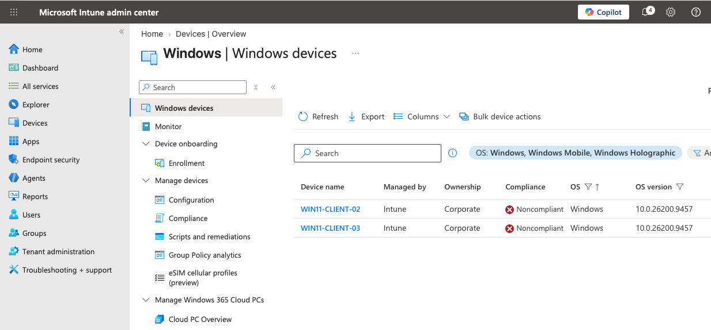
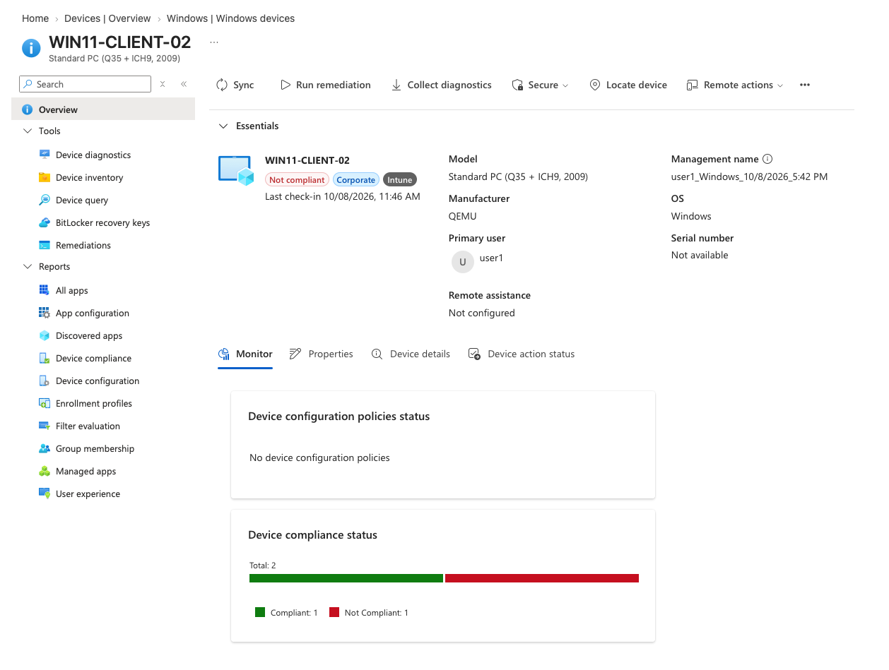
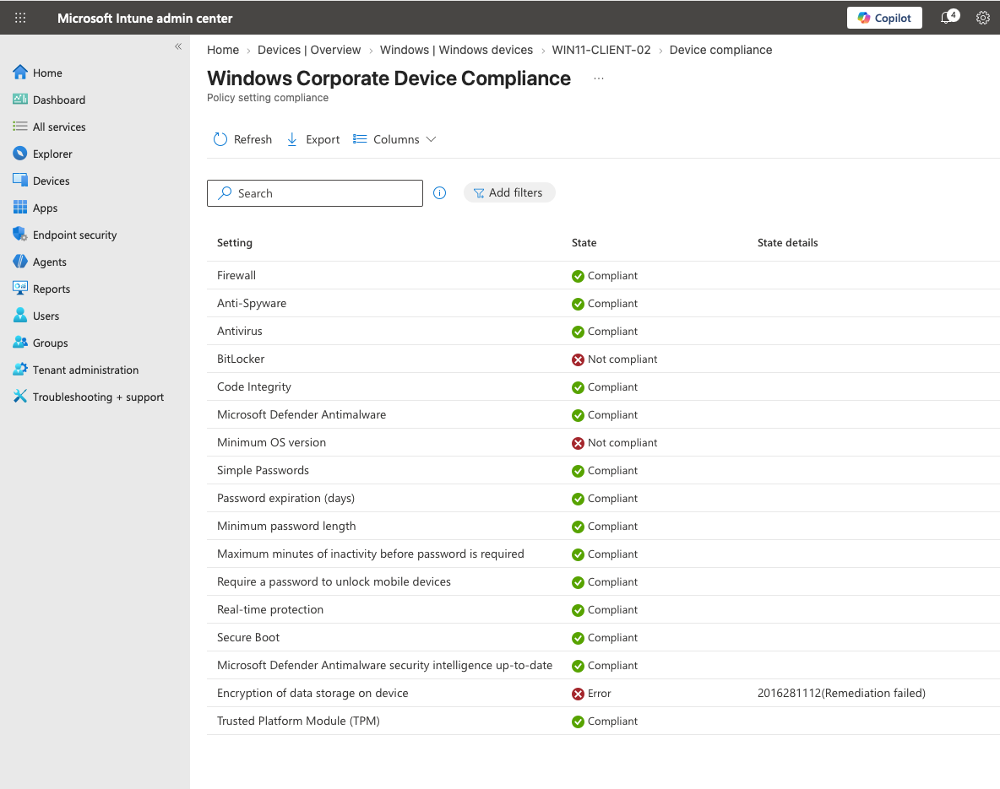

# Microsoft Intune Windows Noncompliance Testing

The baseline Windows compliance policy was applied to corporate Windows endpoints to validate how Microsoft Intune identifies and reports devices that do not meet established security requirements.

Initial evaluation successfully identified noncompliant devices and exposed the individual requirements responsible for the compliance state.

## Compliance Evaluation

The following baseline policy was evaluated (For details on the baseline policy, see the `Compliance Policy` doc):

| Component | Configuration |
|---|---|
| Compliance Policy | `Windows Corporate Device Compliance` |
| Assignment Group | `Intune-corporate-devices` |
| Device Ownership | Corporate |
| Management | Microsoft Intune |
| Noncompliance Action | Mark device noncompliant immediately |
| Status | Active |

After policy evaluation, devices that failed one or more requirements were reported as **Noncompliant** in the Windows device inventory.

## Device Compliance Results

The following requirements did not pass the initial evaluation:

| Requirement | State | Result |
|---|---|---|
| BitLocker | Not compliant | Device does not currently satisfy the BitLocker requirement |
| Minimum OS version | Not compliant | Device does not satisfy the configured minimum OS version requirement |
| Encryption of data storage on device | Error | Intune reported remediation failure `2016281112` |

Other evaluated controls, including Firewall, Antivirus, Antispyware, Secure Boot, TPM, Code Integrity, Microsoft Defender Antimalware, real-time protection, password requirements, and Defender security intelligence, successfully reported **Compliant**.

## Noncompliance Validation

The initial evaluation demonstrates that Intune evaluates individual requirements independently and uses those results to determine the overall compliance state of the endpoint.

    Windows Endpoint
          ↓
    Compliance Policy
          ↓
    Evaluate Requirements
          ↓
    Individual Setting Results
          ↓
    One or More Requirements Fail
          ↓
    Device = Noncompliant

## Remediation

The initial noncompliant state is being retained as part of the lab validation process rather than immediately modifying the baseline policy to make the devices compliant.

Each failed requirement will be investigated separately to determine whether the failure represents:

- A device configuration that requires remediation
- A compliance policy requirement that requires adjustment
- An Intune reporting or evaluation issue

After remediation, the endpoint will be synchronized with Intune and reevaluated against the same baseline.

    Noncompliant
         ↓
    Identify Failed Requirement
         ↓
    Investigate
         ↓
    Remediate
         ↓
    Intune Sync
         ↓
    Reevaluate
         ↓
    Compliant

## Status

The Windows compliance baseline is **active and successfully evaluating managed corporate endpoints**.

Initial testing confirmed that Intune can identify individual failed security requirements and mark affected endpoints as noncompliant. Remediation of the identified BitLocker, encryption, and minimum operating system requirements will be performed and documented as the next phase of the compliance lab.

Microsoft Entra Conditional Access integration will be tested separately after the compliance and remediation lifecycle has been validated.
