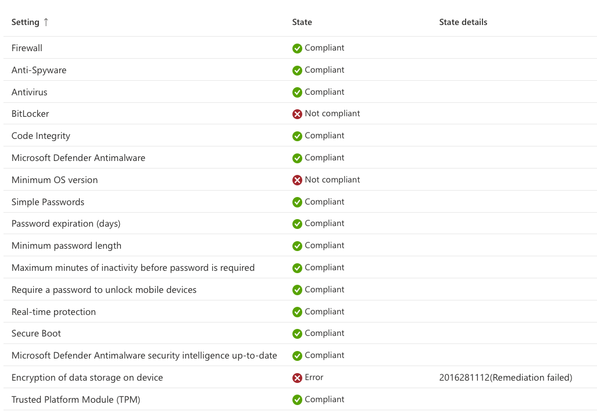
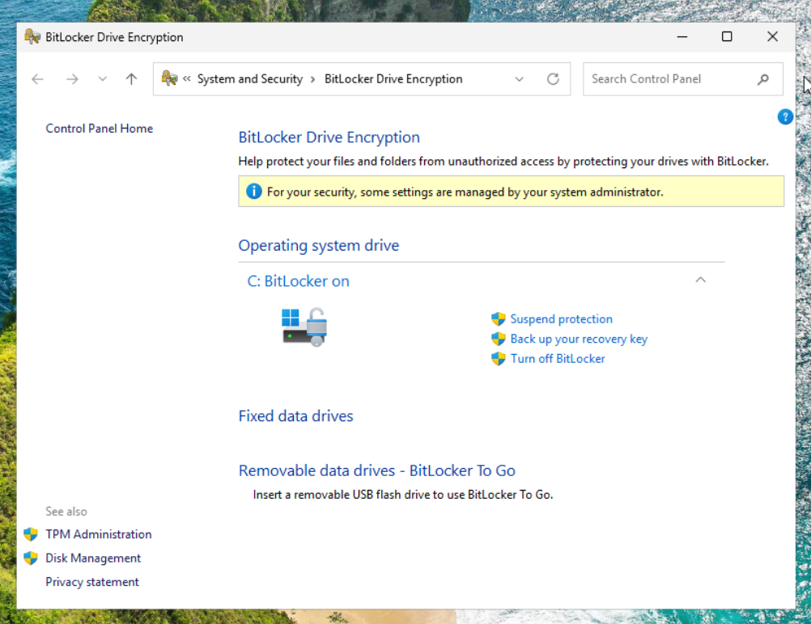
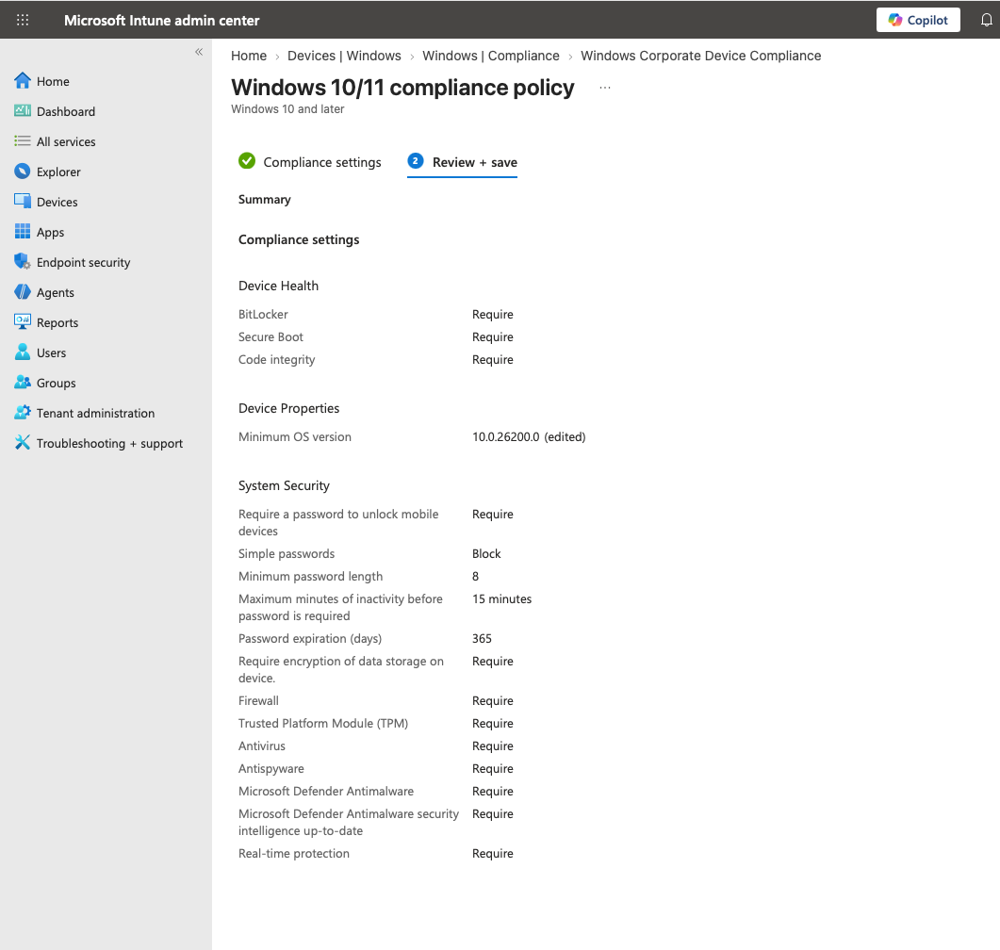
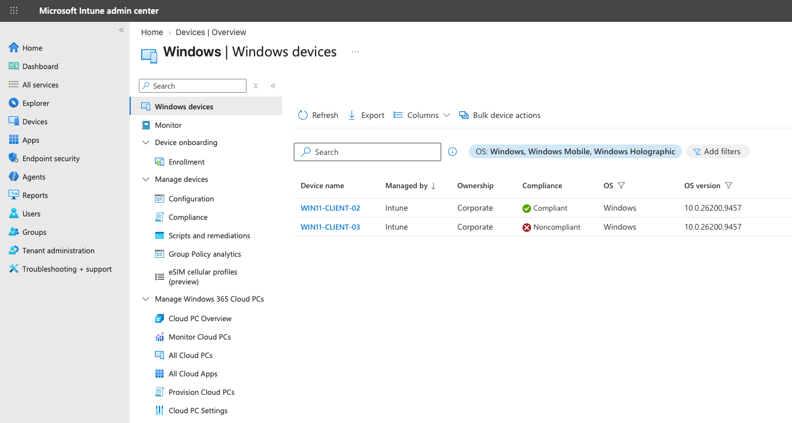
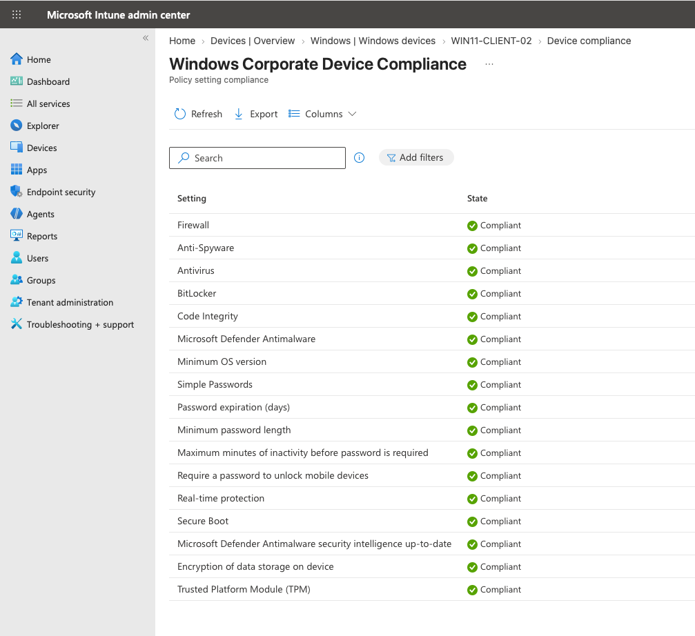

# Microsoft Intune Noncompliance Remediation

Initial compliance testing identified configuration issues on `WIN11-CLIENT-02` that caused the device to be reported as **Noncompliant** by Microsoft Intune.

The failed requirements were investigated and remediated without removing the device from management or weakening the intended compliance baseline.

## Initial Findings

The compliance evaluation identified failures related to BitLocker, storage encryption, and the configured minimum Windows version.

| Requirement | Initial State | Finding |
|---|---|---|
| BitLocker | Noncompliant | Operating system drive was not encrypted with BitLocker |
| Data Storage Encryption | Error | Encryption requirement could not be satisfied |
| Minimum OS Version | Noncompliant | Minimum version was not entered with sufficient version specificity |

Other security requirements evaluated by the policy were compliant.

## BitLocker Remediation

BitLocker was enabled on the operating system drive and the drive was encrypted.

The BitLocker recovery information was backed up to Microsoft Entra ID so that the recovery key can be retrieved through the managed device record when required.

After encryption was completed and the device reported its updated state to Intune, the BitLocker and storage-encryption requirements could be reevaluated against the compliance baseline.

## Minimum OS Version Remediation

The endpoint was already running a Windows build that met the intended operating system baseline. The compliance failure was caused by how the minimum version had originally been specified in the policy.

The minimum OS version was updated to use a more specific Windows version:

| Setting | Original | Updated |
|---|---|---|
| Minimum OS Version | `26200` | `10.0.26200.0` |

This allowed Intune to correctly evaluate the installed Windows version against the intended baseline.

## Compliance Re-Evaluation

After the BitLocker and minimum OS version issues were remediated, the endpoint synchronized with Intune and the compliance policy was reevaluated.

The device transitioned from:

    Noncompliant
         ↓
    Identify Failed Requirements
         ↓
    Enable BitLocker
         ↓
    Back Up Recovery Key to Entra ID
         ↓
    Correct Minimum OS Version
         ↓
    Intune Sync and Re-Evaluation
         ↓
    Compliant

`WIN11-CLIENT-02` now reports **Compliant** while remaining Intune-managed and classified as a corporate device.

## Result

The remediation test validated the complete Intune compliance workflow:

- Individual failed requirements were identified through per-setting compliance results.
- BitLocker was enabled and the operating system drive was encrypted.
- BitLocker recovery information was backed up to Microsoft Entra ID.
- The minimum OS version configuration was corrected to accurately represent the intended Windows baseline.
- The device was synchronized and reevaluated by Intune.
- The endpoint successfully transitioned from **Noncompliant** to **Compliant**.

The baseline compliance policy remains active and will be used for future corporate Windows endpoints. With the compliance and remediation workflow validated, the environment can later integrate device compliance with Microsoft Entra Conditional Access.
