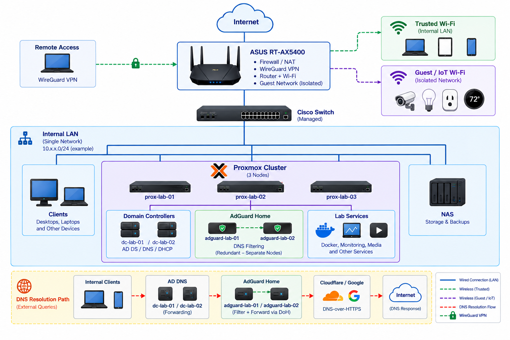

# 🌐 Network Infrastructure

**Status:** 🟢 Operational (Phase 1)

The physical and logical foundation of the homelab—routing, switching, wireless, IP design, and core network services.

> [!NOTE]
> The current environment is built around an ASUS RT-AX5400 router that consolidates routing, firewall, DHCP, VPN, and wireless services. This intentionally simplifies the initial homelab while providing a stable foundation for learning and future expansion.

## Objectives

- Design and document a structured network topology
- Implement a scalable IP addressing scheme
- Establish reliable DHCP and DNS services
- Segment trusted, guest, and lab traffic
- Maintain documentation sufficient to rebuild the network from scratch

## Logical Network Topology



> [!NOTE]
> The Cisco managed switch is deployed and provides centralized Ethernet connectivity for wired infrastructure. The ASUS RT-AX5400 currently remains responsible for routing, firewall, DHCP, VPN, and wireless services. VLAN segmentation and dedicated firewall services are planned for a future phase.

## Current Environment

- ASUS RT-AX5400 Router
- Cisco Catalyst Managed Switch
- 10.0.0.0/24 Network
- DHCP Reservations for infrastructure devices
- Synology NAS connected through the managed switch
- Proxmox virtualization hosts connected through the managed switch
- Ethernet-connected infrastructure and lab systems
- Guest Wi-Fi used for IoT isolation

## Technologies

### Current

- ASUS RT-AX5400
- Cisco Catalyst Managed Switch
- DHCP Reservations
- Guest Network Isolation
- Synology NAS
- Ethernet-connected virtualization and server infrastructure

### Planned

- VLAN Segmentation
- Internal DNS Services
- Configuration Backups
- NetBox IPAM
- OPNsense Firewall

## Key Tasks

### Completed

- [x] Define IP addressing plan
- [x] Configure DHCP reservations
- [x] Implement guest network isolation
- [x] Deploy Cisco managed switch
- [x] Configure switch management access
- [x] Document current network architecture

### In Progress

- [ ] Create physical port maps
- [ ] Build device inventory
- [ ] Document cabling layout

### Planned

- [ ] Implement VLAN segmentation
- [ ] Configure VLAN trunks
- [ ] Map SSIDs to VLANs
- [ ] Deploy internal DNS services
- [ ] Implement automated configuration backups
- [ ] Deploy IPAM solution (NetBox)

## Current Network Design

> **Note:** IP addresses shown below have been sanitized for public documentation. The production network uses a different private IP addressing scheme, but the allocation strategy remains the same.

### LAN

| Setting | Value |
|----------|-------|
| Network | 10.0.0.0/24 |
| Gateway | 10.0.0.1 |
| DHCP Pool | 10.0.0.150 - 10.0.0.249 |

### Address Allocation

| Range | Purpose |
|---------|---------|
| 10.0.0.2 - 10.0.0.49 | Infrastructure |
| 10.0.0.50 - 10.0.0.99 | Future Infrastructure |
| 10.0.0.100 - 10.0.0.149 | Servers and Lab Systems |
| 10.0.0.150 - 10.0.0.249 | DHCP Clients |
| 10.0.0.250 - 10.0.0.254 | Reserved |

See [`ip-addressing-plan.md`](./ip-addressing-plan.md) for detailed assignments.

## Related Projects

- [proxmox-virtualization-lab](../proxmox-virtualization-lab/) — Proxmox cluster, VMs, and lab workloads connected to this network
- [network-security](../network-security/) — Firewall policies and segmentation strategy
- [media-services-platform](../media-services-platform/) — Media services hosted on network infrastructure
- [infrastructure-monitoring](../infrastructure-monitoring/) — Monitoring and observability stack

## Folder Structure

```text
network-infrastructure/
├── README.md
├── network-design.md
├── ip-addressing-plan.md
├── device-inventory.md
├── lessons-learned.md
├── configs/
├── scripts/
└── diagrams/
```
