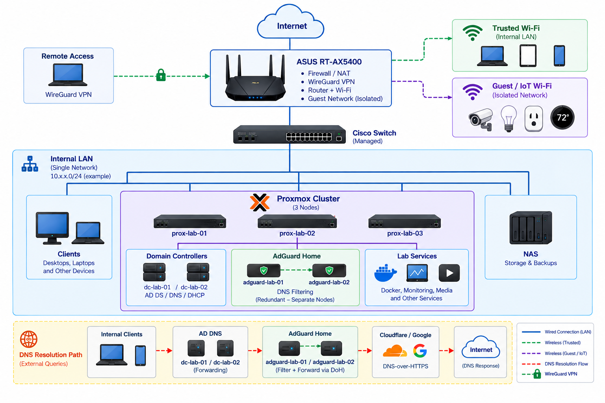

# Network Architecture

## Overview

The network infrastructure provides the physical and logical foundation for the homelab, including routing, switching, wireless connectivity, IP addressing, DHCP, DNS, DNS filtering, remote access, storage connectivity, and virtualization infrastructure.

The current environment uses a single trusted internal network for primary infrastructure and endpoints, with guest and IoT devices isolated through the router's guest wireless network.



*Current logical architecture showing routing, switching, virtualization, Active Directory services, redundant DNS filtering, storage, wireless connectivity, and remote access.*

> [!NOTE]
> Implementation-specific network addresses, allocation ranges, VLAN identifiers, credentials, and device assignments are intentionally omitted or generalized in public documentation.


## Current Architecture

```text
                           Internet
                              │
                              ▼
                       ASUS RT-AX5400
                  Routing / Firewall / NAT
                     WireGuard / Wireless
                              │
                              ▼
                    Cisco Managed Switch
                              │
          ┌───────────────────┼───────────────────┐
          │                   │                   │
          ▼                   ▼                   ▼
      Proxmox VE          Synology NAS      Wired Systems
       Cluster
          │
          ├───────────────┬───────────────┐
          │               │               │
          ▼               ▼               ▼
     AD / DNS / DHCP   AdGuard Home    Lab Services
       Services         Instances
```

Wireless connectivity is currently provided by the ASUS gateway.

```text
ASUS RT-AX5400
      │
      ├── Trusted Wireless
      │       │
      │       └── Internal Network
      │
      └── Guest / IoT Wireless
              │
              └── Isolated from Trusted Network
```

The Cisco managed switch provides centralized Ethernet connectivity for wired infrastructure while the ASUS RT-AX5400 remains the network gateway.


## Core Components

| Component | Role |
|---|---|
| ASUS RT-AX5400 | Internet gateway, routing, firewall, NAT, WireGuard VPN, and wireless |
| Cisco Catalyst Managed Switch | Centralized Ethernet connectivity and switch management |
| Proxmox VE Cluster | Hosts virtualized infrastructure and network services |
| Windows Server | Active Directory-integrated DNS and redundant DHCP |
| AdGuard Home | Redundant DNS filtering and encrypted upstream DNS |
| Synology NAS | Network storage and backup services |
| Uptime Kuma | Network and service availability monitoring |


## Addressing Architecture

The current environment separates infrastructure addressing from dynamically assigned client addressing within the trusted network.

```text
Private Address Space
│
├── Infrastructure
│   └── Static addressing
│
├── Client Address Space
│   ├── Dynamic DHCP
│   └── DHCP reservations where required
│
└── Reserved Capacity
    └── Future expansion
```

Persistent infrastructure systems use static addressing where independence from DHCP is appropriate.

Client endpoints receive network configuration through redundant Windows Server DHCP services.

Specific address ranges and device assignments are intentionally excluded from public documentation.

See [`ip-addressing-plan.md`](./ip-addressing-plan.md) for additional addressing design information.


## DHCP Architecture

DHCP is provided by two Windows Server systems configured with a failover relationship.

```text
                   Client Endpoints
                         │
                         ▼
                 DHCP Infrastructure
                         │
                ┌────────┴────────┐
                │                 │
                ▼                 ▼
          DHCP Server 01    DHCP Server 02
                │                 │
                └────────┬────────┘
                         │
                  Failover Relationship
```

The DHCP infrastructure centrally distributes:

- Client IP configuration
- Default gateway information
- Internal DNS servers
- DNS domain configuration

Both DHCP servers are authorized in Active Directory and configured to maintain service availability through DHCP failover.

Controlled testing confirmed that DHCP service remains available when either individual DHCP server is unavailable.


## DNS Architecture

Internal and external DNS responsibilities are intentionally separated.

Active Directory-integrated DNS provides internal name resolution and domain service discovery.

External queries are forwarded through redundant AdGuard Home instances for DNS filtering and encrypted upstream resolution.

```text
Internal Clients
      │
      ▼
Active Directory DNS
  dc-lab-01 / dc-lab-02
      │
      │ External DNS Forwarding
      ▼
    AdGuard Home
adguard-lab-01 / adguard-lab-02
      │
      │ DNS Filtering
      │ DNS-over-HTTPS
      ▼
Cloudflare / Google
      │
      ▼
   Internet DNS
```

Both Active Directory DNS servers use both AdGuard instances as forwarders.

The AdGuard instances are hosted across separate Proxmox failure domains so the loss of a single virtualization host does not remove all external DNS filtering capability.

Controlled failure testing confirmed that external DNS resolution continues when either AdGuard instance is unavailable.

DNS-over-HTTPS currently protects the upstream connection between AdGuard and public DNS resolvers. DNS traffic inside the trusted network remains standard DNS.

See [`dns-filtering-adguard-home.md`](./dns-filtering-adguard-home.md) for the detailed DNS filtering architecture.


## Service Redundancy

Redundancy is implemented for critical network services where practical.

| Service | Architecture | Failure Protection |
|---|---|---|
| DHCP | Two Windows Server DHCP servers | DHCP failover |
| Internal DNS | Two Active Directory DNS servers | Multiple DNS servers |
| DNS Filtering | Two AdGuard Home instances | Redundant forwarders |
| AdGuard Hosting | Separate Proxmox hosts | Reduced single-host dependency |
| Upstream DNS | Multiple public resolvers | Resolver redundancy |

The design reduces dependency on individual virtual machines and virtualization hosts for core DHCP and DNS services.


## Network Segmentation

The current trusted wired and wireless environment operates as a single internal network.

Guest and IoT devices use the ASUS guest wireless network and are isolated from the trusted internal environment.

```text
                    ASUS RT-AX5400
                          │
             ┌────────────┴────────────┐
             │                         │
             ▼                         ▼
      Trusted Network            Guest / IoT
             │                         │
      Internal Resources          Internet Access
                                       │
                              Internal Access Blocked
```

Full infrastructure segmentation has not yet been implemented.


## Remote Access

WireGuard VPN is currently hosted by the ASUS gateway and provides encrypted remote access to the home network.

```text
Remote Device
      │
      │ WireGuard Tunnel
      ▼
   Internet
      │
      ▼
ASUS RT-AX5400
      │
      ▼
Internal Network
```

This provides remote connectivity without directly exposing internal management services to the Internet.


## Monitoring

Network and service availability are monitored through the existing infrastructure monitoring environment.

Uptime Kuma provides availability monitoring for important network devices and services, while additional infrastructure monitoring is maintained in the dedicated monitoring project.

```text
Network Infrastructure
        │
        ▼
 Monitoring Services
        │
        ├── Network Devices
        ├── Core Infrastructure
        ├── DNS Services
        └── Platform Services
```

Detailed observability architecture is documented separately in the infrastructure monitoring project.


## Current Design Principles

The network architecture follows several operational principles:

- Keep infrastructure addressing predictable.
- Centralize wired connectivity through managed switching.
- Maintain redundant DHCP and DNS services.
- Preserve Active Directory DNS for internal domain resolution.
- Separate external DNS filtering from internal DNS authority.
- Distribute redundant services across separate virtualization failure domains where practical.
- Isolate guest and IoT wireless devices from trusted infrastructure.
- Avoid direct Internet exposure of internal management services.
- Document infrastructure sufficiently to support troubleshooting and rebuilds.


## Planned Architecture

The next major network architecture phase will introduce a dedicated OPNsense firewall and VLAN-based segmentation.

```text
                         Internet
                            │
                            ▼
                         OPNsense
                            │
                            ▼
                    Cisco Managed Switch
                            │
          ┌─────────────────┼─────────────────┐
          │                 │                 │
          ▼                 ▼                 ▼
     Management          Servers          Trusted
          │
          │                 ┌─────────────────┤
          │                 │                 │
          ▼                 ▼                 ▼
    Infrastructure         IoT              Guest
```

Planned segmentation will separate systems by function and allow communication between network zones to be controlled through firewall policy.

Potential logical zones include:

- Management infrastructure
- Servers and services
- Trusted endpoints
- IoT devices
- Guest devices

Specific VLAN identifiers, subnet assignments, and firewall policies will be documented when the segmented architecture is implemented.

> [!IMPORTANT]
> OPNsense and VLAN-based segmentation represent the planned architecture and are not part of the currently deployed network.


