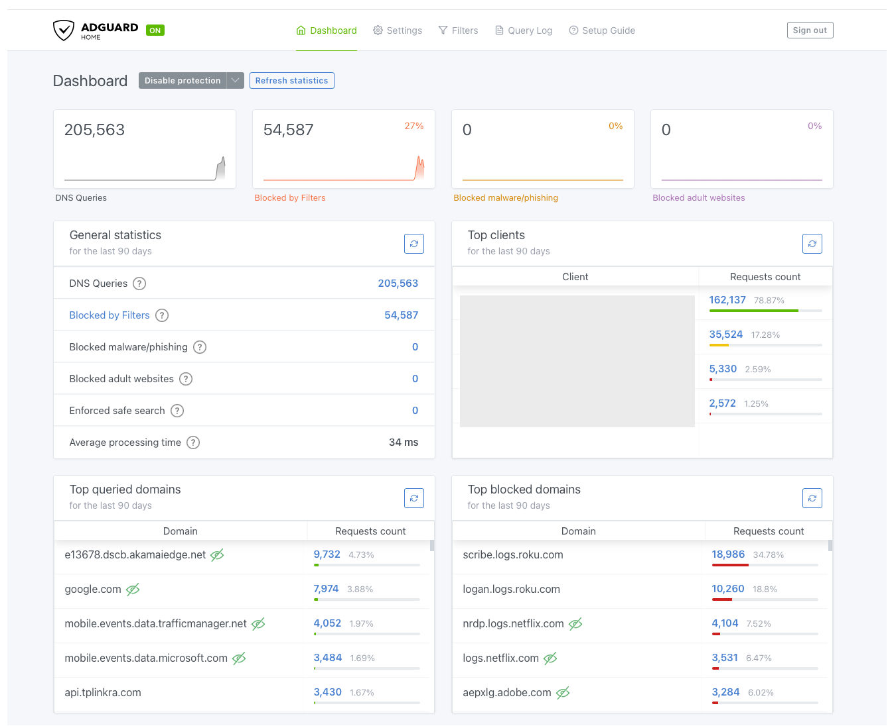

# AdGuard Home DNS Filtering



## Overview

The homelab uses two AdGuard Home instances to provide centralized DNS filtering and encrypted upstream DNS resolution while preserving Active Directory DNS for internal services.

Both Active Directory DNS servers forward unresolved external queries to the AdGuard pair. The AdGuard instances are hosted in separate Proxmox failure domains and forward permitted queries to public resolvers using DNS-over-HTTPS (DoH).

The deployment was designed to provide:

- Network-wide DNS filtering.
- Encrypted upstream DNS using DoH.
- Redundant filtering and forwarding.
- Failure-domain separation across Proxmox hosts.
- Continued use of AD-integrated DNS for the internal domain.


## Architecture

```text
                         Client Devices
                              │
                              │ DNS
                              ▼
                 ┌─────────────────────────┐
                 │   Active Directory DNS  │
                 │                         │
                 │  dc-lab-01  dc-lab-02   │
                 └────────────┬────────────┘
                              │
                       DNS Forwarders
                              │
                 ┌────────────┴────────────┐
                 ▼                         ▼
        ┌────────────────┐        ┌────────────────┐
        │ adguard-lab-01 │        │ adguard-lab-02 │
        └───────┬────────┘        └───────┬────────┘
                │                         │
                ▼                         ▼
        Separate Proxmox          Separate Proxmox
               Host                      Host
                │                         │
                └────────────┬────────────┘
                             │
                             │ DNS-over-HTTPS
                             ▼
                  Cloudflare / Google
                             │
                             ▼
                          Internet
```

This creates two distinct DNS layers:

| Layer | Role |
|---|---|
| Active Directory DNS | Internal resolution and AD service discovery |
| AdGuard Home | Filtering and encrypted upstream resolution |


## Active Directory DNS Integration

Domain clients continue to use:

- `dc-lab-01`
- `dc-lab-02`

The sanitized internal namespace is:

```text
lab.example.com
```

The domain controllers remain authoritative for this namespace and provide the DNS functionality required by Active Directory, including internal records and service discovery.

Both domain controllers use both AdGuard instances as DNS forwarders:

```text
dc-lab-01
 ├── adguard-lab-01
 └── adguard-lab-02

dc-lab-02
 ├── adguard-lab-01
 └── adguard-lab-02
```

Internal queries are therefore handled by Active Directory DNS, while unresolved external queries are passed to the redundant AdGuard layer.

### Resolution Flow

```text
Internal Query
---------------

Client
  │
  ▼
dc-lab-01 / dc-lab-02
  │
  ▼
AD-Integrated DNS
  │
  ▼
Internal Resource


External Query
---------------

Client
  │
  ▼
dc-lab-01 / dc-lab-02
  │
  ▼
adguard-lab-01 / adguard-lab-02
  │
  ├── DNS Filtering
  │
  ▼
DNS-over-HTTPS
  │
  ▼
Cloudflare / Google
```

This preserves the existing Active Directory DNS architecture while adding filtering and encrypted upstream resolution.


## DNS Filtering and Encrypted Upstream Resolution

Encrypted upstream DNS and network-wide filtering were the primary drivers for introducing AdGuard Home.

AdGuard evaluates forwarded external queries before sending permitted requests to the configured public resolvers.

```text
Query received from AD DNS
          │
          ▼
   adguard-lab-01/02
          │
          ▼
   Apply DNS filtering
          │
     ┌────┴────┐
     │         │
  Blocked    Allowed
     │         │
     ▼         ▼
  Block     DoH Query
 Response       │
               ▼
       Cloudflare / Google
               │
               ▼
          DNS Response
```

Cloudflare and Google Public DNS are configured as encrypted DoH upstream resolvers.

This provides centralized filtering for advertising, tracking, telemetry, and other unwanted domains without requiring filtering software on each endpoint.

### Encryption Boundary

The current deployment does **not** provide end-to-end encrypted DNS.

```text
Client
  │
  │ Standard DNS
  ▼
Active Directory DNS
  │
  │ Standard DNS
  ▼
AdGuard Home
  │
  │ DNS-over-HTTPS
  ▼
Public DNS Resolver
```

DNS traffic inside the trusted lab network currently uses standard DNS transport. The upstream connection from AdGuard to the public resolvers uses DoH.

Client-side or internal encrypted DNS may be evaluated later while preserving Active Directory DNS requirements.


## Redundancy and Failure Domains

A single AdGuard instance would create a new dependency in the external DNS resolution path.

Two instances were therefore deployed:

- `adguard-lab-01`
- `adguard-lab-02`

They are hosted on separate Proxmox nodes rather than sharing the same virtualization failure domain.

```text
          ┌──────────────────────┐
          │ Separate Proxmox Host│
          │                      │
          │   adguard-lab-01     │
          └──────────────────────┘

          ┌──────────────────────┐
          │ Separate Proxmox Host│
          │                      │
          │   adguard-lab-02     │
          └──────────────────────┘
```

This protects the filtering layer against individual:

- AdGuard service failures.
- Container or guest failures.
- Container host failures.
- Proxmox maintenance events.
- Proxmox host failures.

Combined with the two domain controllers, the design provides redundancy at both internal DNS and filtering layers.


## Failover Validation

Redundancy was tested by independently taking each AdGuard instance offline.

| Test | Result |
|---|---|
| `adguard-lab-01` offline | External DNS continued through `adguard-lab-02` |
| `adguard-lab-02` offline | External DNS continued through `adguard-lab-01` |

Both tests passed.

```text
Normal
────────────────────────────

AD DNS
 ├──► adguard-lab-01
 └──► adguard-lab-02


adguard-lab-01 Offline
────────────────────────────

AD DNS
 ├──X  adguard-lab-01
 └──► adguard-lab-02 ──► DoH


adguard-lab-02 Offline
────────────────────────────

AD DNS
 ├──► adguard-lab-01 ──► DoH
 └──X  adguard-lab-02
```

This validated that either AdGuard instance can be removed from service without eliminating external DNS resolution.


## Internal Reverse DNS

Because Active Directory DNS forwards external queries to AdGuard, AdGuard sees the domain controller as the immediate DNS client.

Internal reverse DNS is used to resolve those forwarding addresses to meaningful hostnames.

```text
AdGuard Home
     │
     │ PTR lookup
     ▼
Active Directory DNS
     │
     ▼
dc-lab-01.lab.example.com
```

This allows AdGuard query logs to identify which domain controller forwarded a request rather than displaying only an address.


## Observability Tradeoff

Forwarding through Active Directory DNS introduces an intentional visibility limitation.

```text
client-lab-01
      │
      ▼
  dc-lab-01
      │
      ▼
adguard-lab-01
```

AdGuard sees `dc-lab-01` as the requester rather than `client-lab-01`.

Direct client-to-AdGuard DNS would provide greater per-client statistics, but maintaining Active Directory DNS for domain clients was prioritized over endpoint-level AdGuard attribution.

This limitation is accepted in the current architecture. Internal PTR resolution still provides domain-controller-level identification in AdGuard.


## Security and Privacy Considerations

The deployment follows several security and privacy principles:

- Active Directory DNS remains authoritative for the internal namespace.
- External queries are filtered before reaching public resolvers.
- Public upstream DNS traffic uses DNS-over-HTTPS.
- AdGuard management interfaces remain internal.
- Credentials, API secrets, and other authentication material are excluded from source control.
- Public documentation uses sanitized domains, hostnames, and addressing.
- Redundant instances prevent a single AdGuard service from becoming the sole external DNS dependency.

DoH encrypts transport between AdGuard and its upstream resolvers. It does not make DNS inherently trusted or provide encryption for the complete client-to-resolver path.


## Current Deployment State

| Component | State |
|---|---|
| Redundant Active Directory DNS | Deployed |
| `adguard-lab-01` | Deployed |
| `adguard-lab-02` | Deployed |
| Separate Proxmox failure domains | Deployed |
| Both DCs forwarding to both AdGuard instances | Deployed |
| Network-wide DNS filtering | Deployed |
| Cloudflare DoH | Deployed |
| Google DoH | Deployed |
| Internal PTR resolution for DC identification | Deployed |
| `adguard-lab-01` failure test | Passed |
| `adguard-lab-02` failure test | Passed |
| Per-endpoint AdGuard attribution | Accepted limitation |
| Client-to-resolver encrypted DNS | Future consideration |


## Design Decisions

### Why AdGuard Home?

AdGuard Home provides both centralized DNS filtering and native encrypted upstream DNS support, allowing the lab to introduce filtering and DoH without replacing Active Directory DNS.

### Why Keep Active Directory DNS in Front?

Domain clients depend on Active Directory DNS for internal resolution and domain service discovery. Keeping the domain controllers as the client-facing DNS layer preserves the expected AD architecture.

### Why Deploy Two AdGuard Instances?

DNS is a foundational infrastructure service. A single AdGuard server would introduce a new single point of failure, so two instances were deployed and both were configured as forwarders on each domain controller.

### Why Separate Virtualization Hosts?

Running both instances on the same Proxmox host would provide application-level redundancy but would not protect against host failure or maintenance. The instances were therefore separated across virtualization hosts.

### Why Accept Reduced Client Visibility?

Direct client-to-AdGuard DNS would improve endpoint attribution, but preserving Active Directory DNS behavior was prioritized. Domain-controller-level attribution through PTR resolution is sufficient for the current deployment.


## Future Enhancements

Potential improvements include:

- Evaluate encrypted DNS closer to client endpoints.
- Improve per-client DNS attribution without disrupting Active Directory DNS.
- Expand DNS availability monitoring and alerting.
- Automate configuration consistency between the two AdGuard instances.
- Continue validating DNS behavior during broader infrastructure failure scenarios.


## Related Documentation

This document focuses on what was deployed, why it was deployed, the resulting architecture, and the design decisions made within the lab.

Reusable procedures and technical references are maintained in the repository-level:

```text
docs/
```

Sanitized Docker Compose and configuration examples are maintained in the repository-level:

```text
configs/
```

These directories are located at the top level of the repository rather than within this network infrastructure project.


## Technologies

- AdGuard Home
- Docker
- Docker Compose
- Debian Linux
- Proxmox VE
- Windows Server DNS
- Active Directory Domain Services
- DNS-over-HTTPS
- Cloudflare DNS
- Google Public DNS


## Deployment Summary

The homelab uses redundant Active Directory DNS servers for internal resolution and a redundant AdGuard Home pair for network-wide filtering and encrypted upstream DNS.

Both domain controllers forward unresolved external queries to both AdGuard instances. The AdGuard instances are distributed across separate Proxmox hosts to provide failure-domain isolation.

Permitted external queries are forwarded to public resolvers using DNS-over-HTTPS. Independent failure testing confirmed that either AdGuard instance can be taken offline while external DNS resolution continues through the remaining server.

Because queries are forwarded through Active Directory DNS, AdGuard identifies the forwarding domain controller rather than the original endpoint. This loss of per-client attribution is an accepted tradeoff that preserves the existing Active Directory DNS architecture.
