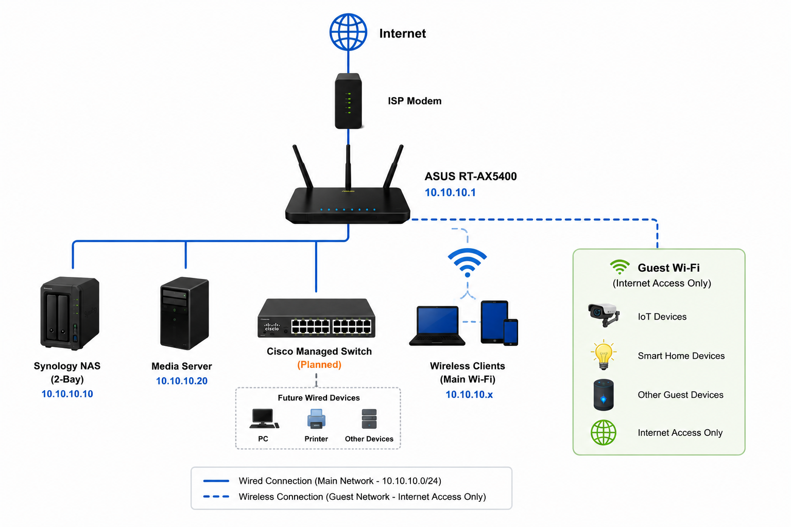

# Network Infrastructure

**Status: 🟢 Operational (Phase 1)**

The physical and logical foundation of the homelab, providing routing, wireless connectivity, IP address management, DHCP services, and device segmentation.

Current deployment is based on an ASUS RT-AX5400 router with DHCP reservations for infrastructure devices and guest network isolation for IoT devices. Future phases will introduce managed switching, VLAN segmentation, and a dedicated firewall platform.

---

## Objectives

- Maintain a documented and repeatable network design
- Establish a structured IP addressing scheme
- Separate trusted devices from IoT devices
- Reserve dedicated address space for infrastructure and lab systems
- Prepare for future VLAN implementation
- Document all network devices and physical connections

---

## Technologies

### Current

- ASUS RT-AX5400 Router
- DHCP Reservations
- Guest Network Isolation
- Synology NAS
- Dedicated Media Server

### Planned

- Cisco Managed Switch
- VLAN Segmentation
- Internal DNS Services
- IPAM Solution (NetBox or Spreadsheet)
- pfSense or OPNsense Firewall

---

## Current Network Topology




```text
Internet
    │
ISP Modem / ONT
    │
ASUS RT-AX5400 (10.10.10.1)
├── Synology NAS
├── Media Server
├── Cisco Managed Switch (Planned)
└── Wireless Clients

Guest Wi-Fi
├── IoT Devices
├── Smart Home Devices
└── Internet Access Only
```

---

## IP Addressing Plan

### Primary LAN

| Setting | Value |
|----------|----------|
| Network | 10.10.10.0/24 |
| Gateway | 10.10.10.1 |
| DHCP Pool | 10.10.10.150 - 10.10.10.249 |
| DHCP Reservations | Infrastructure Devices |
| DNS | ASUS Router |

### Address Allocation Strategy

| Range | Purpose |
|---------|---------|
| 10.10.10.1 | Gateway |
| 10.10.10.2 - 10.10.10.49 | Core Infrastructure |
| 10.10.10.50 - 10.10.10.99 | Future Infrastructure |
| 10.10.10.100 - 10.10.10.149 | Servers and Lab Systems |
| 10.10.10.150 - 10.10.10.249 | DHCP Clients |
| 10.10.10.250 - 10.10.10.254 | Reserved |

---

## Infrastructure Devices

| Device | IP Assignment |
|----------|----------|
| ASUS RT-AX5400 | 10.10.10.1 |
| Synology NAS | Reserved |
| Media Server | Reserved |
| Future Cisco Switch | Reserved |
| Future Hypervisor Hosts | Reserved |

---

## Wireless Design

### Trusted Wireless Network

Purpose:

- Workstations
- Laptops
- Mobile Devices
- Administrative Access

Characteristics:

- Full LAN access
- Access to NAS and servers
- Access to management interfaces

### Guest / IoT Wireless Network

Purpose:

- Smart TVs
- Streaming Devices
- IoT Equipment
- Guest Devices

Characteristics:

- Internet access only
- No access to trusted LAN devices
- Client isolation enabled where supported

---

## Physical Port Map

### ASUS RT-AX5400

| Port | Connection |
|---------|---------|
| WAN | ISP Modem / ONT |
| LAN 1 | Synology NAS |
| LAN 2 | Media Server |
| LAN 3 | Cisco Managed Switch (Planned) |
| LAN 4 | Available |

### Cisco Managed Switch (Planned)

| Port | Connection |
|---------|---------|
| 1 | Uplink to ASUS Router |
| 2 | Media Server |
| 3+ | Lab Equipment |
| Future | Additional Infrastructure |

---

## Lab Infrastructure

The homelab environment will use reserved addresses within the server and lab range:

```text
10.10.10.100 - 10.10.10.149
```

Planned Systems:

- Proxmox Host
- Hyper-V Hosts
- Test Virtual Machines
- Container Services
- Infrastructure Services
- Monitoring Platforms

---

## DHCP Reservation Strategy

Infrastructure devices receive DHCP reservations to maintain consistent addressing while preserving centralized management.

Reserved devices include:

- Router
- NAS
- Servers
- Switches
- Printers
- Hypervisors
- Future Infrastructure Appliances

---

## Documentation Standards

Maintain documentation for:

- Physical topology diagrams
- Port mappings
- IP assignments
- DHCP reservations
- Device inventory
- Firmware versions
- Backup procedures
- Network changes and lessons learned

---

## Future Enhancements

### Phase 2

- Deploy Cisco managed switch
- Migrate wired infrastructure to switch
- Expand lab environment

### Phase 3

- Implement VLAN segmentation
- Create dedicated Lab VLAN
- Create dedicated IoT VLAN
- Create dedicated Management VLAN

### Phase 4

- Deploy pfSense or OPNsense
- Implement advanced firewall policies
- Introduce internal DNS services
- Deploy centralized IPAM solution

---

## Related Projects

- virtualization-lab — Hosts and virtual workloads connected to this network
- home-network-security — Firewall policy and segmentation strategy
- monitoring-observability — Network and infrastructure monitoring

---

## Folder Structure

```text
network-infrastructure/
├── docs/
├── configs/
├── scripts/
└── screenshots/
```
