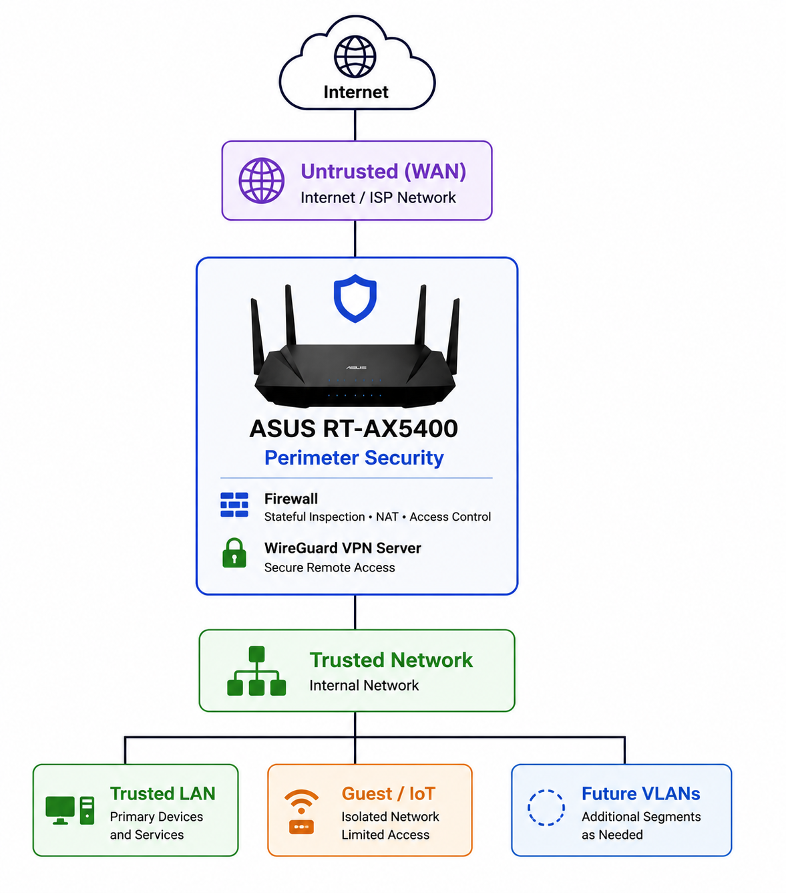

# 🔒 Network Security

**Status: 🚧 In Progress**

This project focuses on the *prevention* side of security by hardening the network infrastructure through segmentation, filtering, and secure remote access.

**Scope:** Detection and response live in [security-operations-lab](../security-operations-lab/). This project builds the defenses.

## Objectives

- Segment the network into trusted, IoT, guest, lab, and management VLANs
- Deploy a stateful firewall with least-privilege inter-VLAN rules
- Filter DNS requests across the network
- Enable intrusion detection and prevention (IDS/IPS)
- Secure remote administration with WireGuard

## Architecture

<p align="left">
  
</p>

## Current Environment

- ASUS RT-AX5400
- WireGuard VPN
- WPA3/WPA2 mixed mode

## Design Principles

- Default deny between VLANs
- Least privilege
- Defense in depth
- Secure by default
- Minimize exposed services
- Document infrastructure as code and documentation


## Target Environment

- OPNsense or pfSense
- Cisco managed switch
- Windows Server (DNS/DHCP) or Technitium DNS
- Suricata IDS/IPS
- VLAN-capable wireless access points

## Current Status

#### Completed

- ✅ Deploy WireGuard VPN
- ✅ Update router firmware
- ✅ Enable secure remote administration
- ✅ Disable UPnP

#### Next Steps

- [ ] Implement VLAN segmentation
- [ ] Deploy a dedicated firewall
- [ ] Configure network-wide DNS filtering
- [ ] Enable IDS/IPS
- [ ] Centralize firewall and IDS logs

## Folder Structure

```text

network-security/
│
├── README.md
├── firewall.md
├── wireguard-vpn.md
├── wireguard-security.md
├── network-segmentation.md (Planned)
├── dns-filtering.md (Planned)
├── ids-ips.md (Planned)
├── remote-administration.md (Planned)
├── security-policies.md (Planned)
└── diagrams/

```

## Security Note

Sanitize all configurations before committing them to the repository. Never include public IP addresses, VPN keys, certificates, passwords, or other sensitive information.
