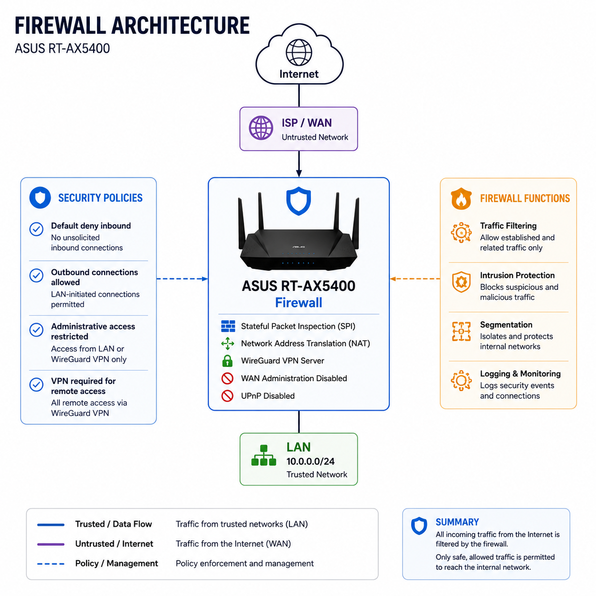

# 🔥 Firewall

This document describes the current and planned firewall architecture protecting the homelab perimeter.

## Purpose

The ASUS RT-AX5400 currently serves as the perimeter firewall and network gateway for the homelab. It protects internal network resources using integrated firewall and packet filtering capabilities, Network Address Translation (NAT), and secure remote access through WireGuard VPN.

The target architecture will replace the ASUS router as the primary gateway with **OPNsense running on dedicated hardware**.

## Current Architecture

<p align="left">
  
</p>

### Current Security Features

- Integrated firewall with inbound and outbound packet filtering
- Network Address Translation (NAT)
- Blocks unsolicited inbound connections
- WAN administration disabled
- Universal Plug and Play (UPnP) disabled
- Secure remote access through WireGuard VPN
- Administrative access limited to the LAN or WireGuard VPN

## Target Architecture

OPNsense will operate on dedicated hardware outside the Proxmox virtualization cluster. This keeps critical firewall and routing services independent of virtualization host maintenance, reboots, and lab experimentation.

Hardware currently supporting Docker-based media services will be repurposed for the dedicated firewall. Existing media workloads will first be migrated to a Linux VM within the Proxmox cluster.

```text
Current

Dedicated Host
└── Docker
    └── Media Services


Target

Internet
   │
   ▼
Dedicated Host
└── OPNsense
    │
    ├── Firewall / NAT
    ├── VLAN Routing
    ├── Inter-VLAN Policies
    ├── WireGuard
    └── IDS/IPS
          │
          ▼
     Managed Network

Proxmox Cluster
└── Linux VM
    └── Docker
        └── Media Services
```

This design separates critical network infrastructure from application workloads while consolidating general-purpose services within the virtualization environment.

## Planned Security Capabilities

- Stateful firewall and NAT
- VLAN routing and segmentation
- Default-deny inter-VLAN policies
- Least-privilege firewall rules
- WireGuard remote access
- Network-wide DNS filtering
- Suricata IDS/IPS
- Centralized firewall and security logging
- Dedicated management access controls

## Roadmap

- [ ] Migrate Docker-based media services to Proxmox
- [ ] Repurpose existing hardware for OPNsense
- [ ] Deploy OPNsense on dedicated hardware
- [ ] Validate WAN and LAN connectivity
- [ ] Replace the ASUS router as the primary gateway
- [ ] Implement VLAN segmentation
- [ ] Configure inter-VLAN firewall policies
- [ ] Migrate WireGuard remote access
- [ ] Deploy Suricata IDS/IPS
- [ ] Centralize firewall and security logging
