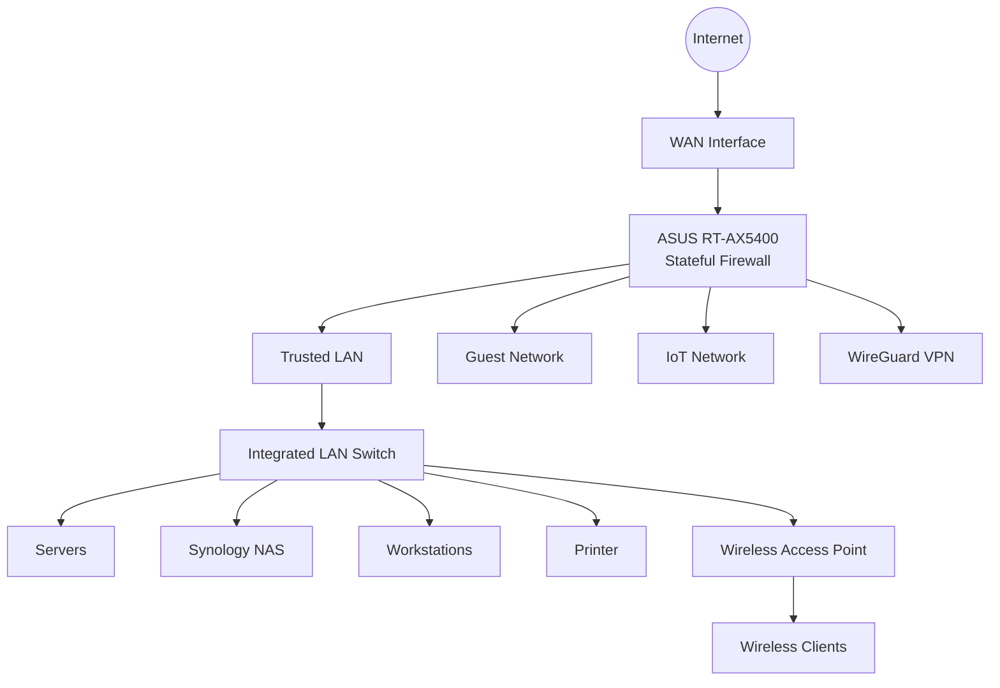

# 🔥 Firewall

This document describes the current firewall architecture protecting the homelab perimeter.

## Purpose

The ASUS RT-AX5400 currently serves as the perimeter firewall for the homelab. It protects internal network resources using a stateful firewall, Network Address Translation (NAT), and secure remote access through WireGuard VPN.

## Logical Architecture

## Security Features

- Stateful Packet Inspection (SPI) firewall
- Network Address Translation (NAT)
- Blocks unsolicited inbound connections
- WAN administration disabled
- Universal Plug and Play (UPnP) disabled
- Secure remote access through WireGuard VPN
- Administrative access limited to the LAN or WireGuard VPN

## Roadmap

- Replace the ASUS RT-AX5400 with OPNsense or pfSense
- Implement VLAN segmentation
- Configure inter-VLAN firewall policies
- Deploy Suricata IDS/IPS
- Centralize firewall and security logging
