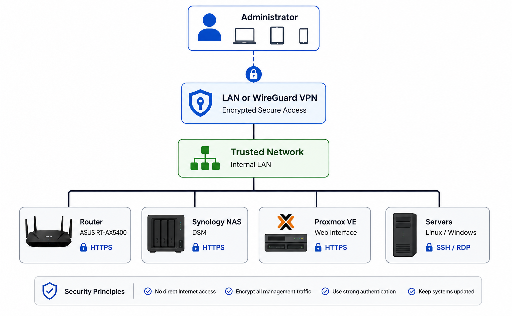

# 🖥️ Management Access

This document describes how the homelab infrastructure is securely managed from both the local network and remote locations.

## Purpose

Administrative access is restricted to secure management protocols. No management interfaces are exposed directly to the Internet.

## Diagram

  

## Current Management Services

| Device | Access Method |
|---------|---------------|
| ASUS RT-AX5400 | HTTPS |
| Synology NAS | HTTPS |
| WireGuard VPN | Secure Remote Access |

## Security Controls

### Management Access

- HTTPS enabled for web management
- HTTP disabled where supported
- WAN administration disabled
- Administrative access limited to the LAN or WireGuard VPN

### Authentication

- Strong administrator passwords
- Separate administrative accounts where supported
- Credentials stored in a password manager

### Maintenance

- Firmware kept up to date
- Security updates applied regularly
- Administrative configuration documented

## Security Principles

- Never expose management interfaces to the Internet
- Encrypt all administrative traffic
- Restrict management access to trusted users
- Keep infrastructure updated

## Roadmap

- SSH administration for Linux servers
- RDP administration for Windows servers
- HTTPS management for Proxmox
- Management VLAN
- SSH key authentication
- Multi-factor authentication where supported
- Centralized authentication with Active Directory

## Security Note

Administrative credentials, VPN keys, SSH keys, and other secrets are never stored in this repository.
