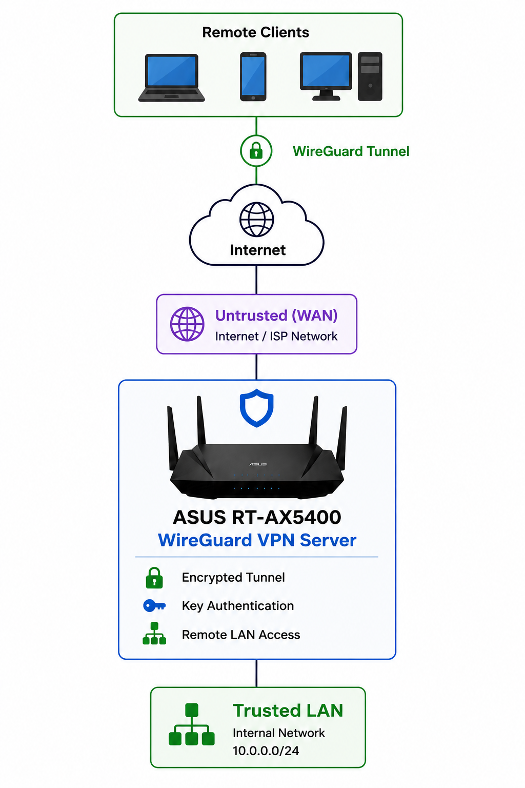

# WireGuard VPN

## Goal

Provide secure remote access to the home network without exposing internal services directly to the Internet.

The current implementation uses WireGuard on the ASUS RT-AX5400. The target architecture will migrate WireGuard to OPNsense to centralize VPN management and provide more granular control over remote access through firewall policies and network segmentation.

## Current Configuration

- Platform: ASUS RT-AX5400
- VPN: WireGuard
- VPN subnet: *Sanitized*
- Peers: Personal devices only
- Traffic routing: Full tunnel

## Architecture

<p align="left">
  
</p>

## Why WireGuard

- Fast and lightweight VPN protocol
- Built into the current ASUS RT-AX5400
- Provides encrypted remote access without exposing internal services
- Supports individual peer configurations and cryptographic keys
- Can be integrated directly into the target OPNsense firewall architecture

## Current Access Model

WireGuard currently provides trusted remote devices with access to the home network through the ASUS router.

The existing implementation provides secure remote connectivity but offers limited flexibility for applying granular access policies to different VPN peers and internal network segments.

The target OPNsense deployment will move VPN termination to the primary firewall, allowing remote-access policy to be managed alongside VLAN and inter-network firewall rules.

```text
Current

Remote Device
     │
     │ WireGuard
     ▼
ASUS RT-AX5400
     │
     ▼
Home Network


Target

Remote Device
     │
     │ WireGuard
     ▼
   OPNsense
     │
     ├── VPN Peer Management
     ├── Firewall Policies
     └── Network Segmentation
              │
              ▼
        Authorized Resources
```

## Validation

- ✅ Connected successfully over a cellular hotspot
- ✅ Verified the public IP address changed to the home network using an external IP verification service
- ✅ Accessed the router remotely
- ✅ Accessed the NAS remotely
- ✅ Accessed Jellyfin remotely
- ✅ Verified Internet traffic routed through the home network
- ✅ Confirmed no internal services were exposed directly to the Internet

## Issue Encountered

### Client Configuration

The client configuration page includes both an **Address** field and a **Server** field. Initially, I assumed the Server field should contain the VPN server's address, which prevented clients from connecting.

Testing with the default ASUS-generated configuration showed that both fields are expected to use the values generated by the router.

**Resolution**

Restored the default configuration and verified successful connectivity. After confirming the VPN worked correctly, I changed the VPN subnet to better align with the internal IP addressing scheme.

This provides a cleaner foundation for future firewall rules and network segmentation.

## Target OPNsense Integration

WireGuard will migrate from the ASUS router to the dedicated OPNsense firewall as the network-security architecture is implemented.

The migration is intended to provide:

- Centralized VPN and firewall administration
- Individual WireGuard peer management
- Granular firewall policies for VPN traffic
- Restricted access to specific VLANs and network resources
- Improved logging and visibility
- Integration with the broader network segmentation strategy
- Easier revocation of individual remote-access peers

Rather than treating VPN-connected devices as broadly trusted network clients, access can be explicitly permitted based on the resources each peer or VPN network requires.

## Future Improvements

- [ ] Deploy the dedicated OPNsense firewall
- [ ] Configure WireGuard on OPNsense
- [ ] Migrate existing WireGuard peers
- [ ] Define VPN-specific firewall policies
- [ ] Restrict remote access based on VLAN and resource requirements
- [ ] Integrate internal DNS
- [ ] Validate full-tunnel routing
- [ ] Validate access restrictions between VPN clients and internal network segments
- [ ] Centralize VPN and firewall logging
