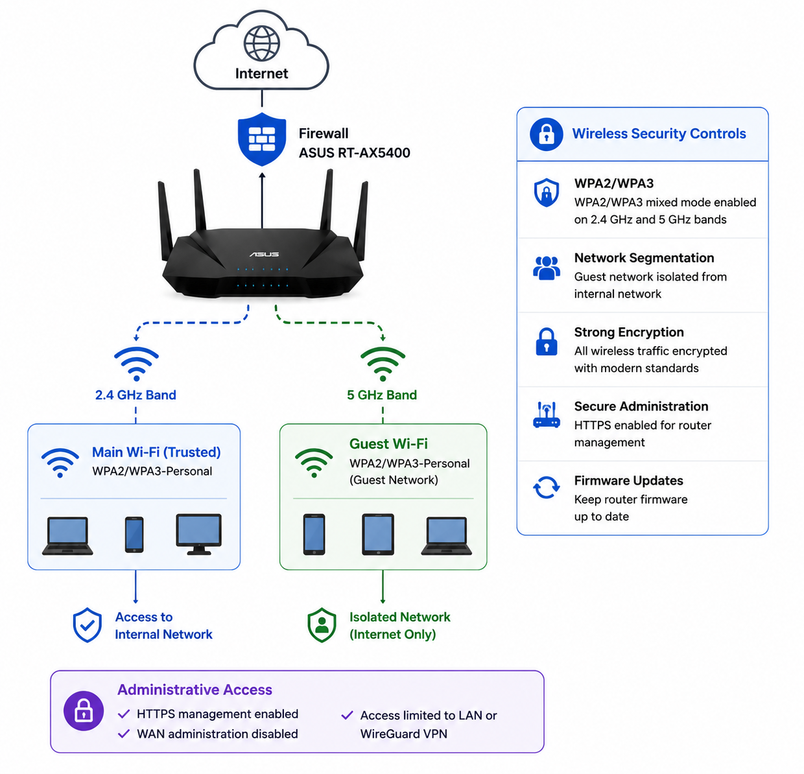

# 📶 Wireless Security

This document describes the wireless security configuration protecting the homelab and the security controls applied to the current wireless infrastructure.

## Purpose

The ASUS RT-AX5400 provides integrated wireless networking for the homelab. The wireless network is configured to provide secure client connectivity while minimizing unnecessary exposure through modern encryption and administrative hardening.

## Diagram

  

## Current Configuration

### Wireless Networks

| Network | Purpose | Security |
|----------|---------|----------|
| Main Wi-Fi | Trusted devices | WPA2/WPA3-Personal |
| Guest Wi-Fi | Guests and IoT devices | WPA2/WPA3-Personal (Guest Network) |

### Wireless Security

- WPA2/WPA3 mixed mode enabled
- Separate Guest Wi-Fi network
- Guest network isolated from the internal network
- Strong WPA passphrases
- SSID broadcasting enabled
- Built-in ASUS wireless access point
- WPS disabled

### Router Administration

- HTTPS management enabled
- WAN administration disabled
- Administrative access limited to the LAN or WireGuard VPN
- Router firmware kept current

## Security Principles

- Encrypt all wireless communications
- Separate trusted and untrusted devices
- Restrict administrative access
- Minimize exposed management services
- Keep firmware up to date

## Roadmap

- Deploy dedicated wireless access points
- Implement WPA3-Enterprise
- Integrate RADIUS authentication
- Separate SSIDs by VLAN
- Deploy multiple enterprise access points for roaming
- Enable centralized wireless management

## Security Note

Wireless credentials, SSIDs, and administrative passwords are never committed to this repository.
