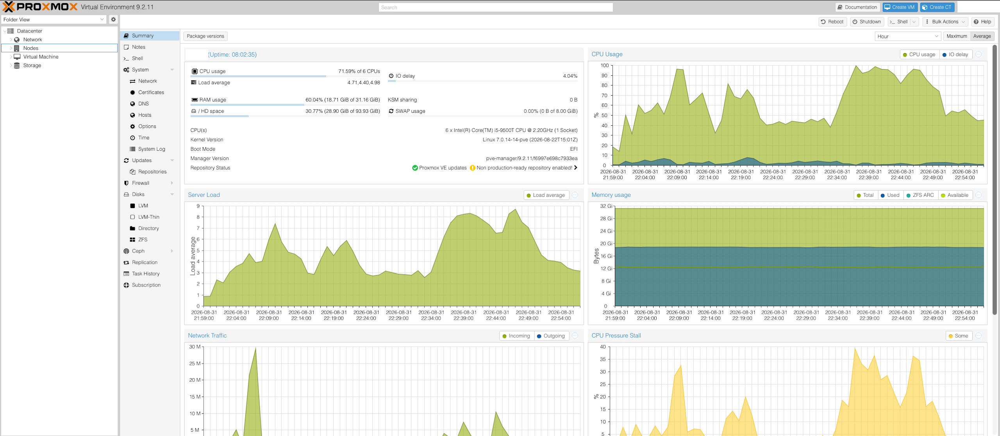

# 🖥️ Virtualization Lab (Proxmox)

**Status: 🟡 In Progress**

Bare-metal virtualization environment built with **Proxmox VE** and repurposed hardware.

This lab provides the virtualization foundation for the broader infrastructure homelab, supporting Windows and Linux workloads used throughout networking, identity, automation, monitoring, container, and security projects.


_Proxmox VE management interface from the lab environment._

## Objectives

- Deploy and administer Proxmox VE on bare-metal hardware
- Design host storage for system and virtual workloads
- Build and operate a multi-node Proxmox cluster
- Configure Linux bridge and VLAN-aware virtual networking
- Build reusable Linux and Windows VM templates
- Manage the VM lifecycle including cloning, snapshots, backups, and migration
- Validate cluster quorum, migration, and failure-recovery workflows

## Technologies

- Proxmox VE
- KVM/QEMU
- Corosync
- Cloud-init
- LVM-thin
- Linux bridges
- VLAN tagging

## Architecture

```text
                  Proxmox VE Cluster
                         │
              ┌──────────┼──────────┐
              │          │          │
        prox-lab-01  prox-lab-02  prox-lab-03
              │          │        (Planned)
              └──────────┼──────────┘
                         │
               Virtual Infrastructure
                         │
              ┌──────────┼──────────┐
              │          │          │
           Windows     Linux      Docker
             VMs        VMs      Workloads
```

The environment currently consists of two active Proxmox nodes with a third node planned to complete the three-node cluster architecture.

Containerized workloads are deployed through **Docker running within Linux virtual machines**, rather than directly through Proxmox LXC containers.

## Implementation

- [x] Deploy initial Proxmox VE bare-metal host
- [x] Complete post-install repository and system configuration
- [x] Validate CPU virtualization support, memory, storage, and system health
- [x] Configure static Proxmox management networking
- [x] Establish host and VM storage design
- [x] Configure dedicated NVMe LVM-thin VM storage
- [x] Deploy second Proxmox VE host
- [x] Initialize Proxmox cluster
- [x] Join second node to cluster
- [x] Validate Corosync communication
- [x] Standardize node-local VM storage naming
- [ ] Create Linux cloud-init template
- [ ] Create Windows Server template
- [ ] Configure VLAN-aware virtual networking
- [ ] Test snapshots and cloning
- [ ] Configure VM backup and restore
- [ ] Deploy third Proxmox host
- [ ] Validate three-node quorum
- [ ] Test VM migration
- [ ] Test node failure and recovery

## Storage Design

Each active host uses separate storage for the Proxmox installation and primary virtual workloads:

```text
Proxmox Node
│
├── SATA SSD
│   ├── Proxmox VE
│   └── Local storage
│
└── NVMe SSD
    └── LVM-thin VM storage
```

NVMe storage is node-local rather than shared between cluster members. Node-specific storage IDs provide clear identification of storage associated with each host.

Detailed storage architecture and cluster behavior are documented in [Proxmox Cluster](./proxmox-cluster.md).

## Networking

Proxmox uses Linux bridges to connect virtual machines and host management services to the physical network:

```text
Physical NIC
     │
     ▼
   vmbr0
     │
     ├── Proxmox Management
     └── Virtual Machines
```

Cluster nodes use static management addressing to provide stable endpoints for management and Corosync communication.

Corosync currently operates over the primary management network. VLAN-aware networking and additional network segmentation will be introduced as the broader homelab network architecture develops.

Firewall and routing services are hosted independently of the Proxmox cluster so virtualization host maintenance and experimentation do not intentionally depend on the availability of a virtualized gateway.

## Documentation

- [Proxmox Cluster](./proxmox-cluster.md)
- [Proxmox Host Baseline Build](./proxmox-host-build.md)
- [Proxmox VM Deployment Baseline](./proxmox-vm-deployment.md)
- [Resource Allocation Strategy](./resource-allocation.md)
- [Troubleshooting](./troubleshooting.md)
- [Lessons Learned](./lessons-learned.md)

## Downstream Projects

This virtualization environment provides infrastructure for:

- [Active Directory Lab](../active-directory-lab/)
- [Docker / Self-Hosted Services](../docker-self-hosted-services/)
- [Kubernetes Lab](../kubernetes-lab/)
- [Infrastructure Monitoring](../infrastructure-monitoring/)
- [Security Operations Lab](../security-operations-lab/)
- [Infrastructure Automation](../infrastructure-automation/)

## Folder Structure

```text
virtualization-lab/
├── README.md
├── proxmox-cluster.md
├── proxmox-host-build.md
├── proxmox-vm-deployment.md
├── resource-allocation.md
├── lessons-learned.md
├── troubleshooting.md
└── diagrams/
```

## Next Steps

1. Deploy and join the third Proxmox node
2. Validate three-node quorum behavior
3. Build reusable Linux and Windows templates
4. Test VM migration between cluster nodes
5. Test snapshots, cloning, backup, and recovery
6. Introduce VLAN-aware networking
7. Test node failure and recovery
