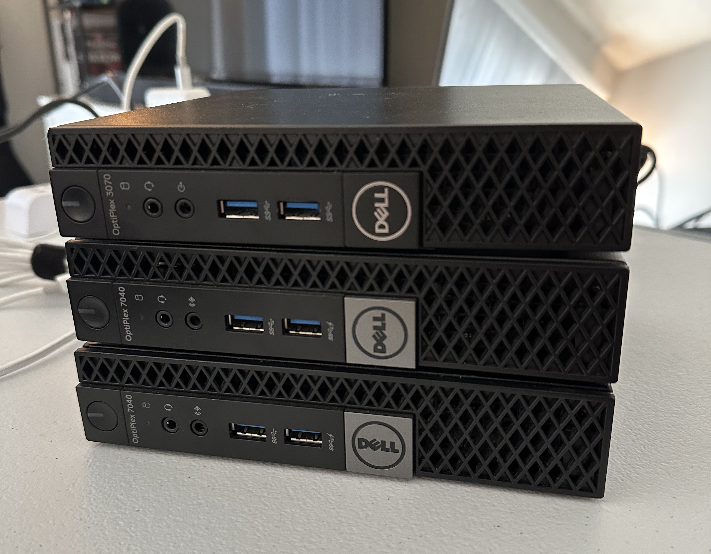

# 🧩 Proxmox Cluster

Three-node Proxmox VE compute environment built for hands-on experience with
multi-node virtualization, cluster management, Corosync, quorum, VM migration,
and failure testing.

The environment began as a single virtualization host and was incrementally
expanded into a three-node cluster.

<p align="left">
  
</p>


## Cluster Overview

**Current State:** Three-node Proxmox VE cluster  
**Quorum:** 2 of 3 votes required  
**Status:** Quorate

```text
Proxmox VE Cluster
├── prox-lab-01
├── prox-lab-02
└── prox-lab-03
```

All three nodes participate as voting cluster members. The three-node
configuration provides an odd number of votes and allows the cluster to
maintain quorum with two available nodes.


## Node Summary

| Node | Hardware | CPU | RAM | System Storage | VM Storage | Status |
|---|---|---|---:|---|---|---|
| `prox-lab-01` | Dell OptiPlex 3070 | Intel Core i5-9500T (6C/6T) | 32 GB | ~1 TB SATA SSD | ~1 TB NVMe SSD | Active |
| `prox-lab-02` | Dell OptiPlex 7040 | Intel Core i7-6700T (4C/8T) | 16 GB | ~1 TB SATA SSD | ~1 TB NVMe SSD | Active |
| `prox-lab-03` | Dell OptiPlex 7040 | Intel Core i7-6700T (4C/8T) | 8 GB | ~500 GB NVMe SSD | ~337 GB NVMe LVM-Thin | Active |


Detailed host capacity and workload allocation are documented in the resource allocation doc:

➡️ [Proxmox Resource Allocation](proxmox-resource-allocation.md)


## Cluster Nodes

### `prox-lab-01`

**Role:** Initial cluster node  
**Status:** Active

Initial bare-metal node used to establish the Proxmox environment and validate
VM, storage, networking, and management workflows.

The node was subsequently used to initialize the Proxmox cluster and hosts
the majority of persistent lab workloads.


### `prox-lab-02`

**Role:** Cluster compute node  
**Status:** Active

Second virtualization host added to introduce multi-node management, Corosync
communication, node-local storage, and VM migration capabilities.


### `prox-lab-03`

**Role:** Cluster compute node  
**Status:** Active

Third virtualization host added to complete the three-node architecture and
provide an odd number of voting members for quorum and failure testing.

Unlike the first two nodes, the primary NVMe drive contains both the Proxmox
installation and LVM-thin VM storage. A secondary HDD provides general-purpose
storage for backups, ISOs, templates, and snippets.


## Cluster Architecture

```text
                    Proxmox VE Cluster
                           │
          ┌────────────────┼────────────────┐
          │                │                │
   prox-lab-01       prox-lab-02       prox-lab-03
          │                │                │
          └────────────────┼────────────────┘
                           │
                  Cluster Services
                           │
              ┌────────────┼────────────┐
              │            │            │
           Corosync     Migration     Quorum
```

The three-node configuration provides centralized cluster management,
node-to-node communication, migration capabilities, and majority-based
quorum.


## Cluster Networking

Cluster nodes use static management addressing to provide stable endpoints
for Proxmox management and Corosync communication.

Each host uses a Linux bridge for management and VM networking:

```text
Physical NIC
     │
     ▼
   vmbr0
     │
     ├── Proxmox Management
     └── VM Networking
```

Management addressing is assigned to the bridge rather than directly to the
physical interface.

Corosync uses the primary management network through **Link 0** for
node-to-node cluster communication.

A dedicated cluster network or additional Corosync link may be evaluated
later for network segmentation and redundancy testing.


## Storage Model

Cluster storage is primarily node-local, with NVMe storage used for VM and
container workloads.

| Node | System Storage | VM Storage |
|---|---|---|
| `prox-lab-01` | ~1 TB SATA SSD | ~1 TB NVMe LVM-Thin |
| `prox-lab-02` | ~1 TB SATA SSD | ~1 TB NVMe LVM-Thin |
| `prox-lab-03` | ~500 GB NVMe SSD | ~337 GB NVMe LVM-Thin |

`prox-lab-01` and `prox-lab-02` use dedicated secondary NVMe drives for VM
and container disks. Their primary SSDs contain the Proxmox installation and
general-purpose ext4 storage.

`prox-lab-03` uses its primary NVMe for both the Proxmox installation and
LVM-thin VM storage. A secondary HDD provides general-purpose storage.

VM storage remains node-local rather than shared between cluster members.

Proxmox storage definitions are managed at the cluster level while the
underlying storage devices remain local to their respective nodes.

Network-backed shared storage may be evaluated for workloads that need to be
accessible across multiple cluster nodes.


## Quorum

The cluster contains three voting nodes with one vote assigned to each node.

```text
prox-lab-01 ─┐
             │
prox-lab-02 ─┼── 3 voting nodes
             │
prox-lab-03 ─┘

Expected Votes = 3
Total Votes    = 3
Quorum         = 2
Status         = Quorate
```

A majority of two votes is required for quorum.

The three-node configuration allows the cluster to maintain quorum when one
node becomes unavailable, providing a more appropriate environment for
testing node failure, quorum behavior, and recovery.


## VM Migration

The cluster provides the foundation for moving workloads between
virtualization hosts.

Because VM storage is currently node-local rather than shared, migration may
require transferring VM disk data between nodes in addition to the VM
configuration.

Migration testing will validate:

- VM movement between nodes
- Node-local storage compatibility
- Network consistency between hosts
- Workload availability during migration
- Recovery procedures following node maintenance or failure


## Implementation Stages

- [x] Deploy initial Proxmox host
- [x] Configure static management networking
- [x] Deploy second Proxmox host
- [x] Initialize Proxmox cluster
- [x] Join second node to cluster
- [x] Validate Corosync communication
- [x] Configure node-local NVMe LVM-thin storage
- [x] Standardize node-specific storage naming
- [x] Deploy third Proxmox host
- [x] Join third node to cluster
- [x] Configure third-node storage
- [x] Validate three-node quorum
- [ ] Test VM migration
- [ ] Test node failure and recovery
- [ ] Evaluate dedicated cluster networking
- [ ] Evaluate shared storage
